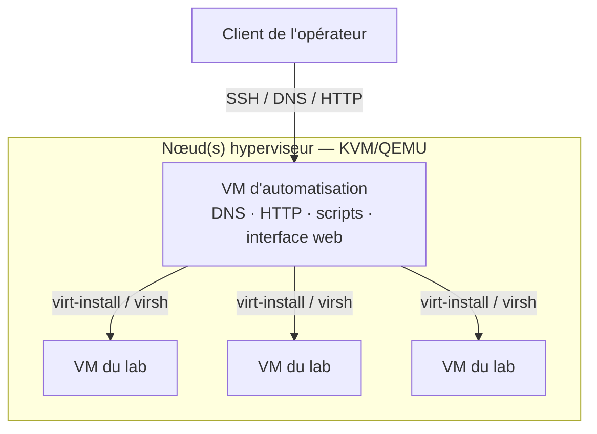
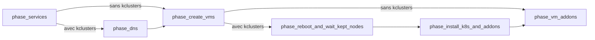
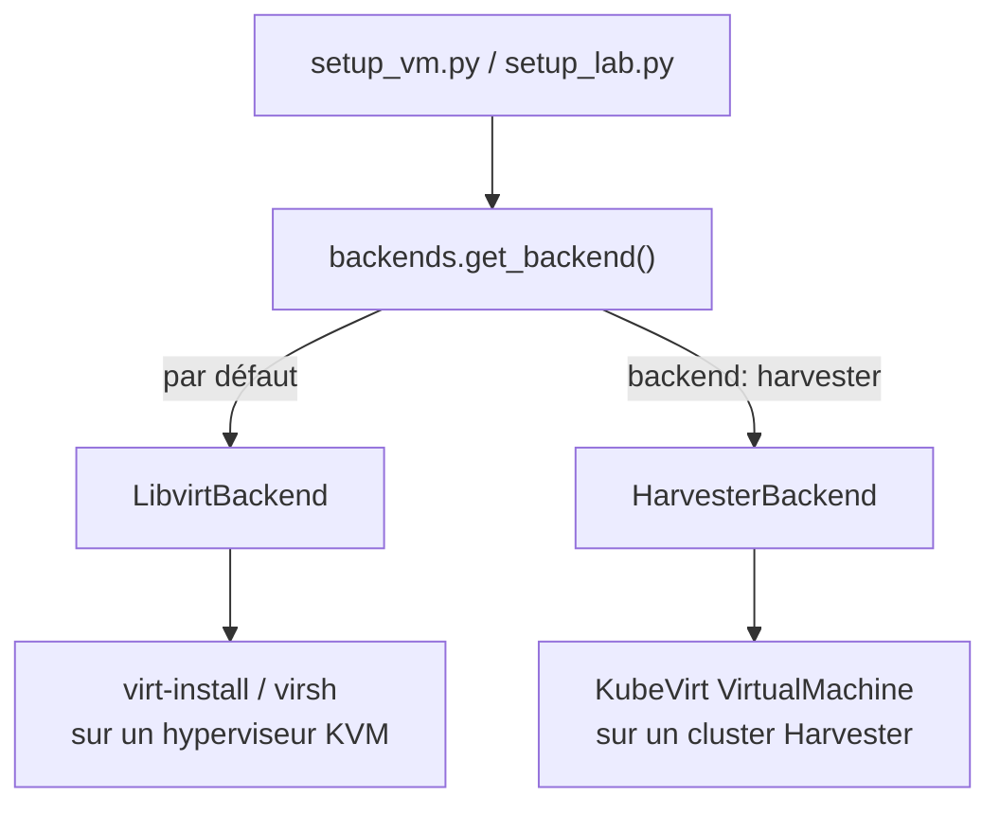
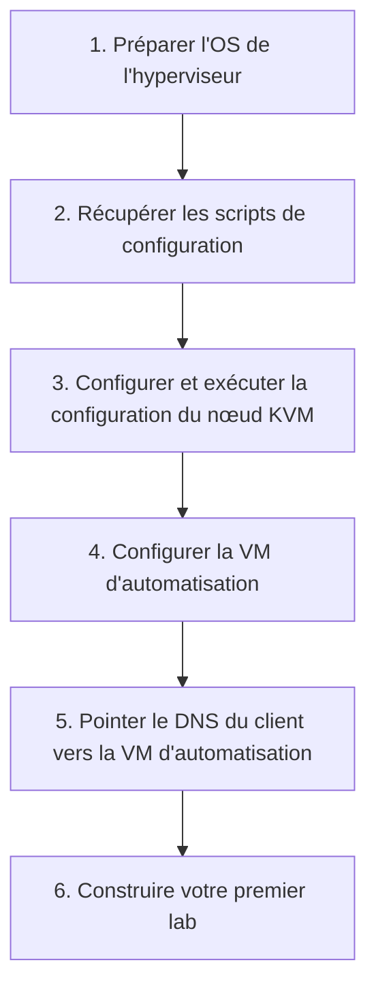
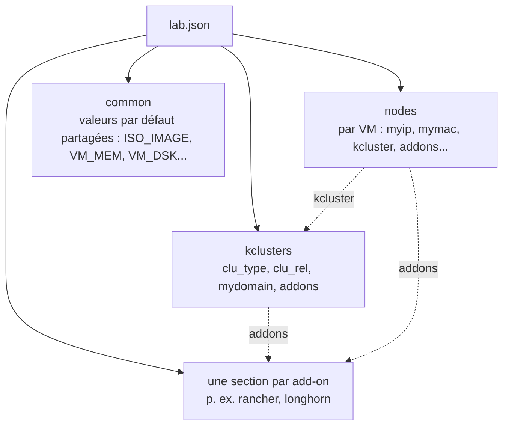

<a id="top"></a>
# lab-in-a-box

<p align="center">
  <a href="https://rmahique.github.io/lab-in-a-box/logo/">
    
  </a>
  <br/>
  <picture>
    <source media="(prefers-color-scheme: dark)" srcset="media/brand/logo-text-dark.png">
    
  </picture>
</p>

<p align="center">
  <a href="https://github.com/SUSE-Technical-Marketing/lab-in-a-box/actions/workflows/ci.yml"></a>
  
  
  
  
</p>

<p align="center">
  <sub>🌐 <a href="README.md">English</a> · <a href="README.es.md">Español</a> · <a href="README.de.md">Deutsch</a> · <a href="README.fr.md"><strong>Français</strong></a> · <a href="README.pt-BR.md">Português (Brasil)</a> · <a href="README.ja.md">日本語</a> · <a href="README.zh-CN.md">简体中文</a></sub>
</p>

> *Ceci est une traduction communautaire. La source de référence est [README.md](README.md) (anglais) et peut être plus à jour que cette page.*

<p align="center"><em>Pointez-le vers un fichier JSON ou YAML. Récupérez un lab fonctionnel — VM, DNS, Kubernetes et add-ons, tout est branché.</em></p>

<p align="center" float="left">
  <kbd></kbd>
</p>

**lab-in-a-box** transforme une seule machine physique en une véritable usine à labs autonome : pointez-le vers un fichier JSON ou YAML décrivant les VM, les clusters Kubernetes et les logiciels souhaités, et il construit le tout — DNS, provisionnement, mise en route des clusters et add-ons — sans avoir à toucher `virt-install` ou Ansible à la main.

## Pourquoi lab-in-a-box ?

<table>
<tr>
<td width="50%" valign="top">

`setup_lab.py` · **Un fichier JSON/YAML, une commande.**
Décrivez les VM, les clusters Kubernetes (RKE2/K3s) et les add-ons de façon déclarative ; il construit tout dans le bon ordre.

`install_<addon>` · **65 add-ons prêts à l'emploi.**
Rancher, Longhorn, NeuVector, Harbor, Keycloak, Jenkins, Argo CD, SUSE Multi-Linux Manager/Uyuni (clés d'activation, RBAC, Content Lifecycle Management, intégration Ansible, et plus), des applications de démonstration vulnérables pour la formation à la sécurité, et plus encore.

[`lab-builder`](#web-ui-lab-builder) · **Une interface web dynamique.**
Génère des formulaires directement à partir du schéma propre à chaque add-on — ajoutez un champ à un script, et l'interface le récupère sans aucune modification côté frontend.

</td>
<td width="50%" valign="top">

`KVM_HOSTS` · **Compatible multi-hyperviseurs.**
Une seule définition de lab peut répartir des VM sur plusieurs hôtes KVM, sélectionnés automatiquement selon le CPU/RAM/disque disponible, ou fixés par nœud.

`podman` · **Suite de tests entièrement conteneurisée.**
Chaque vérification s'exécute dans son propre conteneur jetable, intégré à un hook de pre-commit.

`config_method` · **Provisionnement modulable.**
Ignition+Combustion (SLE Micro), cloud-init (openSUSE/Ubuntu), `virt-customize` (distributions anciennes sans support cloud-init/Ignition), ou une installation scriptée par ISO (AutoYaST/Kickstart/Preseed/AutoInstall).

</td>
</tr>
</table>

---

## Table des matières

- [Architecture](#architecture)
- [Fonctionnement](#how-it-works)
- [Démarrage rapide](#quick-start)
- [Interface web (lab-builder)](#web-ui-lab-builder)
- [Format de définition du lab](#lab-definition-format)
- [Exemples](#examples)
- [Guides pas à pas](#step-by-step-walkthroughs)
- [Commandes disponibles](#available-commands)
- [Add-ons disponibles](#available-addons)
- [Référence de configuration](#configuration-reference)
- [Tests](#testing)
- [Contribuer / Configuration développeur](#contributing--developer-setup)

<p align="right"><a href="#top">↑ retour en haut</a></p>

---

<a id="architecture"></a>
## Architecture

<p align="center" float="left">
  <kbd><picture><source media="(prefers-color-scheme: dark)" srcset="media/diagram1-dark.svg"></picture></kbd>
  <kbd><picture><source media="(prefers-color-scheme: dark)" srcset="media/diagram2-dark.svg"></picture></kbd>
</p>

Le système repose sur une **architecture à deux niveaux** :



### Nœud(s) hyperviseur

Une ou plusieurs machines physiques exécutant KVM/QEMU. Chacune héberge les VM du lab et conserve les images QCOW2 source dans `/var/lib/libvirt/images/sources/`. Un NUC, une station de travail, ou toute machine x86_64 capable d'exécuter KVM convient. Les labs nécessitant plus de capacité qu'une seule machine peuvent s'étendre sur **plusieurs hôtes KVM** — voir [labs multi-hôtes](#multi-host-labs) ci-dessous.

### VM d'automatisation

Une petite VM tournant sur l'hyperviseur qui fait office de plan de contrôle pour tout le lab. Elle fournit :

- **DNS** — BIND (`named`) sert le domaine du lab et relaie les requêtes externes, de sorte que tous les noms d'hôtes du lab se résolvent depuis n'importe quel client pointant vers elle
- **HTTP** — sert les fichiers de provisionnement (Ignition, Combustion, cloud-init) sous `/srv/www/htdocs/lab_creation/`
- **Scripts** — toutes les commandes de gestion du lab, installées dans `/usr/local/bin/`
- **Interface web** (optionnelle) — [lab-builder](#web-ui-lab-builder), un concepteur de lab.json fonctionnant dans le navigateur

Toutes les commandes utilisateur s'exécutent **sur la VM d'automatisation**. Elle se connecte à l'/aux hyperviseur(s) et aux VM créées via SSH. Aucun accès direct à l'hyperviseur n'est nécessaire après la configuration initiale.

### Sous le capot

Les outils en ligne de commande et chaque add-on sont écrits en Python 3.11, résidant dans `libs/` et `scripts/`, installés dans `/usr/local/lib/lab_creation/` — organisés autour d'un petit ensemble de modules de bibliothèque partagés (`lab_creation.py`, `backends.py`, `services.py`, `spacecmd_common.py`, …) plutôt que les uns par rapport aux autres. La création de VM passe par une interface `VMBackend` modulaire (`LibvirtBackend` aujourd'hui), afin que le même code d'orchestration puisse un jour cibler d'autres backends de virtualisation (KubeVirt, Harvester) sans toucher aux add-ons. Un add-on hérité (`install_ds389`) est encore en bash pur — il précède le portage Python et était déjà cassé en bash, donc cela ne valait pas la peine de le porter. L'implémentation de l'ère bash que ceux-ci remplacent survit, archivée, sous `legacy_bash/`.

<p align="right"><a href="#top">↑ retour en haut</a></p>

---

<a id="how-it-works"></a>
## Fonctionnement

### Pipeline de déploiement

`setup_lab.py` exécute une séquence de phases fixe ; les deux phases spécifiques à Kubernetes sont entièrement ignorées pour un lab VM seul (sans section `kclusters`) :



### Provisionnement des VM

Chaque VM est créée par les étapes suivantes :
1. Résoudre à quel hôte KVM elle appartient (le champ explicite `kvm_host`, ou une sélection automatique selon la capacité libre — voir [labs multi-hôtes](#multi-host-labs))
2. Copier et redimensionner une image QCOW2 source sur cet hôte
3. Générer les fichiers de provisionnement à partir de modèles, selon `config_method`
4. Enregistrer une entrée DNS dans BIND
5. Exécuter `virt-install` sur l'hyperviseur via SSH
6. Attendre que SSH devienne disponible

La méthode de provisionnement est contrôlée par `config_method` dans le JSON du lab (par nœud ou dans `common`) :

| Valeur | Méthode | Utilisée pour |
|---|---|---|
| _(vide, par défaut)_ | Ignition + Combustion | SLE Micro |
| `cloud-init` | ISO cloud-init | openSUSE Leap, Ubuntu |
| `virt_customize` | Modifie la QCOW2 directement sur l'hyperviseur (`virt-customize`) — aucun support Ignition/cloud-init requis côté invité | CentOS 7, anciens Debian/RHEL, ou toute image sans Ignition/cloud-init |
| `install_iso` | Installation scriptée depuis une véritable ISO d'installation (AutoYaST, Kickstart, Preseed ou AutoInstall, selon `install_type`) | Distributions sans autre voie de provisionnement |

### Backends de VM

La technologie d'hyperviseur qui crée réellement un nœud est décidée par une interface `VMBackend` interchangeable, résolue une fois par nœud (`backend: harvester` dans la config de ce nœud sélectionne `HarvesterBackend` ; toute autre valeur utilise `LibvirtBackend` par défaut) — chaque add-on et script d'orchestration s'adresse au backend résolu de la même façon, quel qu'il soit :



### Configuration de Kubernetes

Une fois les VM opérationnelles, `setup_lab.py` installe Kubernetes sur chaque nœud selon la section `kclusters` du JSON. RKE2 et K3s sont tous deux pris en charge. Une fois un cluster prêt, ses add-ons s'exécutent en séquence ; les add-ons au niveau VM (rattachés à un seul nœud plutôt qu'à un cluster) s'exécutent une fois ce nœud provisionné.

### Labs multi-hôtes

<a id="multi-host-labs"></a>
Un lab n'est pas limité à un seul hyperviseur. Définissez `KVM_HOSTS` (séparés par des espaces) dans `/etc/lab_creation.cfg` sur la VM d'automatisation pour disposer de plusieurs hyperviseurs :

```ini
KVM_HOSTS="hv1.mydemo.lab hv2.mydemo.lab hv3.mydemo.lab"
```

Ensuite, pour chaque nœud du JSON du lab, vous pouvez soit :
- **le fixer explicitement** — `"kvm_host": "hv2.mydemo.lab"` dans la configuration de ce nœud, soit
- **le laisser se sélectionner automatiquement** — omettre `kvm_host` ; le nœud atterrit sur l'hôte configuré qui dispose actuellement d'assez de CPU/RAM/disque libres (vérifié en direct via SSH).

Les nœuds sans `kvm_host` et les machines avec un seul hôte configuré se comportent exactement comme avant l'existence de cette fonctionnalité — rien ne change pour un lab mono-hyperviseur.

### Ordre de chargement des bibliothèques

Chaque script charge sa configuration dans cet ordre :

1. `/etc/lab_creation.defaults` — valeurs par défaut du système, chemins, listes de paquets
2. `/usr/local/lib/lab_creation/primary.py` — validation des entrées, chargement de la configuration
3. `/etc/lab_creation.cfg` — paramètres spécifiques au nœud (`REMOTE_HOST`, `ROOT_SSH_KEY`, `VIRT_SRV`, `KVM_HOSTS`, etc.)
4. `/usr/local/lib/lab_creation/lab_creation.py` — fonctions de VM, DNS et orchestration
5. `/usr/local/lib/lab_creation/k8s.py` — fonctions de cluster Kubernetes

<p align="right"><a href="#top">↑ retour en haut</a></p>

---

<a id="quick-start"></a>
## Démarrage rapide



### Prérequis

- Une machine capable d'exécuter KVM (Intel VT-x ou AMD-V activé)
- Un accès Internet (ou un miroir local) pour télécharger paquets et images
- Une image QCOW2 pour l'OS choisi, placée dans `/var/lib/libvirt/images/sources/` sur l'hyperviseur

> [!IMPORTANT]
> La VM d'automatisation a spécifiquement besoin de `python3.11` — la chaîne d'outils y est explicitement fixée. La plupart des distributions fournissent par ailleurs un `python3` par défaut plus ancien ; le script d'installation refuse de continuer si `python3.11` est absent.

Images testées :
- [SLE Micro](https://www.suse.com/download/sle-micro/) — recommandé, utilisé avec Ignition+Combustion
- openSUSE Leap Micro — pris en charge, utilisé avec cloud-init

### Étape 1 — Préparer l'OS de l'hyperviseur

Installez SLES (ou une autre distribution Linux compatible KVM) sur votre matériel. Pendant l'installation, choisissez :
- **Réseau** : créez une interface bridge (`br0`) liée à votre NIC principale avec une IP statique
- **Rôle système** : KVM Virtualization Host

<details>
<summary>Créer une clé USB amorçable depuis Linux</summary>

```shell
# Avant d'insérer la clé USB :
cat /proc/partitions > /tmp/partb4

# Insérez la clé USB, puis :
cat /proc/partitions > /tmp/parta

# Trouvez le nouveau périphérique :
diff /tmp/part*
```

> [!WARNING]
> La commande suivante **détruit toutes les données** du périphérique cible. Vérifiez bien `sdX` par rapport à la sortie de `diff` ci-dessus avant de l'exécuter.

```shell
# Écrivez l'ISO (remplacez sdX par votre périphérique) :
dd if=SLE-15-SP6-Online-x86_64-GM-Media1.iso of=/dev/sdX bs=4k && sync
```

</details>

### Étape 2 — Récupérer les scripts de configuration

Depuis n'importe quelle machine Linux ayant un accès SSH à l'hyperviseur :

```shell
curl https://raw.githubusercontent.com/SUSE-Technical-Marketing/lab-in-a-box/main/install_demo_server_scripts.sh | bash -
```

Cela télécharge les scripts de configuration dans `/var/tmp/setup_demo_server/`.

### Étape 3 — Configurer et exécuter la configuration du nœud KVM

<a id="step-3--configure-and-run-the-kvm-node-setup"></a>

```shell
cd /var/tmp/setup_demo_server/setup_demo_server/
vim lab.cfg
```

Paramètres clés dans `lab.cfg` :

| Paramètre | Description |
|---|---|
| `ROOT_PWD_HASH` | Hash du mot de passe root — généré avec `mkpasswd --method=SHA-512 --stdin` |
| `ROOT_SSH_PUB_KEY` | Votre clé publique SSH pour un accès sans mot de passe |
| `AUTOMATION_HOSTNAME` | Nom d'hôte de la VM d'automatisation (ex. `automation.mydemo.lab`) |
| `_QCOW_IMAGE` | Nom du fichier de l'image QCOW2 source |
| Paramètres réseau | IP, passerelle, masque, DNS pour le réseau du lab |

Puis lancez la configuration (remplacez `<IP>` par l'IP de votre hyperviseur, ou omettez-la pour du local) :

```shell
./setup_kvm_node.py <IP>
```

Cela provisionne la VM d'automatisation et démarre tous les services requis.

### Étape 4 — Configurer la VM d'automatisation

Connectez-vous en SSH à la VM d'automatisation et installez les scripts du lab :

```shell
ssh <AUTOMATION_HOSTNAME>
./install_automation_node_scripts.sh

cp /etc/lab_creation.cfg.example /etc/lab_creation.cfg
vim /etc/lab_creation.cfg
```

Paramètres clés dans `lab_creation.cfg` :

| Paramètre | Description |
|---|---|
| `REMOTE_HOST` | Nom d'hôte ou IP de l'hyperviseur KVM (principal) |
| `KVM_HOSTS` | _(optionnel)_ liste d'hyperviseurs supplémentaires séparés par des espaces pour un [lab multi-hôtes](#multi-host-labs) |
| `ROOT_SSH_KEY` | Contenu de la clé publique SSH à injecter dans les VM |
| `VIRT_SRV` | URI de connexion libvirt (ex. `qemu+ssh://root@hypervisor/system`) |
| `NETWORK` | Réseau libvirt par défaut pour les VM (ex. `bridge=br0`) |

### Étape 5 — Pointer le DNS de votre client vers la VM d'automatisation

<a id="step-5--point-your-client-dns-at-the-automation-vm"></a>

Pour que les noms d'hôtes se résolvent depuis votre poste :

```shell
# Linux (NetworkManager) :
nmcli con mod <connection> ipv4.dns <AUTOMATION_IP>

# Ou ajoutez à /etc/resolv.conf :
nameserver <AUTOMATION_IP>
```

### Étape 6 — Construisez votre premier lab

```shell
setup_lab.py examples/cluster.json.template
```

Voir les [Exemples](#examples) ci-dessous pour d'autres points de départ, ou ouvrez l'[interface web](#web-ui-lab-builder) plutôt que d'écrire du JSON à la main.

<p align="right"><a href="#top">↑ retour en haut</a></p>

---

<a id="web-ui-lab-builder"></a>
## Interface web (lab-builder)

Un concepteur de fichiers `lab.json` fonctionnant dans le navigateur, qui **introspecte les propres bibliothèques Python du projet à l'exécution** — il n'a aucune connaissance figée d'un quelconque add-on. Choisissez un composant, et l'interface génère un formulaire directement à partir du schéma de ce composant ; ajoutez un champ à un script, et l'interface l'affiche sans aucune modification côté frontend.

```shell
# Le moyen le plus rapide de l'essayer — aucune dépendance au-delà de Python :
python3.11 webui/run-local.py            # → http://localhost:8677/
```

Pour un déploiement en production (Apache, ou un service autonome systemd/indépendant de l'init, plus HTTPS via un certificat auto-signé généré de manière idempotente), voir **[README.webui.md](README.webui.md)** — qui couvre les trois modes de déploiement, l'API HTTP et le dépannage.

<p align="right"><a href="#top">↑ retour en haut</a></p>

---

<a id="lab-definition-format"></a>
## Format de définition du lab

Les labs sont définis sous forme de fichiers JSON ou YAML (détecté automatiquement — voir la note ci-dessous). Le format actuel prend en charge plusieurs clusters Kubernetes par lab (`kclusters`) ; voir `examples/cluster.json.template` pour l'ancien format mono-cluster (`cluster`).



```jsonc
{
  "nodes": {
    "node101.mydemo.lab": {
      "myip":  "192.168.88.101",
      "mymac": "34:8a:b1:4b:1a:c1",
      "INSTALL_RKE2_TYPE": "server",   // "server" ou "agent"
      "kcluster": "cluster1"           // à quelle entrée kclusters ce nœud appartient
    },
    "node102.mydemo.lab": {
      "myip":  "192.168.88.102",
      "mymac": "34:8a:b1:4b:1a:c2",
      "INSTALL_RKE2_TYPE": "agent",
      "kcluster": "cluster1"
    }
  },
  "common": {
    "ISO_IMAGE":  "SL-Micro.x86_64-6.1-Default-qcow-GM.qcow2",
    "VM_MEM":     "24576",
    "VM_DSK":     "80",
    "VM_CPU":     "6",
    "VM_BOOT":    "uefi",             // uefi (par défaut), firmware=bios, bios, uefi=off
    "mymask":     "24",
    "mygw":       "192.168.88.1",
    "mydns":      "192.168.88.73",
    "mynet_reverse": "88.168.192"
  },
  "kclusters": {
    "cluster1": {
      "clu_type":  "rke2",             // "rke2" ou "k3s"
      "clu_rel":   "stable",
      "mydomain":  "mydemo.lab",
      "addons": ["rancher", "longhorn"]
    }
  },
  "rancher": {
    "rancher_shorthn":   "rancher",
    "rancher_rel":       "rancher-prime",
    "rancher_repo_url":  "https://charts.rancher.com/server-charts/prime",
    "rancher_helm_rel":  "rancher",
    "rancher_helm_chart": "rancher-prime/rancher",
    "rancher_Version":   "--version 2.13.3",
    "cert_manager_ver":  "--version v1.14.4"
  }
}
```

<details>
<summary>Le même lab, en YAML</summary>

```yaml
nodes:
  node101.mydemo.lab:
    myip: "192.168.88.101"
    mymac: "34:8a:b1:4b:1a:c1"
    INSTALL_RKE2_TYPE: server   # "server" ou "agent"
    kcluster: cluster1          # à quelle entrée kclusters ce nœud appartient
  node102.mydemo.lab:
    myip: "192.168.88.102"
    mymac: "34:8a:b1:4b:1a:c2"
    INSTALL_RKE2_TYPE: agent
    kcluster: cluster1

common:
  ISO_IMAGE: SL-Micro.x86_64-6.1-Default-qcow-GM.qcow2
  VM_MEM: "24576"
  VM_DSK: "80"
  VM_CPU: "6"
  VM_BOOT: uefi                # uefi (par défaut), firmware=bios, bios, uefi=off
  mymask: "24"
  mygw: "192.168.88.1"
  mydns: "192.168.88.73"
  mynet_reverse: "88.168.192"

kclusters:
  cluster1:
    clu_type: rke2              # "rke2" ou "k3s"
    clu_rel: stable
    mydomain: mydemo.lab
    addons: [rancher, longhorn]

rancher:
  rancher_shorthn: rancher
  rancher_rel: rancher-prime
  rancher_repo_url: https://charts.rancher.com/server-charts/prime
  rancher_helm_rel: rancher
  rancher_helm_chart: rancher-prime/rancher
  rancher_Version: "--version 2.13.3"
  cert_manager_ver: "--version v1.14.4"
```

</details>

Champs optionnels au niveau du nœud :

| Champ | Description |
|---|---|
| `addons` | Liste des scripts d'add-on à exécuter uniquement pour cette VM |
| `config_method` | Redéfinit la méthode de provisionnement (`cloud-init`, `virt_customize`, `install_iso`) |
| `kvm_host` | Fixe cette VM sur un hyperviseur précis dans un [lab multi-hôtes](#multi-host-labs) |
| `extra_dsk` | Disque(s) supplémentaire(s) à attacher — `"/dev/sdb"`, ou `"/dev/sdb,bus=scsi"` pour redéfinir le bus par défaut par disque |
| `salt_states` | États Salt à appliquer (méthode cloud-init uniquement) |

Champs optionnels de kcluster :

| Champ | Description |
|---|---|
| `mgm_node` | Nom d'hôte du nœud exécutant les installateurs d'add-ons du cluster ; par défaut le premier nœud serveur |

Chaque script d'add-on accepte également `--schema` (alias de `--input-definition`), qui affiche ses propres clés de configuration en JSON ou YAML lisible par une machine — le même schéma que lit l'[interface web](#web-ui-lab-builder) pour construire ses formulaires :

```shell
install_longhorn --schema
setup_lab.py --input-definition yaml   # schéma de topologie de base (common/nodes/kclusters)
```

<p align="right"><a href="#top">↑ retour en haut</a></p>

---

<a id="examples"></a>
## Exemples

### Lab minimal à une seule VM

Le plus petit lab possible — une VM, sans Kubernetes :

```jsonc
{
  "nodes": {
    "standalone.mydemo.lab": { "myip": "192.168.88.50" }
  },
  "common": {
    "ISO_IMAGE": "SL-Micro.x86_64-6.1-Default-qcow-GM.qcow2",
    "VM_MEM": "4096", "VM_DSK": "40", "VM_CPU": "2",
    "mymask": "24", "mygw": "192.168.88.1", "mydns": "192.168.88.73"
  }
}
```

```shell
setup_lab.py standalone.json
```

### RKE2 + Rancher + Longhorn (le cluster « hello world »)

Un cluster à 2 nœuds avec une plateforme de gestion et du stockage distribué — voir l'exemple complet dans [Format de définition du lab](#lab-definition-format) ci-dessus.

```shell
setup_lab.py rancher-cluster.json
# Relancez plus tard, en ignorant toute VM déjà active et accessible :
setup_lab.py --keep rancher-cluster.json
```

### Répartir un cluster sur deux hôtes

Fixez le serveur sur un hyperviseur et laissez les agents se placer automatiquement sur celui des [hôtes configurés](#multi-host-labs) qui a de la place :

```jsonc
{
  "nodes": {
    "srv1.mydemo.lab":   { "myip": "192.168.88.10", "kvm_host": "hv1.mydemo.lab", "kcluster": "prod" },
    "agent1.mydemo.lab": { "myip": "192.168.88.11", "kcluster": "prod" },
    "agent2.mydemo.lab": { "myip": "192.168.88.12", "kcluster": "prod" }
  },
  "common": { "ISO_IMAGE": "SL-Micro.x86_64-6.1-Default-qcow-GM.qcow2", "VM_MEM": "8192", "VM_DSK": "60", "VM_CPU": "4" },
  "kclusters": { "prod": { "clu_type": "rke2", "clu_rel": "stable", "mydomain": "mydemo.lab" } }
}
```

### Serveur SUSE Multi-Linux Manager (Uyuni) + un client enregistré

Déployez un serveur Uyuni avec une clé d'activation, puis enregistrez une seconde VM en tant que client Salt auprès de lui — voir [Add-ons disponibles](#available-addons) pour l'ensemble complet des fonctionnalités (`orgs`, RBAC, Content Lifecycle Management, intégration Ansible, et plus) :

```jsonc
{
  "nodes": {
    "uyuni.mydemo.lab":  { "myip": "192.168.88.30", "addons": ["uyuni"] },
    "client1.mydemo.lab": { "myip": "192.168.88.31", "addons": ["client_registration"] }
  },
  "common": { "ISO_IMAGE": "SL-Micro.x86_64-6.1-Default-qcow-GM.qcow2", "VM_MEM": "8192", "VM_DSK": "60", "VM_CPU": "4" },
  "uyuni": {
    "uyuni_admin": "admin", "uyuni_password": "Uyuni12345",
    "uyuni_activation_key": "1-lab-clients", "uyuni_activation_key_base_channel": "sle-micro-6.1-pool"
  },
  "client_registration": {
    "client_registration_server_type": "uyuni",
    "client_registration_server": "uyuni.mydemo.lab",
    "client_registration_activation_key": "1-lab-clients"
  }
}
```

<p align="right"><a href="#top">↑ retour en haut</a></p>

---

<a id="step-by-step-walkthroughs"></a>
## Guides pas à pas

Les [Exemples](#examples) ci-dessus sont des points de départ à copier-coller. Ces trois guides parcourent des scénarios réels et complets de bout en bout — quoi exécuter, ce qui se passe à chaque étape, et comment vérifier que cela a bien fonctionné. Chaque champ JSON et chaque forme de commande ci-dessous correspond à la propre suite de tests de ce projet (`tests/run_tests.sh`) et à son code source.

> [!TIP]
> Les guides 2 et 3 sont **testés en conditions réelles** — exécutés sur un vrai serveur/matériel, pas seulement vérifiés de façon isolée.

### Guide 1 — Votre premier cluster : RKE2 + Rancher + Longhorn

Objectif : deux VM SLE Micro, un cluster RKE2, Rancher pour la gestion, Longhorn pour le stockage — accessible depuis votre navigateur à la fin.

1. **Écrivez le fichier du lab.** Enregistrez-le sous `rancher-cluster.json` (ajustez les IP/le réseau à votre domaine de lab) :

   ```jsonc
   {
     "nodes": {
       "node101.mydemo.lab": {
         "myip": "192.168.88.101", "mymac": "34:8a:b1:4b:1a:c1",
         "INSTALL_RKE2_TYPE": "server", "kcluster": "cluster1"
       },
       "node102.mydemo.lab": {
         "myip": "192.168.88.102", "mymac": "34:8a:b1:4b:1a:c2",
         "INSTALL_RKE2_TYPE": "agent", "kcluster": "cluster1"
       }
     },
     "common": {
       "ISO_IMAGE": "SL-Micro.x86_64-6.1-Default-qcow-GM.qcow2",
       "VM_MEM": "24576", "VM_DSK": "80", "VM_CPU": "6",
       "mymask": "24", "mygw": "192.168.88.1", "mydns": "192.168.88.73"
     },
     "kclusters": {
       "cluster1": {
         "clu_type": "rke2", "clu_rel": "stable", "mydomain": "mydemo.lab",
         "addons": ["rancher", "longhorn"]
       }
     },
     "rancher": {
       "rancher_shorthn": "rancher", "rancher_rel": "rancher-prime",
       "rancher_repo_url": "https://charts.rancher.com/server-charts/prime",
       "rancher_helm_rel": "rancher", "rancher_helm_chart": "rancher-prime/rancher",
       "rancher_Version": "--version 2.13.3", "cert_manager_ver": "--version v1.14.4"
     }
   }
   ```

2. **Construisez-le :**

   ```shell
   setup_lab.py rancher-cluster.json
   ```

   `setup_lab.py` vérifie automatiquement le fichier avant toute autre chose — IP incorrectes, référence à un `kcluster` inexistant, `ISO_IMAGE` manquant et erreurs similaires sont détectées et affichées (`✗ Preflight FAILED — N error(s)`) sans rien créer, plutôt que d'échouer à mi-chemin. Un fichier correct affiche `✓ Preflight passed` et passe directement à la construction.

   Dans l'ordre, voici ce qui se passe : enregistrement des deux nœuds dans le DNS → création des deux VM (copie de l'image QCOW2, génération des fichiers Combustion, démarrage, attente de SSH) → installation de RKE2 sur `node101` en tant que serveur, puis sur `node102` en tant qu'agent → installation de `rancher` et `longhorn` sur le nœud de gestion du cluster (`mgm_node`, par défaut le premier nœud serveur — ici `node101`). Un cluster à 2 nœuds avec Rancher prend généralement 15 à 25 minutes ; l'essentiel étant l'amorçage de RKE2 et la propre installation Helm de Rancher.

3. **Vérifiez que le DNS résout** (depuis votre propre poste, une fois [pointé vers le DNS de la VM d'automatisation](#step-5--point-your-client-dns-at-the-automation-vm)) :

   ```shell
   dig +short node101.mydemo.lab rancher.mydemo.lab
   ```

   Les deux devraient renvoyer `192.168.88.101` (le nom d'hôte d'ingress de Rancher est la valeur de `rancher_shorthn`, `rancher`, sous le `mydomain` du cluster).

4. **Connectez-vous.** Rendez-vous sur `https://rancher.mydemo.lab` (certificat auto-signé — votre navigateur avertira une fois) et connectez-vous avec `rancher_initial_pwd` depuis `/etc/lab_creation.cfg` sur la VM d'automatisation.

5. **Itérez sans tout reconstruire.** Vous avez modifié la config d'un nœud, ou une VM a planté ? Relancez avec `--keep` : toute VM déjà existante, correspondant à son IP/MAC définie et accessible en SSH est laissée telle quelle ; seul ce qui manque réellement ou est cassé est (re)créé :

   ```shell
   setup_lab.py --keep rancher-cluster.json
   ```

6. **Détruisez-le** une fois terminé :

   ```shell
   destroy_lab.py rancher-cluster.json
   ```

### Guide 2 — Serveur SUSE Multi-Linux Manager (Uyuni) avec un client enregistré

Objectif : un serveur Uyuni avec une véritable clé d'activation, et une seconde VM qui s'enregistre elle-même comme client géré par Salt auprès de lui. **Testé en conditions réelles** de bout en bout contre un vrai serveur Uyuni.

1. **Écrivez le fichier du lab** — un nœud pour le serveur Uyuni, un pour le client :

   ```jsonc
   {
     "nodes": {
       "uyuni.mydemo.lab":   { "myip": "192.168.88.30", "addons": ["uyuni"] },
       "client1.mydemo.lab": { "myip": "192.168.88.31", "addons": ["client_registration"] }
     },
     "common": {
       "ISO_IMAGE": "SL-Micro.x86_64-6.1-Default-qcow-GM.qcow2",
       "VM_MEM": "8192", "VM_DSK": "60", "VM_CPU": "4",
       "mymask": "24", "mygw": "192.168.88.1", "mydns": "192.168.88.73", "mydomain": "mydemo.lab"
     },
     "uyuni": {
       "uyuni_admin": "admin", "uyuni_password": "Uyuni12345",
       "uyuni_activation_key": "1-lab-clients", "uyuni_activation_key_base_channel": "sle-micro-6.1-pool"
     },
     "client_registration": {
       "client_registration_server_type": "uyuni",
       "client_registration_server": "uyuni.mydemo.lab",
       "client_registration_activation_key": "1-lab-clients"
     }
   }
   ```

2. **Construisez-le :**

   ```shell
   setup_lab.py uyuni-lab.json
   ```

   Les add-ons de niveau VM (`uyuni` comme `client_registration` sont rattachés à un nœud, pas à un cluster, puisqu'il n'y a pas de section `kclusters` ici) s'exécutent dès que leur propre nœud est opérationnel. `install_uyuni` démarre le serveur, attend qu'il devienne accessible, puis crée la clé d'activation. `install_client_registration` amorce ensuite `client1` auprès de lui — installe le script d'amorçage, l'exécute, puis interroge périodiquement jusqu'à ce que la clé Salt du nouveau minion apparaisse comme en attente, et l'accepte alors.

3. **Vérifiez que le client s'est réellement enregistré.** Connectez-vous en SSH au serveur Uyuni et interrogez-le directement :

   ```shell
   ssh uyuni.mydemo.lab
   mgrctl exec 'spacecmd -- system_list'
   ```

   `client1.mydemo.lab` devrait figurer dans la liste.

4. **Connectez-vous à l'interface web** sur `https://uyuni.mydemo.lab` avec `uyuni_admin`/`uyuni_password` pour voir la même chose visuellement, parcourir la clé d'activation, ou exécuter un highstate.

Aspérité connue en amont (pas un bug de ce projet, documentée au cas où vous la rencontreriez) : le propre scriptlet de mise à niveau de paquets de `salt-transactional-update` peut laisser une clé YAML dupliquée dans `/etc/salt/minion.d/transactional_update.conf` sur le client, faisant boucler `salt-minion` en échec jusqu'à ce que ce soit dédupliqué manuellement. Rien dans ce dépôt ne touche à ce fichier.

### Guide 3 — VM d'automatisation sous NAT (portable à une seule carte réseau comme hyperviseur)

Objectif : amorcer la VM d'automatisation sur un hôte sans NIC libre à mettre en bridge — un réseau privé géré par libvirt à la place, avec des ports précis redirigés en DNAT depuis la véritable IP de l'hôte lui-même. **Testé en conditions réelles** de bout en bout sur une VM imbriquée jetable.

Cela ne change rien au flux [Démarrage rapide](#quick-start) par défaut si vous n'y adhérez pas — `_network_mode` vaut `"bridge"` par défaut, identique octet pour octet à toute configuration existante.

1. **Dans `lab.cfg`** ([Étape 3](#step-3--configure-and-run-the-kvm-node-setup) du Démarrage rapide), définissez :

   ```ini
   _network_mode="nat"
   _nat_network_name="labnat"          # valeur par défaut affichée — un nouveau réseau virtuel libvirt, pas le vrai LAN de votre hôte
   _nat_network_cidr="192.168.150.0/24" # valeur par défaut affichée
   _nat_forwarded_ports="22:22/TCP 80:80/TCP 443:443/TCP"  # valeur par défaut affichée — « <port sur l'IP RÉELLE de l'HYPERVISEUR> : <port sur la VM d'automatisation> / <protocole> »
   ```

   Cela redirige les ports 22/80/443 de l'**IP réelle et joignable de l'extérieur de l'hyperviseur** (`<externe>`) vers les mêmes ports sur l'**adresse NAT privée de la VM d'automatisation** (`<interne>`) — à ce stade, la VM d'automatisation est la seule chose qui écoute sur ce réseau privé, donc « interne » signifie toujours ici « sur la VM d'automatisation ». (L'étape 5 ci-dessous réutilise exactement la même syntaxe `<externe>:<interne>/<protocole>` pour rediriger vers une VM du *lab* à la place, une fois qu'elle existe — là, « interne » désigne l'adresse NAT privée de cette VM, pas celle de la VM d'automatisation.)

2. **Lancez la configuration exactement comme d'habitude :**

   ```shell
   ./setup_kvm_node.py
   ```

   Cela définit le réseau libvirt `labnat` (NAT, DHCP/passerelle gérés par libvirt lui-même — le même mécanisme que le réseau `default` intégré de libvirt, mais sous le nom/CIDR propres à ce projet) au lieu d'un bridge, puis crée la VM d'automatisation dessus avec une IP statique dans cette plage privée, puis redirige (DNAT) les trois ports ci-dessus depuis la véritable IP de l'hôte lui-même.

3. **Vérifiez que le réseau et les règles de redirection existent**, sur l'hyperviseur :

   ```shell
   virsh net-list                              # labnat: active
   iptables -t nat -L LAB_PORTFWD -n -v         # règles DNAT vers l'IP privée de la VM d'automatisation
   iptables -L LAB_PORTFWD_FWD -n -v            # règles ACCEPT correspondantes dans la chaîne FORWARD
   ```

4. **Accédez à la VM d'automatisation depuis l'extérieur de l'hyperviseur**, en utilisant la véritable IP de l'hyperviseur lui-même — pas l'adresse privée `192.168.150.x` de la VM d'automatisation, qui n'est routable depuis nulle part ailleurs :

   ```shell
   ssh root@<ip-reelle-de-l-hyperviseur>          # redirigé (DNAT) vers le SSH de la VM d'automatisation, port 22
   ```

   Les ports 80 et 443 sont également redirigés par défaut (le serveur HTTP des fichiers de provisionnement et, une fois l'[interface web](#web-ui-lab-builder) configurée, son écouteur HTTPS) — accessibles de la même façon, via la véritable IP de l'hyperviseur.

5. **Ajoutez une redirection pour une VM du lab**, pas seulement pour la VM d'automatisation elle-même : donnez à ce nœud un champ `forwarded_ports` et activez une fois le service `portforward`, dans `common.services` :

   ```jsonc
   {
     "nodes": {
       "app1.mydemo.lab": {
         "myip": "192.168.150.20",
         "forwarded_ports": ["8080:80/TCP", "8443:443/TCP"]
       }
     },
     "common": { "services": ["portforward"], "...": "…reste de common comme d'habitude" }
   }
   ```

   `setup_lab.py`/`setup_vm.py` redirigent (DNAT) ces deux ports depuis la véritable IP de l'hyperviseur de la même façon, dès que le premier nœud du lab déclare `forwarded_ports`.

<p align="right"><a href="#top">↑ retour en haut</a></p>

---

<a id="available-commands"></a>
## Commandes disponibles

Toutes les commandes s'exécutent sur la **VM d'automatisation** et prennent un fichier JSON de définition de lab comme premier argument.

| Commande | Description |
|---|---|
| `setup_lab.py [--keep] <lab.json>` | Crée toutes les VM, met en place les clusters Kubernetes, et installe chaque add-on de cluster et de VM dans l'ordre. `--keep` ignore toute VM déjà existante, correspondant à l'IP/MAC définie et accessible en SSH — sans cette option, chaque VM est détruite et recréée. |
| `setup_vm.py <lab.json> <hostname>` | Créer ou recréer une seule VM |
| `destroy_vm.py <lab.json> <hostname>` | Détruire une seule VM |
| `destroy_lab.py <lab.json>` | Détruire toutes les VM d'un lab |

Chaque commande et chaque script `install_<addon>` prend en charge :

```shell
setup_lab.py --version              # affiche la version installée
install_longhorn --schema           # affiche le schéma de configuration de cet add-on (JSON)
install_longhorn --schema yaml      # ...ou YAML
```

<p align="right"><a href="#top">↑ retour en haut</a></p>

---

<a id="available-addons"></a>
## Add-ons disponibles

Les add-ons sont référencés par leur nom dans le tableau `addons` d'un kcluster ou d'un nœud. Le script `install_<name>` correspondant doit se trouver dans le `PATH`.

<sub>Aller à : <a href="#addons-k8s">Kubernetes &amp; GitOps</a> · <a href="#addons-security">Sécurité &amp; conformité</a> · <a href="#addons-suma">SUSE Multi-Linux Manager / Uyuni</a> · <a href="#addons-storage">Stockage &amp; bases de données</a> · <a href="#addons-collaboration">Collaboration &amp; partage de fichiers</a> · <a href="#addons-cicd">CI/CD &amp; outils</a> · <a href="#addons-ai">IA / ML</a> · <a href="#addons-virt">Virtualisation</a> · <a href="#addons-demos">Applications de démo</a> · <a href="#addons-games">Jeux</a></sub>

<a id="addons-k8s"></a>
<details open>
<summary><strong>Plateforme Kubernetes &amp; GitOps</strong></summary>

| Nom de l'add-on | Description |
|---|---|
| [`rancher`](https://www.rancher.com/) | Plateforme de gestion Kubernetes SUSE Rancher Prime |
| [`longhorn`](https://longhorn.io/) | Stockage bloc distribué SUSE Longhorn |
| [`harbor`](https://goharbor.io/) | Registre de conteneurs |
| [`argocd`](https://argo-cd.readthedocs.io/) | Contrôleur GitOps Argo CD |
| [`kubewarden`](https://www.kubewarden.io/) | Moteur de politiques Kubernetes |
| [`istio`](https://istio.io/) | Maillage de services |
| [`linkerd`](https://linkerd.io/) | Maillage de services |
| [`traefik`](https://traefik.io/) | Contrôleur d'ingress |
| [`nginx`](https://nginx.org/) | Contrôleur d'ingress / proxy inverse |
| [`coredns`](https://coredns.io/) | DNS du cluster |
| [`kucero`](https://github.com/SUSE/kucero) | Rotation des certificats du cluster Kubernetes |
| [`fluid`](https://fluid-cloudnative.github.io/) | Orchestration/mise en cache des données pour charges de travail cloud-native |
| [`suse_observability`](https://www.suse.com/products/suse-observability/) | SUSE Observability (métriques/traces/topologie basées sur StackState) |
| [`agones`](https://agones.dev/) | Hébergement/mise à l'échelle de serveurs de jeu dédiés (agones.dev) |
</details>

<a id="addons-security"></a>
<details open>
<summary><strong>Sécurité &amp; conformité</strong></summary>

| Nom de l'add-on | Description |
|---|---|
| [`neuvector`](https://open-docs.neuvector.com/) | Plateforme de sécurité de conteneurs SUSE NeuVector |
| [`nv_testing`](https://open-docs.neuvector.com/testing/testing) | Charges de travail de test de sécurité NeuVector (pods nginx/node/redis) |
| [`nv-demo-helm`](https://open-docs.neuvector.com/) | Démos NeuVector basées sur Helm |
| [`complianceascode`](https://complianceascode.github.io/) | Opérateur OpenSCAP/ComplianceAsCode |
| [`keycloak`](https://www.keycloak.org/) | Gestion des identités et des accès |
| [`kagent`](https://kagent.dev/) | Assistant de sécurité IA agentique pour Kubernetes |
| `insecure_app` | Application web intentionnellement vulnérable (démo/formation) |
| [`struts_demo`](https://struts.apache.org/) | Application de démo vulnérable Apache Struts2 (CVE-2017-5638) |
</details>

<a id="addons-suma"></a>
<details open>
<summary><strong>SUSE Multi-Linux Manager / Uyuni</strong></summary>

| Nom de l'add-on | Description |
|---|---|
| [`uyuni`](https://www.uyuni-project.org/) | Serveur Uyuni (upstream) : clés d'activation, organisations, RBAC, Content Lifecycle Management, intégration Ansible, audit SCAP/CVE, topologie d'environnements dev/QA/prod — voir `install_uyuni --schema` pour la liste complète des champs |
| [`smlm`](https://www.suse.com/products/multi-linux-manager/) | Serveur SUSE Multi-Linux Manager — le même ensemble de fonctionnalités que `uyuni`, déployé via Kubernetes/Helm |
| [`smlm_proxy`](https://www.suse.com/products/multi-linux-manager/) | Proxy SMLM |
| `client_registration` | Enregistre n'importe quelle VM en tant que client Salt d'un serveur `uyuni`/`smlm` existant (amorçage par clé d'activation + acceptation de la clé Salt) |
| [`suma`](https://www.suse.com/products/multi-linux-manager/) | SUSE Multi-Linux Manager (SUMA), installé directement sur l'OS via `mgradm` — pas Kubernetes |
| [`ansible_control_node`](https://documentation.suse.com/multi-linux-manager/5.1/en/docs/administration/ansible-setup-control-node.html) | Provisionne un vrai nœud de contrôle Ansible : installe `ansible-core`, déploie des playbooks d'exemple + un script d'inventaire dynamique qui interroge la propre liste de systèmes de `uyuni`/`smlm`, configure l'accès SSH au reste du lab. S'associe au propre champ `*_ansible_control_nodes` de `uyuni`/`smlm`, qui active l'entitlement « Ansible Control Node » côté serveur |
</details>

<a id="addons-storage"></a>
<details open>
<summary><strong>Stockage &amp; bases de données</strong></summary>

| Nom de l'add-on | Description |
|---|---|
| [`mariadb`](https://mariadb.org/) | Base de données MariaDB — Kubernetes (manifeste sans Helm) ou installée nativement sur l'OS ; le chemin natif OS (`libs/db_common.py`) est aussi réutilisé directement par d'autres add-ons (`nextcloud`, `seafile`) qui ont besoin d'une base de données compagne sur le même hôte |
| [`postgresql`](https://www.postgresql.org/) | Base de données PostgreSQL — Kubernetes (Helm) ou installée nativement sur l'OS ; le chemin natif OS (`libs/db_common.py`) est aussi réutilisé directement par d'autres add-ons (p. ex. `nextcloud`) qui ont besoin d'une base de données compagne sur le même hôte |
| [`openldap`](https://www.openldap.org/) | Service d'annuaire OpenLDAP |
| [`ds389`](https://www.port389.org/) | 389 Directory Server (LDAP) |
</details>

<a id="addons-collaboration"></a>
<details open>
<summary><strong>Collaboration &amp; partage de fichiers</strong></summary>

| Nom de l'add-on | Description |
|---|---|
| [`nextcloud`](https://nextcloud.com/) | Nextcloud — conteneurs podman autonomes (sans Kubernetes, le seul mode prenant en charge les installations d'applications en air gap) par défaut, ou le vrai chart Helm communautaire sur un cluster Kubernetes ; applications Talk/Groupware/Flow/Assistant optionnelles et intégration d'édition de documents ONLYOFFICE/Euro-Office/Collabora |
| [`seafile`](https://www.seafile.com/) | Seafile — conteneurs podman autonomes (sans Kubernetes) par défaut, ou le vrai chart Helm officiel sur un cluster Kubernetes |
</details>

<a id="addons-cicd"></a>
<details open>
<summary><strong>CI/CD &amp; outils de développement</strong></summary>

| Nom de l'add-on | Description |
|---|---|
| [`jenkins`](https://www.jenkins.io/) | Jenkins CI |
| [`gitlab`](https://about.gitlab.com/) | GitLab — conteneur podman Omnibus autonome (sans Kubernetes) par défaut, ou le vrai chart Helm officiel sur un cluster Kubernetes |
| [`appcollection`](https://apps.rancher.io/) | SUSE Application Collection |
| [`stackpack`](https://www.stackstate.com/) | Intégration de supervision StackState |
| [`trento`](https://www.trento-project.io/) | Supervision d'infrastructure SAP |
| [`prometheus`](https://prometheus.io/) | Serveur Prometheus autonome (conteneur podman, sans Kubernetes) — collecte les propres exporteurs intégrés d'un serveur `smlm`/`uyuni` (`smlm_monitoring_enabled`) ou toute cible personnalisée `prometheus_scrape_configs` |
| [`grafana`](https://grafana.com/) | Serveur Grafana autonome (conteneur podman, sans Kubernetes) — provisionne automatiquement une source de données Prometheus et, optionnellement, le vrai tableau de bord communautaire de Grafana Labs pour les propres exporteurs d'un serveur `smlm`/`uyuni` |
</details>

<a id="addons-ai"></a>
<details open>
<summary><strong>IA / ML</strong></summary>

| Nom de l'add-on | Description |
|---|---|
| [`ollama`](https://ollama.com/) | Runtime LLM local |
| [`deepseek`](https://www.deepseek.com/) | Modèle DeepSeek, servi via Ollama |
| [`apertus`](https://www.swiss-ai.org/apertus) | Modèle Apertus (Swiss AI Initiative), servi via Ollama |
| [`gemini`](https://ai.google.dev/gemini-api) | Proxy de l'API Google Gemini (LiteLLM) |
| [`anthropic`](https://www.anthropic.com/) | Proxy de l'API Anthropic Claude (LiteLLM) |
| [`openai`](https://openai.com/) | Proxy de l'API OpenAI (LiteLLM) |
| [`kimi`](https://www.moonshot.ai/) | Proxy de l'API Moonshot AI Kimi (LiteLLM) |
| [`open_webui`](https://openwebui.com/) | Frontend de chat pour Ollama / points de terminaison compatibles OpenAI |
| [`hermes`](https://github.com/NousResearch/hermes-agent) | Hermes Agent — l'agent IA personnel auto-améliorant de Nous Research (bot Telegram/Discord/Slack + tableau de bord web) |
| [`suse_ai`](https://www.suse.com/solutions/artificial-intelligence/) | Stack IA propre à SUSE : Ollama + Open WebUI + Milvus |
| [`milvus`](https://milvus.io/) | Base de données vectorielle Milvus (recherche RAG/embeddings) |
| [`qdrant`](https://qdrant.tech/) | Base de données vectorielle Qdrant (recherche RAG/embeddings) |
| [`weaviate`](https://weaviate.io/) | Base de données vectorielle Weaviate (recherche RAG/embeddings) |
| [`gpu_operator`](https://github.com/NVIDIA/gpu-operator) | NVIDIA GPU Operator (ordonnancement GPU pour charges de travail IA) |
| [`qwen`](https://qwenlm.github.io/) | Modèle Qwen2.5, servi via Ollama |
| [`mistral`](https://mistral.ai/) | Modèle Mistral, servi via Ollama |
| [`codellama`](https://github.com/meta-llama/codellama) | Modèle Code Llama, servi via Ollama |
| [`starcoder2`](https://github.com/bigcode-project/starcoder2) | Modèle StarCoder2, servi via Ollama |
| [`phoebe`](https://github.com/SUSE/phoebe) | (voir `install_phoebe --schema`) |
</details>

<a id="addons-virt"></a>
<details open>
<summary><strong>Virtualisation</strong></summary>

| Nom de l'add-on | Description |
|---|---|
| [`harvester`](https://harvesterhci.io/) | Provisionnement de nœuds SUSE Virtualization (Harvester/KubeVirt) |
| [`kiwi`](https://osinside.github.io/kiwi/) | Constructeur d'appliances KIWI |

</details>

<a id="addons-demos"></a>
<details open>
<summary><strong>Applications de démo</strong></summary>

| Nom de l'add-on | Description |
|---|---|
| [`wordpress`](https://wordpress.org/) | Application de démo WordPress + MySQL |
| [`fluentd`](https://www.fluentd.org/) | Agrégation de logs |
| [`mailman`](https://www.list.org/) | Gestion de listes de diffusion GNU Mailman 3 + interface web |
| [`mediagoblin`](https://www.mediagoblin.org/) | Plateforme fédérée de publication multimédia GNU MediaGoblin |
| [`colt`](https://gitlab.com/NalaGinrut/colt) | Colt, un moteur de blog basé sur git sur GNU Artanis |
| [`wikimusic`](https://codeberg.org/jjba23/wikimusic) | WikiMusic, un CMS de connaissances musicales sur GNU Artanis |
| [`home_assistant`](https://www.home-assistant.io/) | Plateforme domotique Home Assistant |

</details>

<a id="addons-games"></a>
<details open>
<summary><strong>Jeux</strong></summary>

| Nom de l'add-on | Description |
|---|---|
| [`supertux_classic`](https://github.com/Alzter/SuperTux-Classic) | SuperTux Classic, un jeu de plateforme Godot open source auto-hébergé |
| [`skynet_simulator`](https://github.com/edisgreat/skynet-simulator) | Skynet Simulator, un jeu de puzzle/idle open source auto-hébergé pour navigateur |
| [`open_saber`](https://github.com/leandrodreamer/BeepSaber) | Open Saber, un jeu de rythme/découpe de blocs open source auto-hébergé |

</details>

Pour ajouter un nouvel add-on : créez `scripts/install_<name>.py` en suivant le modèle d'un add-on existant (importez `addon_common`, chargez la section JSON correspondante via `load_definition()`, effectuez le travail via SSH), ajoutez des modèles sous `templates/addons/<name>/` si nécessaire, et référencez `"<name>"` dans le tableau `addons` de votre JSON — la boucle de déploiement de `install_automation_node_scripts.sh` et l'interface web le découvrent toutes deux automatiquement.

<p align="right"><a href="#top">↑ retour en haut</a></p>

---

<a id="configuration-reference"></a>
## Référence de configuration

### `/etc/lab_creation.defaults`

Valeurs par défaut à l'échelle du système, chargées par chaque script. Définit les chemins, les délais d'attente par défaut et les listes de paquets. **Ne pas modifier** sauf si vous savez ce que vous faites.

### `/etc/lab_creation.cfg`

Configuration spécifique au nœud pour la VM d'automatisation. Copié depuis `/etc/lab_creation.cfg.example` lors de la configuration. Variables clés :

| Variable | Description |
|---|---|
| `REMOTE_HOST` | Nom d'hôte ou IP de l'hyperviseur KVM |
| `KVM_HOSTS` | _(optionnel)_ liste d'hyperviseurs séparés par des espaces pour un [lab multi-hôtes](#multi-host-labs) ; par défaut seulement `REMOTE_HOST` |
| `VIRT_SRV` | URI libvirt pour l'hyperviseur distant |
| `ROOT_SSH_KEY` | Contenu de la clé publique SSH injectée dans les VM provisionnées |
| `NETWORK` | Chaîne de réseau libvirt par défaut |
| `REMOTE_DNS_SERVERS` | Liste de serveurs DNS supplémentaires à mettre à jour, séparés par des espaces |
| `delay_min` | Minutes d'attente entre les étapes de provisionnement (augmenter sur du matériel lent) |

### `/usr/local/lib/lab_creation/`

Modules de bibliothèque Python installés. Mis à jour en exécutant `install_automation_node_scripts.sh` depuis le dépôt sur la VM d'automatisation.

| Fichier | Contenu |
|---|---|
| `lab_creation.py` | Fonctions d'aide au cycle de vie des VM, DNS, résolution multi-hôtes et orchestration |
| `backends.py` | Interface `VMBackend` + `LibvirtBackend` (créer/supprimer/redémarrer une VM, envoi des fichiers de provisionnement) |
| `services.py` | Gestion du service DNS |
| `spacecmd_common.py` | Automatisation partagée SUSE Multi-Linux Manager/Uyuni (clés d'activation, organisations, RBAC, CLM, Ansible, SCAP/CVE) utilisée par `install_uyuni`/`install_smlm`/`install_client_registration` |
| `primary.py` | Validation des entrées et chargement de la configuration |
| `k8s.py` | Interface de distribution de cluster Kubernetes (RKE2/K3s) |
| `addon_common.py` | Infrastructure CLI partagée utilisée par chaque add-on `install_*` (dispatch `--help`/`--version`/`--schema`, validation de schéma) |

Les quatre auxiliaires bash (`lab_creation.bash`, `k8s_functions.bash`, `primary_functions.bash`, `extensions.sh`) sont également toujours installés à leurs côtés — conservés indéfiniment pour `install_ds389`, le seul add-on n'ayant jamais été porté en Python.

<p align="right"><a href="#top">↑ retour en haut</a></p>

---

<a id="testing"></a>
## Tests

Chaque vérification s'exécute dans son **propre conteneur `podman` indépendant et jetable** — un plantage, un blocage, ou un état résiduel dans l'un ne peut affecter aucun autre :

```shell
tests/run_tests.sh
```

Couvre la syntaxe bash et Python sur l'ensemble de l'arborescence, la cohérence du schéma/de l'interface web, des tests unitaires avec SSH simulé pour chaque bibliothèque centrale et script d'orchestration, et des tests de non-régression pour les bugs découverts lors de tests en conditions réelles. Pour ajouter une nouvelle vérification, déposez un script exécutable dans `tests/checks/` — il est détecté automatiquement, sans câblage supplémentaire.

Intégré à un hook de pre-commit (à activer une fois par clone, voir [Contribuer](#contributing--developer-setup)) — s'exécute automatiquement à chaque commit et est ignoré avec un avertissement si `podman` n'est pas installé, plutôt que de bloquer le commit.

<p align="right"><a href="#top">↑ retour en haut</a></p>

---

<a id="contributing--developer-setup"></a>
## Contribuer / Configuration développeur

Voir **[CONTRIBUTING.md](CONTRIBUTING.md)** (en anglais) pour le guide complet (configuration de développement, conventions de code, comment ajouter un add-on, processus de PR). Ce projet suit le [Code de conduite Contributor Covenant](CODE_OF_CONDUCT.md) ; voir [SECURITY.md](SECURITY.md) pour signaler une vulnérabilité. Chaque push et pull request passe par [CI](https://github.com/SUSE-Technical-Marketing/lab-in-a-box/actions/workflows/ci.yml) — vérifications de syntaxe/import Python 3.11, schéma de chaque add-on, `shellcheck`, et la suite de tests conteneurisée complète ci-dessous.

### Configuration git ponctuelle

Après avoir cloné le dépôt, exécutez :

```shell
git config core.hooksPath .githooks
```

Cela active les hooks dans `.githooks/`, qui :
- exécutent la [suite de tests](#testing) complète avant chaque commit
- gèrent l'horodatage de version par script (voir ci-dessous)

### Fonctionnement du versionnage

> [!NOTE]
> Ceci est entièrement géré par les hooks git ci-dessus — vous ne modifiez jamais `__LABVERSION__` à la main.

Chaque script contient l'espace réservé :

```python
__LABVERSION__ = "__LABVERSION__"
```

Les hooks dans `.githooks/` développent et restaurent automatiquement cet espace réservé :

| Hook | Déclencheur | Action |
|---|---|---|
| `post-checkout` | `git checkout` / `git switch` | Remplace `__LABVERSION__` dans chaque script par le hash du dernier commit ayant modifié ce fichier |
| `post-merge` | `git pull` / `git merge` | Idem ci-dessus |
| `post-rewrite` | `git rebase` / `git commit --amend` | Idem ci-dessus |
| `pre-commit` | `git commit` | Restaure `__LABVERSION__` dans tout script indexé avant l'écriture du commit, afin que les hash ne soient jamais stockés dans le dépôt |

Résultat : chaque script dans votre arborescence de travail affiche sa propre version via `--version`, et le dépôt lui-même stocke toujours l'espace réservé propre. Lorsque les scripts sont installés via `install_automation_node_scripts.sh`, la même substitution de hash par fichier est appliquée à l'installation via `git log -1 --format=%h`.

### Installer les scripts sur la VM d'automatisation

Depuis la racine du dépôt sur la VM d'automatisation (ou toute machine ayant cloné le dépôt) :

```shell
./install_automation_node_scripts.sh
```

Cela sauvegarde l'installation existante (à la fois sa propre archive horodatée et, séparément, ce que votre propre processus de sauvegarde conserve), copie chaque script/bibliothèque/modèle vers son chemin système, et horodate chaque fichier installé avec son hash de version.

### Dépendances

À l'exécution (sur la VM d'automatisation) :
`python3.11`, `jq`, `ssh`, `rsync`, `nc`, `helm`, `kubectl`, `named` (BIND)

La configuration de l'hyperviseur nécessite en plus :
`virt-install`, `virsh`, `qemu-img`, `zypper`, des images QCOW2 source dans `/var/lib/libvirt/images/sources/`

L'exécution de la [suite de tests](#testing) nécessite en plus :
`podman`
