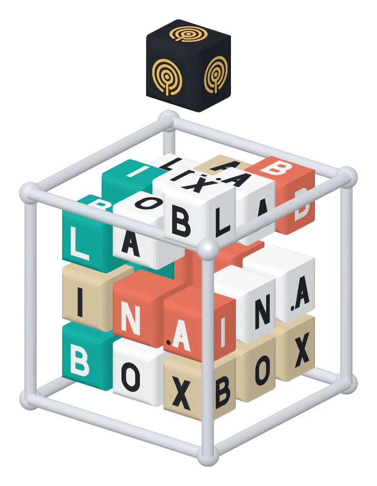
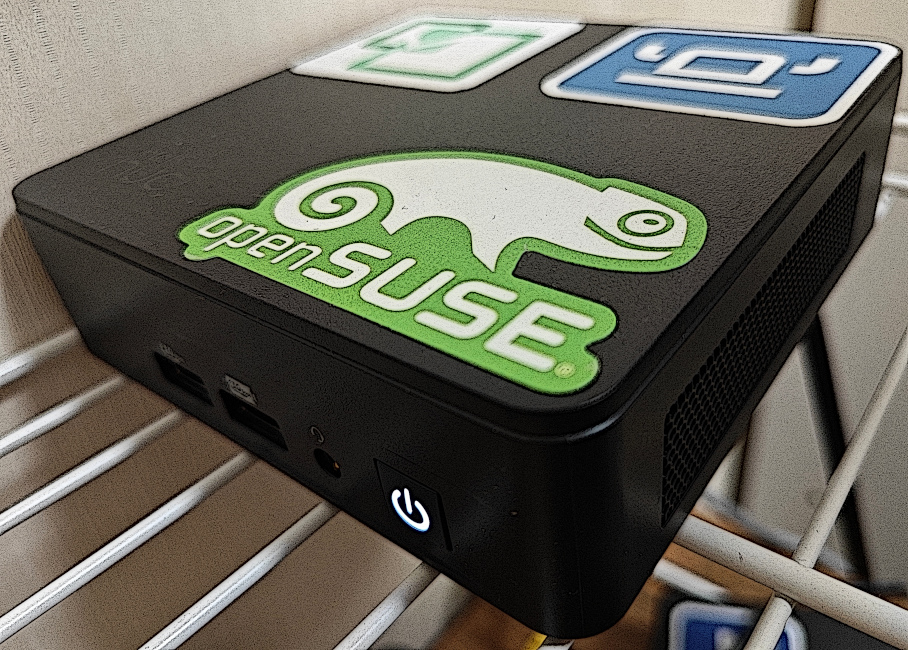
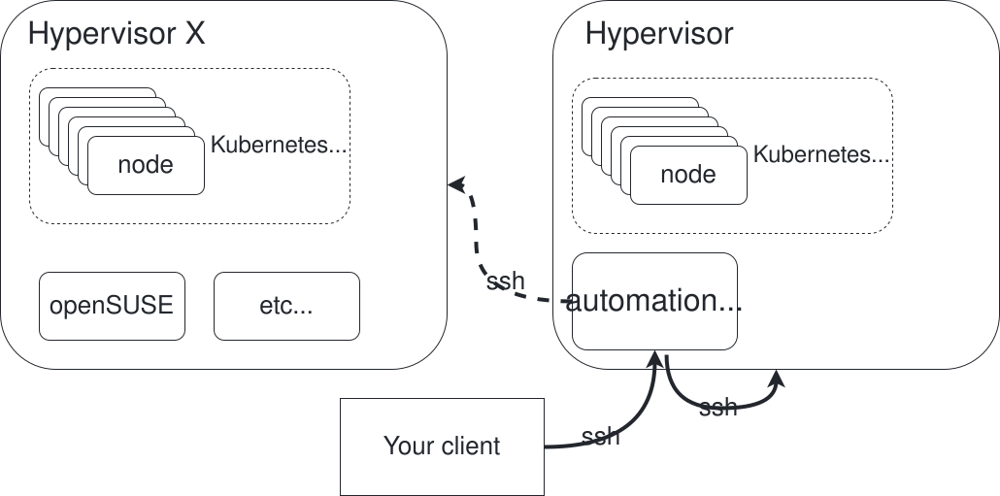
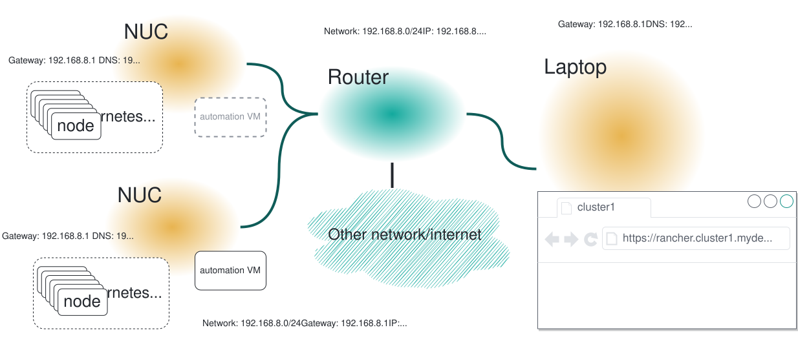
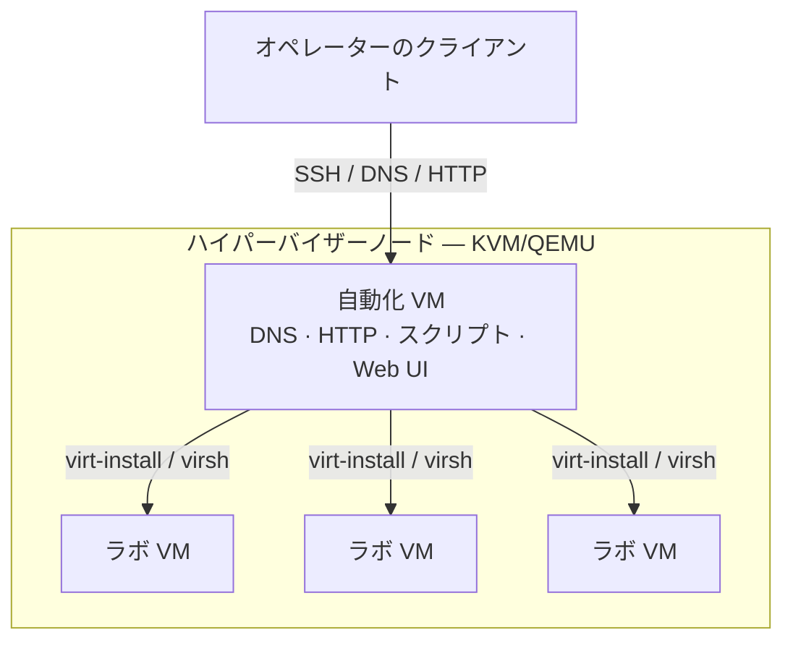
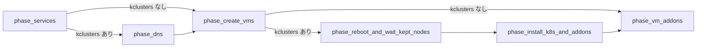
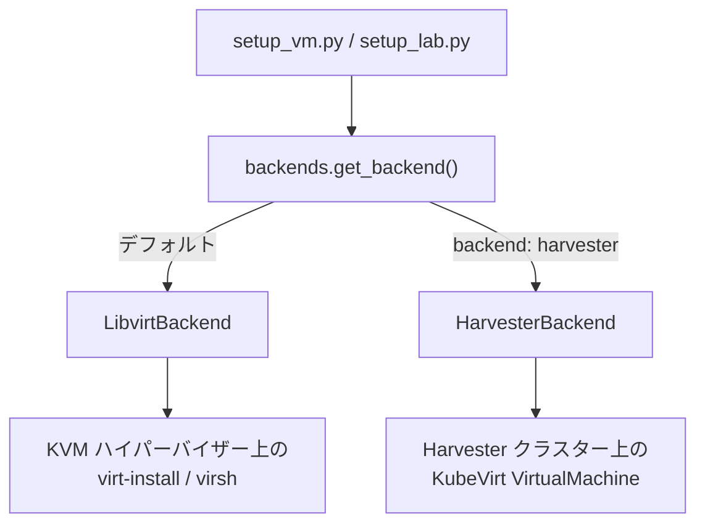
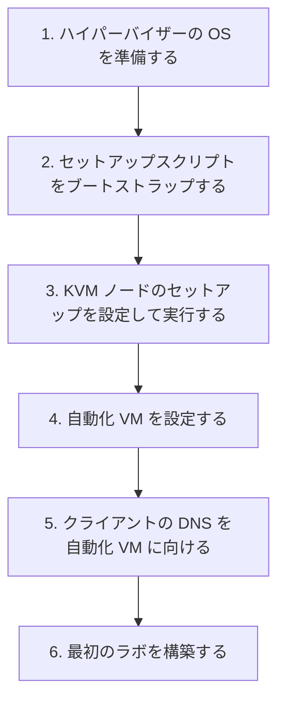
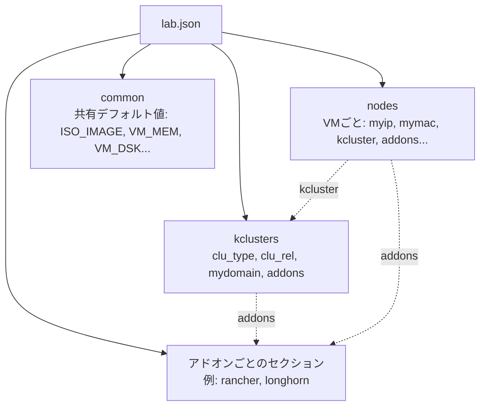

<a id="top"></a>

<p align="center">
  <a href="https://rmahique.github.io/lab-in-a-box/logo/">
    
  </a>
  <br/>
  <picture>
    <source media="(prefers-color-scheme: dark)" srcset="media/brand/logo-text-dark.png">
    
  </picture>
</p>

<p align="center">
  <a href="https://github.com/SUSE-Technical-Marketing/lab-in-a-box/actions/workflows/ci.yml"></a>
  
  
  
  
</p>

<p align="center">
  <sub>🌐 <a href="README.md">English</a> · <a href="README.es.md">Español</a> · <a href="README.de.md">Deutsch</a> · <a href="README.fr.md">Français</a> · <a href="README.pt-BR.md">Português (Brasil)</a> · <a href="README.ja.md"><strong>日本語</strong></a> · <a href="README.zh-CN.md">简体中文</a></sub>
</p>

> *これはコミュニティによる翻訳です。正典となる情報源は [README.md](README.md)（英語）であり、このページより新しい場合があります。*

<p align="center"><em>JSON または YAML ファイルを1つ用意するだけ。VM、DNS、Kubernetes、アドオンがすべて配線された、動作するラボが手に入る。</em></p>

<p align="center" float="left">
  <kbd></kbd>
</p>

**lab-in-a-box** は、1台のベアメタルマシンを自己完結型の「ラボ工場」に変える。欲しい VM、Kubernetes クラスター、ソフトウェアを記述した JSON または YAML ファイルを指定するだけで、DNS、プロビジョニング、クラスターの立ち上げ、アドオンまで、すべてを構築する — `virt-install` や Ansible を手で操作する必要はない。

## なぜ lab-in-a-box なのか

<table>
<tr>
<td width="50%" valign="top">

`setup_lab.py` · **JSON/YAML ファイル1つ、コマンド1つ。**
VM、Kubernetes クラスター（RKE2/K3s）、アドオンを宣言的に記述するだけ。正しい順序ですべてを構築する。

`install_<addon>` · **65種類のアドオンをすぐに利用可能。**
Rancher、Longhorn、NeuVector、Harbor、Keycloak、Jenkins、Argo CD、SUSE Multi-Linux Manager/Uyuni（アクティベーションキー、RBAC、Content Lifecycle Management、Ansible 連携など）、セキュリティトレーニング用の脆弱なデモアプリなど。

[`lab-builder`](#web-ui-lab-builder) · **動的な Web UI。**
各アドオン自身のスキーマからフォームを直接生成する — スクリプトにフィールドを追加すれば、フロントエンドを一切変更せずに UI がそれを取り込む。

</td>
<td width="50%" valign="top">

`KVM_HOSTS` · **マルチハイパーバイザー対応。**
1つのラボ定義で複数の KVM ホストに VM を分散配置できる。空き CPU/RAM/ディスクによる自動選択、またはノードごとの固定指定が可能。

`podman` · **完全にコンテナ化されたテストスイート。**
すべてのチェックが使い捨てのコンテナで実行され、pre-commit フックに組み込まれている。

`config_method` · **差し替え可能なプロビジョニング。**
Ignition+Combustion（SLE Micro）、cloud-init（openSUSE/Ubuntu）、`virt-customize`（cloud-init/Ignition 未対応の古いディストリビューション向け）、またはスクリプト化された ISO インストール（AutoYaST/Kickstart/Preseed/AutoInstall）。

</td>
</tr>
</table>

---

## 目次

- [アーキテクチャ](#architecture)
- [動作の仕組み](#how-it-works)
- [クイックスタート](#quick-start)
- [Web UI（lab-builder）](#web-ui-lab-builder)
- [ラボ定義フォーマット](#lab-definition-format)
- [例](#examples)
- [ステップバイステップ・ウォークスルー](#step-by-step-walkthroughs)
- [利用可能なコマンド](#available-commands)
- [利用可能なアドオン](#available-addons)
- [設定リファレンス](#configuration-reference)
- [テスト](#testing)
- [貢献 / 開発環境のセットアップ](#contributing--developer-setup)

<p align="right"><a href="#top">↑ トップへ戻る</a></p>

---

<a id="architecture"></a>
## アーキテクチャ

<p align="center" float="left">
  <kbd><picture><source media="(prefers-color-scheme: dark)" srcset="media/diagram1-dark.svg"></picture></kbd>
  <kbd><picture><source media="(prefers-color-scheme: dark)" srcset="media/diagram2-dark.svg"></picture></kbd>
</p>

このシステムは **2階層アーキテクチャ** を中心に構築されている：



### ハイパーバイザーノード

KVM/QEMU を実行する1台以上の物理・ベアメタルマシン。それぞれがラボの VM をホストし、`/var/lib/libvirt/images/sources/` に元となる QCOW2 イメージを保持する。NUC、ワークステーション、あるいは KVM を実行できる任意の x86_64 マシンであればよい。1台では容量が足りないラボは **複数の KVM ホスト** にまたがることができる — 詳細は下記の[マルチホストラボ](#multi-host-labs)を参照。

### 自動化 VM

ハイパーバイザー上で動作し、ラボ全体のコントロールプレーンとして機能する小さな VM。以下を提供する：

- **DNS** — BIND（`named`）がラボドメインを提供し、外部リクエストを転送する。そのため、これを参照するどのクライアントからでもラボ内のすべてのホスト名が解決できる
- **HTTP** — プロビジョニングファイル（Ignition、Combustion、cloud-init）を `/srv/www/htdocs/lab_creation/` で配信する
- **スクリプト** — すべてのラボ管理コマンドが `/usr/local/bin/` にインストールされている
- **Web UI**（任意）— [lab-builder](#web-ui-lab-builder)、ブラウザベースの lab.json デザイナー

すべてのユーザーコマンドは **自動化 VM 上で** 実行される。自動化 VM はハイパーバイザーと作成された VM に SSH で接続する。初期セットアップ後は、ハイパーバイザーへの直接アクセスは不要。

### 内部の仕組み

コマンドラインツールと各アドオンはすべて Python 3.11 で書かれており、`libs/` と `scripts/` に存在し、`/usr/local/lib/lab_creation/` にインストールされる — 互いに依存し合うのではなく、少数の共有ライブラリモジュール（`lab_creation.py`、`backends.py`、`services.py`、`spacecmd_common.py` など）を中心に構成されている。VM 作成は差し替え可能な `VMBackend` インターフェース（現在は `LibvirtBackend`）の背後にあり、同じオーケストレーションコードが将来的に他の仮想化バックエンド（KubeVirt、Harvester）を、アドオンに手を加えることなく対象にできるようになっている。1つのレガシーアドオン（`install_ds389`）はまだ純粋な bash のままだ — これは Python 移植より前からあり、bash の時点ですでに壊れていたため、移植する価値がなかった。これらが置き換えた bash 時代の実装は `legacy_bash/` 以下にアーカイブされたまま残っている。

<p align="right"><a href="#top">↑ トップへ戻る</a></p>

---

<a id="how-it-works"></a>
## 動作の仕組み

### デプロイパイプライン

`setup_lab.py` は固定されたフェーズの順序で実行される。`kclusters` セクションを持たない VM のみのラボでは、Kubernetes 専用の2つのフェーズは完全にスキップされる：



### VM のプロビジョニング

各 VM は次の手順で作成される：
1. どの KVM ホストに属するかを解決する（明示的な `kvm_host` フィールド、または空き容量による自動選択 — [マルチホストラボ](#multi-host-labs)を参照）
2. そのホスト上で元となる QCOW2 イメージをコピーしてリサイズする
3. `config_method` に従ってテンプレートからプロビジョニングファイルを生成する
4. BIND に DNS エントリを登録する
5. ハイパーバイザー上で SSH 経由で `virt-install` を実行する
6. SSH が利用可能になるまで待機する

プロビジョニング方式はラボ JSON の `config_method`（ノードごと、または `common`）で制御される：

| 値 | 方式 | 用途 |
|---|---|---|
| _(空、デフォルト)_ | Ignition + Combustion | SLE Micro |
| `cloud-init` | cloud-init ISO | openSUSE Leap、Ubuntu |
| `virt_customize` | ハイパーバイザー上で QCOW2 を直接変更する（`virt-customize`）— ゲスト側で Ignition/cloud-init のサポートは不要 | CentOS 7、古い Debian/RHEL、または Ignition/cloud-init を持たない任意のイメージ |
| `install_iso` | 実際のインストーラー ISO からのスクリプト化インストール（`install_type` に応じて AutoYaST、Kickstart、Preseed、AutoInstall） | 他にプロビジョニング手段のないディストリビューション |

### VM バックエンド

どのハイパーバイザー技術が実際にノードを作成するかは、ノードごとに一度だけ解決される差し替え可能な `VMBackend` インターフェースによって決まる（そのノードの設定で `backend: harvester` を指定すると `HarvesterBackend` が選ばれ、それ以外はデフォルトで `LibvirtBackend` が使われる）。どのアドオンやオーケストレーションスクリプトも、解決されたバックエンドがどちらであっても同じ方法でやり取りする：



### Kubernetes のセットアップ

VM が立ち上がると、`setup_lab.py` は JSON の `kclusters` セクションに従って各ノードに Kubernetes をインストールする。RKE2 と K3s の両方をサポートする。クラスターの準備が整うと、そのアドオンが順番に実行される。VM レベルのアドオン（クラスターではなく単一ノードに紐づくもの）は、そのノードがプロビジョニングされた後に実行される。

### マルチホストラボ

<a id="multi-host-labs"></a>
ラボは1つのハイパーバイザーに限定されない。自動化 VM 上の `/etc/lab_creation.cfg` に `KVM_HOSTS`（スペース区切り）を設定すると、複数のハイパーバイザーを利用できるようになる：

```ini
KVM_HOSTS="hv1.mydemo.lab hv2.mydemo.lab hv3.mydemo.lab"
```

その後、ラボ JSON の各ノードについて、次のいずれかを選べる：
- **明示的に固定する** — そのノードの設定に `"kvm_host": "hv2.mydemo.lab"` を指定する、または
- **自動選択させる** — `kvm_host` を省略する。ノードは、その時点で十分な空き CPU/RAM/ディスクを持つ設定済みホスト（SSH でライブに確認される）に配置される。

`kvm_host` を指定しないノードや、設定済みホストが1つしかないマシンは、この機能が存在する前とまったく同じように動作する — シングルハイパーバイザーのラボでは何も変わらない。

### ライブラリの読み込み順序

各スクリプトは次の順序で設定を読み込む：

1. `/etc/lab_creation.defaults` — システム全体のデフォルト、パス、パッケージリスト
2. `/usr/local/lib/lab_creation/primary.py` — 入力検証、設定の読み込み
3. `/etc/lab_creation.cfg` — ノード固有の設定（`REMOTE_HOST`、`ROOT_SSH_KEY`、`VIRT_SRV`、`KVM_HOSTS` など）
4. `/usr/local/lib/lab_creation/lab_creation.py` — VM、DNS、オーケストレーション関数
5. `/usr/local/lib/lab_creation/k8s.py` — Kubernetes クラスター関数

<p align="right"><a href="#top">↑ トップへ戻る</a></p>

---

<a id="quick-start"></a>
## クイックスタート



### 必要条件

- KVM を実行できるマシン（Intel VT-x または AMD-V が有効）
- パッケージとイメージのダウンロード用のインターネットアクセス（またはローカルミラー）
- 選択した OS の QCOW2 イメージを、ハイパーバイザー上の `/var/lib/libvirt/images/sources/` に配置しておくこと

> [!IMPORTANT]
> 自動化 VM には具体的に `python3.11` が必要 — ツールチェーンは明示的にこのバージョンに固定されている。ほとんどのディストリビューションはこれとは別に、より古いデフォルトの `python3` を同梱している。インストールスクリプトは `python3.11` が見つからない場合、処理を続行しない。

テスト済みイメージ：
- [SLE Micro](https://www.suse.com/download/sle-micro/) — 推奨。Ignition+Combustion で使用
- openSUSE Leap Micro — サポート対象。cloud-init で使用

### ステップ1 — ハイパーバイザーの OS を準備する

ハードウェアに SLES（または他の KVM 対応 Linux）をインストールする。インストール時には次を選択する：
- **ネットワーク**：メインの NIC に紐づく静的 IP 付きのブリッジインターフェース（`br0`）を作成する
- **システムロール**：KVM Virtualization Host

<details>
<summary>Linux から起動可能な USB を作成する</summary>

```shell
# USB を挿す前に：
cat /proc/partitions > /tmp/partb4

# USB を挿してから：
cat /proc/partitions > /tmp/parta

# 新しいデバイスを見つける：
diff /tmp/part*
```

> [!WARNING]
> 次のコマンドは対象デバイスの**すべてのデータを破壊する**。実行する前に、上記の `diff` の出力と `sdX` を必ず照合すること。

```shell
# ISO を書き込む（sdX を自分のデバイスに置き換える）：
dd if=SLE-15-SP6-Online-x86_64-GM-Media1.iso of=/dev/sdX bs=4k && sync
```

</details>

### ステップ2 — セットアップスクリプトをブートストラップする

ハイパーバイザーへの SSH アクセスを持つ任意の Linux マシンから：

```shell
curl https://raw.githubusercontent.com/SUSE-Technical-Marketing/lab-in-a-box/main/install_demo_server_scripts.sh | bash -
```

これによりセットアップスクリプトが `/var/tmp/setup_demo_server/` にダウンロードされる。

### ステップ3 — KVM ノードのセットアップを設定して実行する

<a id="step-3--configure-and-run-the-kvm-node-setup"></a>

```shell
cd /var/tmp/setup_demo_server/setup_demo_server/
vim lab.cfg
```

`lab.cfg` の主な設定：

| 設定 | 説明 |
|---|---|
| `ROOT_PWD_HASH` | root パスワードのハッシュ — `mkpasswd --method=SHA-512 --stdin` で生成 |
| `ROOT_SSH_PUB_KEY` | パスワードなしアクセス用の自分の SSH 公開鍵 |
| `AUTOMATION_HOSTNAME` | 自動化 VM のホスト名（例：`automation.mydemo.lab`） |
| `_QCOW_IMAGE` | 元となる QCOW2 イメージのファイル名 |
| ネットワーク設定 | ラボネットワーク用の IP、ゲートウェイ、マスク、DNS |

その後、セットアップを実行する（`<IP>` をハイパーバイザーの IP に置き換える。ローカルの場合は省略）：

```shell
./setup_kvm_node.py <IP>
```

これにより自動化 VM がプロビジョニングされ、必要なすべてのサービスが起動する。

### ステップ4 — 自動化 VM を設定する

SSH で自動化 VM に接続し、ラボスクリプトをインストールする：

```shell
ssh <AUTOMATION_HOSTNAME>
./install_automation_node_scripts.sh

cp /etc/lab_creation.cfg.example /etc/lab_creation.cfg
vim /etc/lab_creation.cfg
```

`lab_creation.cfg` の主な設定：

| 設定 | 説明 |
|---|---|
| `REMOTE_HOST` | （プライマリの）KVM ハイパーバイザーのホスト名または IP |
| `KVM_HOSTS` | _(任意)_ [マルチホストラボ](#multi-host-labs)向けの追加ハイパーバイザーのスペース区切りリスト |
| `ROOT_SSH_KEY` | VM に注入する SSH 公開鍵の内容 |
| `VIRT_SRV` | libvirt 接続 URI（例：`qemu+ssh://root@hypervisor/system`） |
| `NETWORK` | VM 用のデフォルト libvirt ネットワーク（例：`bridge=br0`） |

### ステップ5 — クライアントの DNS を自動化 VM に向ける

<a id="step-5--point-your-client-dns-at-the-automation-vm"></a>

自分のデスクトップからホスト名を解決できるようにするには：

```shell
# Linux（NetworkManager）：
nmcli con mod <connection> ipv4.dns <AUTOMATION_IP>

# または /etc/resolv.conf に追加：
nameserver <AUTOMATION_IP>
```

### ステップ6 — 最初のラボを構築する

```shell
setup_lab.py examples/cluster.json.template
```

他の出発点については下記の[例](#examples)を参照するか、JSON を手書きする代わりに [Web UI](#web-ui-lab-builder) を開く。

<p align="right"><a href="#top">↑ トップへ戻る</a></p>

---

<a id="web-ui-lab-builder"></a>
## Web UI（lab-builder）

**プロジェクト自身の Python ライブラリを実行時にイントロスペクトする**、ブラウザベースの `lab.json` デザイナー — アドオンについてハードコードされた知識は一切持たない。コンポーネントを選ぶと、そのコンポーネント自身のスキーマから直接フォームが生成される。スクリプトにフィールドを追加すれば、フロントエンドを変更せずに UI に表示される。

```shell
# 試す最も速い方法 — Python 以外の依存関係は不要：
python3.11 webui/run-local.py            # → http://localhost:8677/
```

本番デプロイ（Apache、または init に依存しないスタンドアロンの systemd サービス、および冪等に生成される自己署名証明書による HTTPS）については **[README.webui.md](README.webui.md)** を参照 — 3つのデプロイモード、HTTP API、トラブルシューティングをすべてカバーしている。

<p align="right"><a href="#top">↑ トップへ戻る</a></p>

---

<a id="lab-definition-format"></a>
## ラボ定義フォーマット

ラボは JSON または YAML ファイルとして定義される（自動検出 — 下記の注記を参照）。現在のフォーマットは、ラボごとに複数の Kubernetes クラスター（`kclusters`）をサポートしている。従来のシングルクラスター形式（`cluster`）については `examples/cluster.json.template` を参照。



```jsonc
{
  "nodes": {
    "node101.mydemo.lab": {
      "myip":  "192.168.88.101",
      "mymac": "34:8a:b1:4b:1a:c1",
      "INSTALL_RKE2_TYPE": "server",   // "server" または "agent"
      "kcluster": "cluster1"           // このノードがどの kclusters エントリに属するか
    },
    "node102.mydemo.lab": {
      "myip":  "192.168.88.102",
      "mymac": "34:8a:b1:4b:1a:c2",
      "INSTALL_RKE2_TYPE": "agent",
      "kcluster": "cluster1"
    }
  },
  "common": {
    "ISO_IMAGE":  "SL-Micro.x86_64-6.1-Default-qcow-GM.qcow2",
    "VM_MEM":     "24576",
    "VM_DSK":     "80",
    "VM_CPU":     "6",
    "VM_BOOT":    "uefi",             // uefi（デフォルト）、firmware=bios、bios、uefi=off
    "mymask":     "24",
    "mygw":       "192.168.88.1",
    "mydns":      "192.168.88.73",
    "mynet_reverse": "88.168.192"
  },
  "kclusters": {
    "cluster1": {
      "clu_type":  "rke2",             // "rke2" または "k3s"
      "clu_rel":   "stable",
      "mydomain":  "mydemo.lab",
      "addons": ["rancher", "longhorn"]
    }
  },
  "rancher": {
    "rancher_shorthn":   "rancher",
    "rancher_rel":       "rancher-prime",
    "rancher_repo_url":  "https://charts.rancher.com/server-charts/prime",
    "rancher_helm_rel":  "rancher",
    "rancher_helm_chart": "rancher-prime/rancher",
    "rancher_Version":   "--version 2.13.3",
    "cert_manager_ver":  "--version v1.14.4"
  }
}
```

<details>
<summary>同じラボを YAML で書くと</summary>

```yaml
nodes:
  node101.mydemo.lab:
    myip: "192.168.88.101"
    mymac: "34:8a:b1:4b:1a:c1"
    INSTALL_RKE2_TYPE: server   # "server" または "agent"
    kcluster: cluster1          # このノードがどの kclusters エントリに属するか
  node102.mydemo.lab:
    myip: "192.168.88.102"
    mymac: "34:8a:b1:4b:1a:c2"
    INSTALL_RKE2_TYPE: agent
    kcluster: cluster1

common:
  ISO_IMAGE: SL-Micro.x86_64-6.1-Default-qcow-GM.qcow2
  VM_MEM: "24576"
  VM_DSK: "80"
  VM_CPU: "6"
  VM_BOOT: uefi                # uefi（デフォルト）、firmware=bios、bios、uefi=off
  mymask: "24"
  mygw: "192.168.88.1"
  mydns: "192.168.88.73"
  mynet_reverse: "88.168.192"

kclusters:
  cluster1:
    clu_type: rke2              # "rke2" または "k3s"
    clu_rel: stable
    mydomain: mydemo.lab
    addons: [rancher, longhorn]

rancher:
  rancher_shorthn: rancher
  rancher_rel: rancher-prime
  rancher_repo_url: https://charts.rancher.com/server-charts/prime
  rancher_helm_rel: rancher
  rancher_helm_chart: rancher-prime/rancher
  rancher_Version: "--version 2.13.3"
  cert_manager_ver: "--version v1.14.4"
```

</details>

ノードレベルの任意フィールド：

| フィールド | 説明 |
|---|---|
| `addons` | このVMだけに対して実行するアドオンスクリプトのリスト |
| `config_method` | プロビジョニング方式を上書きする（`cloud-init`、`virt_customize`、`install_iso`） |
| `kvm_host` | [マルチホストラボ](#multi-host-labs)において、このVMを特定のハイパーバイザーに固定する |
| `extra_dsk` | 追加でアタッチするディスク — `"/dev/sdb"`、またはディスクごとにデフォルトのバスを上書きする `"/dev/sdb,bus=scsi"` |
| `salt_states` | 適用する Salt state（cloud-init 方式のみ） |

kcluster の任意フィールド：

| フィールド | 説明 |
|---|---|
| `mgm_node` | クラスターのアドオンインストーラーを実行するノードのホスト名。デフォルトは最初のサーバーノード |

各アドオンスクリプトは `--schema`（`--input-definition` のエイリアス）もサポートしており、自身の設定キーを機械可読な JSON または YAML で出力する — これは [Web UI](#web-ui-lab-builder) がフォームを構築する際に読み取るのと同じスキーマである：

```shell
install_longhorn --schema
setup_lab.py --input-definition yaml   # 基本トポロジースキーマ（common/nodes/kclusters）
```

<p align="right"><a href="#top">↑ トップへ戻る</a></p>

---

<a id="examples"></a>
## 例

### 最小のシングル VM ラボ

可能な限り最小のラボ — Kubernetes なしの VM 1台：

```jsonc
{
  "nodes": {
    "standalone.mydemo.lab": { "myip": "192.168.88.50" }
  },
  "common": {
    "ISO_IMAGE": "SL-Micro.x86_64-6.1-Default-qcow-GM.qcow2",
    "VM_MEM": "4096", "VM_DSK": "40", "VM_CPU": "2",
    "mymask": "24", "mygw": "192.168.88.1", "mydns": "192.168.88.73"
  }
}
```

```shell
setup_lab.py standalone.json
```

### RKE2 + Rancher + Longhorn（"hello world" クラスター）

管理プラットフォームと分散ストレージを備えた2ノードクラスター — 完全な例は上記の[ラボ定義フォーマット](#lab-definition-format)を参照。

```shell
setup_lab.py rancher-cluster.json
# 後で再実行し、すでに起動していて到達可能な VM はスキップする：
setup_lab.py --keep rancher-cluster.json
```

### クラスターを2つのホストに分散させる

サーバーを1つのハイパーバイザーに固定し、エージェントは空きのある[設定済みホスト](#multi-host-labs)に自動配置させる：

```jsonc
{
  "nodes": {
    "srv1.mydemo.lab":   { "myip": "192.168.88.10", "kvm_host": "hv1.mydemo.lab", "kcluster": "prod" },
    "agent1.mydemo.lab": { "myip": "192.168.88.11", "kcluster": "prod" },
    "agent2.mydemo.lab": { "myip": "192.168.88.12", "kcluster": "prod" }
  },
  "common": { "ISO_IMAGE": "SL-Micro.x86_64-6.1-Default-qcow-GM.qcow2", "VM_MEM": "8192", "VM_DSK": "60", "VM_CPU": "4" },
  "kclusters": { "prod": { "clu_type": "rke2", "clu_rel": "stable", "mydomain": "mydemo.lab" } }
}
```

### SUSE Multi-Linux Manager（Uyuni）サーバー + 登録済みクライアント

アクティベーションキー付きの Uyuni サーバーを立ち上げ、2台目の VM をそれに対する Salt クライアントとして登録する — 機能の全体像（`orgs`、RBAC、Content Lifecycle Management、Ansible 連携など）は[利用可能なアドオン](#available-addons)を参照：

```jsonc
{
  "nodes": {
    "uyuni.mydemo.lab":  { "myip": "192.168.88.30", "addons": ["uyuni"] },
    "client1.mydemo.lab": { "myip": "192.168.88.31", "addons": ["client_registration"] }
  },
  "common": { "ISO_IMAGE": "SL-Micro.x86_64-6.1-Default-qcow-GM.qcow2", "VM_MEM": "8192", "VM_DSK": "60", "VM_CPU": "4" },
  "uyuni": {
    "uyuni_admin": "admin", "uyuni_password": "Uyuni12345",
    "uyuni_activation_key": "1-lab-clients", "uyuni_activation_key_base_channel": "sle-micro-6.1-pool"
  },
  "client_registration": {
    "client_registration_server_type": "uyuni",
    "client_registration_server": "uyuni.mydemo.lab",
    "client_registration_activation_key": "1-lab-clients"
  }
}
```

<p align="right"><a href="#top">↑ トップへ戻る</a></p>

---

<a id="step-by-step-walkthroughs"></a>
## ステップバイステップ・ウォークスルー

上記の[例](#examples)はコピー＆ペースト用の出発点である。以下の3つは、実際のシナリオを最初から最後まで完全にたどるもの — 何を実行し、各ステップで何が起こり、実際に動作したことをどう確認するか。以下の JSON フィールドとコマンドの形式はすべて、このプロジェクト自身のテストスイート（`tests/run_tests.sh`）およびソースコードと一致している。

> [!TIP]
> ウォークスルー2と3は**実機テスト済み**である — 単独で検証されただけでなく、実際のサーバー/ハードウェアに対して実行されている。

### ウォークスルー1 — 最初のクラスター：RKE2 + Rancher + Longhorn

目標：2台の SLE Micro VM、RKE2 クラスター、管理用の Rancher、ストレージ用の Longhorn — 最終的にブラウザから到達可能になる。

1. **ラボファイルを書く。** `rancher-cluster.json` として保存する（IP/ネットワークは自分のラボドメインに合わせて調整）：

   ```jsonc
   {
     "nodes": {
       "node101.mydemo.lab": {
         "myip": "192.168.88.101", "mymac": "34:8a:b1:4b:1a:c1",
         "INSTALL_RKE2_TYPE": "server", "kcluster": "cluster1"
       },
       "node102.mydemo.lab": {
         "myip": "192.168.88.102", "mymac": "34:8a:b1:4b:1a:c2",
         "INSTALL_RKE2_TYPE": "agent", "kcluster": "cluster1"
       }
     },
     "common": {
       "ISO_IMAGE": "SL-Micro.x86_64-6.1-Default-qcow-GM.qcow2",
       "VM_MEM": "24576", "VM_DSK": "80", "VM_CPU": "6",
       "mymask": "24", "mygw": "192.168.88.1", "mydns": "192.168.88.73"
     },
     "kclusters": {
       "cluster1": {
         "clu_type": "rke2", "clu_rel": "stable", "mydomain": "mydemo.lab",
         "addons": ["rancher", "longhorn"]
       }
     },
     "rancher": {
       "rancher_shorthn": "rancher", "rancher_rel": "rancher-prime",
       "rancher_repo_url": "https://charts.rancher.com/server-charts/prime",
       "rancher_helm_rel": "rancher", "rancher_helm_chart": "rancher-prime/rancher",
       "rancher_Version": "--version 2.13.3", "cert_manager_ver": "--version v1.14.4"
     }
   }
   ```

2. **構築する：**

   ```shell
   setup_lab.py rancher-cluster.json
   ```

   `setup_lab.py` は他の何かを行う前に、まずファイルを自動的にプリフライトチェックする — 誤った IP、存在しない `kcluster` への参照、`ISO_IMAGE` の欠落といった間違いは検出されて出力され（`✗ Preflight FAILED — N error(s)`）、途中まで作成が進んでから失敗するのではなく、何も作成されない。問題のないファイルは `✓ Preflight passed` を出力し、そのまま構築に進む。

   順序としては：両方のノードを DNS に登録する → 両方の VM を作成する（QCOW2 イメージをコピーし、Combustion ファイルを生成し、起動し、SSH を待つ）→ `node101` にサーバーとして RKE2 をインストールし、続いて `node102` にエージェントとしてインストールする → クラスターの管理ノード（`mgm_node`、デフォルトは最初のサーバーノード — ここでは `node101`）に `rancher` と `longhorn` をインストールする。Rancher を含む2ノードクラスターは通常15〜25分かかる。ほとんどの時間は RKE2 のブートストラップと Rancher 自身の Helm インストールに費やされる。

3. **DNS が解決することを確認する**（自分のデスクトップから、[自動化 VM の DNS を参照するよう設定した](#step-5--point-your-client-dns-at-the-automation-vm)後）：

   ```shell
   dig +short node101.mydemo.lab rancher.mydemo.lab
   ```

   両方とも `192.168.88.101` を返すはず（Rancher の ingress ホスト名は `rancher_shorthn` の値、`rancher`、をクラスターの `mydomain` の下に付けたもの）。

4. **ログインする。** `https://rancher.mydemo.lab` にアクセスし（自己署名証明書 — ブラウザが一度警告する）、自動化 VM の `/etc/lab_creation.cfg` にある `rancher_initial_pwd` でログインする。

5. **すべてを再構築せずに反復する。** ノードの設定を変更した、あるいは VM がクラッシュした場合は、`--keep` を付けて再実行する：すでに存在し、定義された IP/MAC と一致し、SSH で到達可能な VM はそのままにされる。実際に欠けているか壊れているものだけが（再）作成される：

   ```shell
   setup_lab.py --keep rancher-cluster.json
   ```

6. 終わったら**破棄する**：

   ```shell
   destroy_lab.py rancher-cluster.json
   ```

### ウォークスルー2 — 登録済みクライアントを持つ SUSE Multi-Linux Manager（Uyuni）サーバー

目標：本物のアクティベーションキーを持つ Uyuni サーバーと、それに対して自身を Salt 管理クライアントとして登録する2台目の VM。実際の Uyuni サーバーに対して**エンドツーエンドで実機テスト済み**。

1. **ラボファイルを書く** — Uyuni サーバー用に1ノード、クライアント用にもう1ノード：

   ```jsonc
   {
     "nodes": {
       "uyuni.mydemo.lab":   { "myip": "192.168.88.30", "addons": ["uyuni"] },
       "client1.mydemo.lab": { "myip": "192.168.88.31", "addons": ["client_registration"] }
     },
     "common": {
       "ISO_IMAGE": "SL-Micro.x86_64-6.1-Default-qcow-GM.qcow2",
       "VM_MEM": "8192", "VM_DSK": "60", "VM_CPU": "4",
       "mymask": "24", "mygw": "192.168.88.1", "mydns": "192.168.88.73", "mydomain": "mydemo.lab"
     },
     "uyuni": {
       "uyuni_admin": "admin", "uyuni_password": "Uyuni12345",
       "uyuni_activation_key": "1-lab-clients", "uyuni_activation_key_base_channel": "sle-micro-6.1-pool"
     },
     "client_registration": {
       "client_registration_server_type": "uyuni",
       "client_registration_server": "uyuni.mydemo.lab",
       "client_registration_activation_key": "1-lab-clients"
     }
   }
   ```

2. **構築する：**

   ```shell
   setup_lab.py uyuni-lab.json
   ```

   VM レベルのアドオン（`uyuni` と `client_registration` はどちらも、ここには `kclusters` セクションが存在しないため、クラスターではなくノードに紐づいている）は、自身のノードが立ち上がり次第実行される。`install_uyuni` はサーバーを起動し、到達可能になるまで待ってから、アクティベーションキーを作成する。続いて `install_client_registration` が `client1` をそれに対してブートストラップする — ブートストラップスクリプトをインストールして実行し、新しい minion の Salt キーが保留状態として現れるまで定期的に確認し、現れたら承認する。

3. **クライアントが実際に登録されたことを確認する。** SSH で Uyuni サーバーに接続し、直接尋ねる：

   ```shell
   ssh uyuni.mydemo.lab
   mgrctl exec 'spacecmd -- system_list'
   ```

   `client1.mydemo.lab` がリストに現れるはず。

4. `uyuni_admin`/`uyuni_password` で `https://uyuni.mydemo.lab` の**Web UI にログインする**と、同じことを視覚的に確認したり、アクティベーションキーを閲覧したり、highstate を実行したりできる。

既知のアップストリームの粗さ（このプロジェクトのバグではないが、遭遇した場合のために記載）：`salt-transactional-update` 自身のパッケージアップグレードスクリプトレットが、クライアント上の `/etc/salt/minion.d/transactional_update.conf` に重複した YAML キーを残すことがあり、手動で重複を解消するまで `salt-minion` がクラッシュループする。このリポジトリのコードはこのファイルには一切触れていない。

### ウォークスルー3 — NAT 配下の自動化 VM（ハイパーバイザーとしてのシングル NIC ラップトップ）

目標：ブリッジ用の空き NIC がないホスト上で自動化 VM をブートストラップする — 代わりに libvirt が管理するプライベートネットワークを使い、ホスト自身の実 IP から特定のポートを DNAT で転送する。使い捨ての入れ子 VM 上で**エンドツーエンドで実機テスト済み**。

これを有効にしない限り、[デフォルトのクイックスタート](#quick-start)のフローには何の変更もない — `_network_mode` はデフォルトで `"bridge"` であり、既存のあらゆるセットアップとバイト単位で同一である。

1. **`lab.cfg` で**（クイックスタートの[ステップ3](#step-3--configure-and-run-the-kvm-node-setup)）、次を設定する：

   ```ini
   _network_mode="nat"
   _nat_network_name="labnat"          # 表示されているデフォルト値 — 新しい libvirt 仮想ネットワークであり、ホストの実際の LAN ではない
   _nat_network_cidr="192.168.150.0/24" # 表示されているデフォルト値
   _nat_forwarded_ports="22:22/TCP 80:80/TCP 443:443/TCP"  # 表示されているデフォルト値 — 「<ハイパーバイザーの実IP上のポート>:<automation VM 上のポート>/<プロトコル>」
   ```

   これにより、**ハイパーバイザー自身の実際に外部到達可能な IP**（`<外部>`）上のポート 22/80/443 が、**automation VM のプライベート NAT アドレス**（`<内部>`）上の同じポートへ転送される — この時点でこのプライベートネットワーク上で待ち受けているのは automation VM だけなので、ここでの「内部」は常に「automation VM 上」を意味する。（後述のステップ5では、同じ `<外部>:<内部>/<プロトコル>` という構文を再利用して、代わりに *lab* VM（作成済みのもの）へ転送する — その場合の「内部」は automation VM ではなく、そのラボ VM 自身のプライベート NAT アドレスを指す。）

2. **いつも通りセットアップを実行する：**

   ```shell
   ./setup_kvm_node.py
   ```

   これにより、ブリッジの代わりに libvirt ネットワーク `labnat`（NAT 化されており、DHCP/ゲートウェイは libvirt 自身が処理する — libvirt 組み込みの `default` ネットワークと同じ仕組みで、名前と CIDR だけがこのプロジェクト独自のものになっている）が定義され、続いてそのプライベート範囲内の静的 IP を持つ自動化 VM がその上に作成され、その後、上記の3つのポートがホスト自身の実 IP から DNAT で転送される。

3. **ネットワークと転送ルールが存在することを確認する**（ハイパーバイザー上で）：

   ```shell
   virsh net-list                              # labnat: active
   iptables -t nat -L LAB_PORTFWD -n -v         # 自動化 VM のプライベート IP への DNAT ルール
   iptables -L LAB_PORTFWD_FWD -n -v            # FORWARD チェーンに対応する ACCEPT ルール
   ```

4. **ハイパーバイザーの外部から自動化 VM に到達する**。使うのはハイパーバイザー自身の実 IP であり、他のどこからもルーティングできない自動化 VM のプライベートアドレス `192.168.150.x` ではない：

   ```shell
   ssh root@<ハイパーバイザーの実IP>          # DNAT で自動化 VM の SSH（ポート22）へ転送される
   ```

   ポート80と443もデフォルトで転送される（プロビジョニングファイル用の HTTP サーバーと、[Web UI](#web-ui-lab-builder) をセットアップした後はその HTTPS リスナー）— ハイパーバイザーの実 IP を通じて同様にアクセスできる。

5. **ラボ VM 向けの転送を追加する。** 自動化 VM 自身だけでなく：そのノードに `forwarded_ports` フィールドを与え、`common.services` で一度だけ `portforward` サービスを有効にする：

   ```jsonc
   {
     "nodes": {
       "app1.mydemo.lab": {
         "myip": "192.168.150.20",
         "forwarded_ports": ["8080:80/TCP", "8443:443/TCP"]
       }
     },
     "common": { "services": ["portforward"], "...": "…common の残りはいつも通り" }
   }
   ```

   ラボ内のいずれかのノードが初めて `forwarded_ports` を宣言した時点で、`setup_lab.py`/`setup_vm.py` は同じ方法でハイパーバイザーの実 IP からこれら2つのポートを DNAT 転送する。

<p align="right"><a href="#top">↑ トップへ戻る</a></p>

---

<a id="available-commands"></a>
## 利用可能なコマンド

すべてのコマンドは**自動化 VM 上で**実行され、最初の引数としてラボ定義の JSON ファイルを取る。

| コマンド | 説明 |
|---|---|
| `setup_lab.py [--keep] <lab.json>` | すべての VM を作成し、Kubernetes クラスターをセットアップし、クラスターレベルおよび VM レベルのすべてのアドオンを順番にインストールする。`--keep` は、すでに存在し、定義された IP/MAC と一致し、SSH で到達可能な VM をスキップする — これを指定しない場合、すべての VM が破棄され再作成される。 |
| `setup_vm.py <lab.json> <hostname>` | 単一の VM を作成または再作成する |
| `destroy_vm.py <lab.json> <hostname>` | 単一の VM を破棄する |
| `destroy_lab.py <lab.json>` | ラボ内のすべての VM を破棄する |

すべてのコマンドと、すべての `install_<addon>` スクリプトは以下をサポートする：

```shell
setup_lab.py --version              # インストール済みバージョンを表示する
install_longhorn --schema           # このアドオンの設定スキーマを表示する（JSON）
install_longhorn --schema yaml      # ...または YAML
```

<p align="right"><a href="#top">↑ トップへ戻る</a></p>

---

<a id="available-addons"></a>
## 利用可能なアドオン

アドオンは kcluster またはノードの `addons` 配列に名前で参照される。対応する `install_<name>` スクリプトが `PATH` 上に存在する必要がある。

<sub>ジャンプ: <a href="#addons-k8s">Kubernetes & GitOps</a> · <a href="#addons-security">セキュリティ & コンプライアンス</a> · <a href="#addons-suma">SUSE Multi-Linux Manager / Uyuni</a> · <a href="#addons-storage">ストレージ & データベース</a> · <a href="#addons-collaboration">コラボレーション & ファイル共有</a> · <a href="#addons-cicd">CI/CD & ツール</a> · <a href="#addons-ai">AI / ML</a> · <a href="#addons-virt">仮想化</a> · <a href="#addons-demos">デモアプリケーション</a> · <a href="#addons-games">ゲーム</a></sub>

<a id="addons-k8s"></a>
<details open>
<summary><strong>Kubernetes プラットフォーム & GitOps</strong></summary>

| アドオン名 | 説明 |
|---|---|
| [`rancher`](https://www.rancher.com/) | SUSE Rancher Prime Kubernetes 管理プラットフォーム |
| [`longhorn`](https://longhorn.io/) | SUSE Longhorn 分散ブロックストレージ |
| [`harbor`](https://goharbor.io/) | コンテナレジストリ |
| [`argocd`](https://argo-cd.readthedocs.io/) | Argo CD GitOps コントローラー |
| [`kubewarden`](https://www.kubewarden.io/) | Kubernetes ポリシーエンジン |
| [`istio`](https://istio.io/) | サービスメッシュ |
| [`linkerd`](https://linkerd.io/) | サービスメッシュ |
| [`traefik`](https://traefik.io/) | Ingress コントローラー |
| [`nginx`](https://nginx.org/) | Ingress コントローラー / リバースプロキシ |
| [`coredns`](https://coredns.io/) | クラスター DNS |
| [`kucero`](https://github.com/SUSE/kucero) | Kubernetes クラスター証明書のローテーション |
| [`fluid`](https://fluid-cloudnative.github.io/) | クラウドネイティブワークロード向けのデータオーケストレーション/キャッシュ |
| [`suse_observability`](https://www.suse.com/products/suse-observability/) | SUSE Observability（StackState ベースのメトリクス/トレース/トポロジー） |
| [`agones`](https://agones.dev/) | 専用ゲームサーバーのホスティング/スケーリング（agones.dev） |
</details>

<a id="addons-security"></a>
<details open>
<summary><strong>セキュリティ & コンプライアンス</strong></summary>

| アドオン名 | 説明 |
|---|---|
| [`neuvector`](https://open-docs.neuvector.com/) | SUSE NeuVector コンテナセキュリティプラットフォーム |
| [`nv_testing`](https://open-docs.neuvector.com/testing/testing) | NeuVector セキュリティテストワークロード（nginx/node/redis pod） |
| [`nv-demo-helm`](https://open-docs.neuvector.com/) | NeuVector の Helm ベースのデモワークロード |
| [`complianceascode`](https://complianceascode.github.io/) | OpenSCAP/ComplianceAsCode オペレーター |
| [`keycloak`](https://www.keycloak.org/) | アイデンティティ・アクセス管理 |
| [`kagent`](https://kagent.dev/) | Kubernetes 向けエージェント型 AI セキュリティアシスタント |
| `insecure_app` | 意図的に脆弱な Web アプリケーション（デモ/トレーニング用） |
| [`struts_demo`](https://struts.apache.org/) | 脆弱な Apache Struts2 デモアプリケーション（CVE-2017-5638） |
</details>

<a id="addons-suma"></a>
<details open>
<summary><strong>SUSE Multi-Linux Manager / Uyuni</strong></summary>

| アドオン名 | 説明 |
|---|---|
| [`uyuni`](https://www.uyuni-project.org/) | Uyuni サーバー（アップストリーム）：アクティベーションキー、組織、RBAC、Content Lifecycle Management、Ansible 連携、SCAP/CVE 監査、dev/QA/prod 環境トポロジー — フィールドの完全な一覧は `install_uyuni --schema` を参照 |
| [`smlm`](https://www.suse.com/products/multi-linux-manager/) | SUSE Multi-Linux Manager サーバー — `uyuni` と同じ機能セットを Kubernetes/Helm でデプロイしたもの |
| [`smlm_proxy`](https://www.suse.com/products/multi-linux-manager/) | SMLM プロキシ |
| `client_registration` | 任意の VM を既存の `uyuni`/`smlm` サーバーの Salt クライアントとして登録する（アクティベーションキーによるブートストラップ + salt キーの承認） |
| [`suma`](https://www.suse.com/products/multi-linux-manager/) | SUSE Multi-Linux Manager（SUMA）。`mgradm` を使って OS 上に直接インストールされる — Kubernetes ではない |
| [`ansible_control_node`](https://documentation.suse.com/multi-linux-manager/5.1/en/docs/administration/ansible-setup-control-node.html) | 実際の Ansible コントロールノードをプロビジョニングする：`ansible-core` をインストールし、サンプルの Playbook と `uyuni`/`smlm` 自身のシステム一覧を問い合わせる動的インベントリスクリプトを配置し、ラボの他のノードへの SSH アクセスを設定する。`uyuni`/`smlm` 自身の `*_ansible_control_nodes` フィールドと連携し、サーバー側の「Ansible Control Node」エンタイトルメントを有効化する |
</details>

<a id="addons-storage"></a>
<details open>
<summary><strong>ストレージ & データベース</strong></summary>

| アドオン名 | 説明 |
|---|---|
| [`mariadb`](https://mariadb.org/) | MariaDB データベース — Kubernetes（Helm 不使用のマニフェスト）または OS に直接インストール。OS ネイティブのパス（`libs/db_common.py`）は、同じホスト上に付随データベースを必要とする他のアドオン（`nextcloud`、`seafile`）からも直接再利用される |
| [`postgresql`](https://www.postgresql.org/) | PostgreSQL データベース — Kubernetes（Helm）または OS に直接インストール。OS ネイティブのパス（`libs/db_common.py`）は、同じホスト上に付随データベースを必要とする他のアドオン（例：`nextcloud`）からも直接再利用される |
| [`openldap`](https://www.openldap.org/) | OpenLDAP ディレクトリサービス |
| [`ds389`](https://www.port389.org/) | 389 Directory Server（LDAP） |
</details>

<a id="addons-collaboration"></a>
<details open>
<summary><strong>コラボレーション & ファイル共有</strong></summary>

| アドオン名 | 説明 |
|---|---|
| [`nextcloud`](https://nextcloud.com/) | Nextcloud — デフォルトではスタンドアロンの podman コンテナ（Kubernetes 不使用、エアギャップ環境でのアプリインストールに対応する唯一のモード）、または Kubernetes クラスター上の実際のコミュニティ Helm チャート。オプションで Talk/Groupware/Flow/Assistant アプリ、および ONLYOFFICE/Euro-Office/Collabora によるドキュメント編集連携 |
| [`seafile`](https://www.seafile.com/) | Seafile — デフォルトではスタンドアロンの podman コンテナ（Kubernetes 不使用）、または Kubernetes クラスター上の実際の公式 Helm チャート |
</details>

<a id="addons-cicd"></a>
<details open>
<summary><strong>CI/CD & 開発者向けツール</strong></summary>

| アドオン名 | 説明 |
|---|---|
| [`jenkins`](https://www.jenkins.io/) | Jenkins CI |
| [`gitlab`](https://about.gitlab.com/) | GitLab — デフォルトではスタンドアロンの Omnibus podman コンテナ（Kubernetes 不使用）、または Kubernetes クラスター上の実際の公式 Helm チャート |
| [`appcollection`](https://apps.rancher.io/) | SUSE Application Collection |
| [`stackpack`](https://www.stackstate.com/) | StackState 監視連携 |
| [`trento`](https://www.trento-project.io/) | SAP インフラストラクチャ監視 |
| [`prometheus`](https://prometheus.io/) | スタンドアロンの Prometheus サーバー（podman コンテナ、Kubernetes 不使用）— `smlm`/`uyuni` サーバー自身のバンドル済みエクスポーター（`smlm_monitoring_enabled`）またはカスタムの `prometheus_scrape_configs` ターゲットをスクレイピングする |
| [`grafana`](https://grafana.com/) | スタンドアロンの Grafana サーバー（podman コンテナ、Kubernetes 不使用）— Prometheus データソースを自動プロビジョニングし、オプションで `smlm`/`uyuni` サーバー自身のエクスポーター向けの実際の Grafana Labs コミュニティダッシュボードも設定する |
</details>

<a id="addons-ai"></a>
<details open>
<summary><strong>AI / ML</strong></summary>

| アドオン名 | 説明 |
|---|---|
| [`ollama`](https://ollama.com/) | ローカル LLM ランタイム |
| [`deepseek`](https://www.deepseek.com/) | Ollama 経由で提供される DeepSeek モデル |
| [`apertus`](https://www.swiss-ai.org/apertus) | Ollama 経由で提供される Apertus（Swiss AI Initiative）モデル |
| [`gemini`](https://ai.google.dev/gemini-api) | Google Gemini API プロキシ（LiteLLM） |
| [`anthropic`](https://www.anthropic.com/) | Anthropic Claude API プロキシ（LiteLLM） |
| [`openai`](https://openai.com/) | OpenAI API プロキシ（LiteLLM） |
| [`kimi`](https://www.moonshot.ai/) | Moonshot AI Kimi API プロキシ（LiteLLM） |
| [`open_webui`](https://openwebui.com/) | Ollama / OpenAI 互換エンドポイント向けのチャットフロントエンド |
| [`hermes`](https://github.com/NousResearch/hermes-agent) | Hermes Agent — Nous Research の自己改善型パーソナル AI エージェント（Telegram/Discord/Slack ボット + Web ダッシュボード） |
| [`suse_ai`](https://www.suse.com/solutions/artificial-intelligence/) | SUSE 独自の Ollama + Open WebUI + Milvus AI スタック |
| [`milvus`](https://milvus.io/) | Milvus ベクトルデータベース（RAG/embedding 検索） |
| [`qdrant`](https://qdrant.tech/) | Qdrant ベクトルデータベース（RAG/embedding 検索） |
| [`weaviate`](https://weaviate.io/) | Weaviate ベクトルデータベース（RAG/embedding 検索） |
| [`gpu_operator`](https://github.com/NVIDIA/gpu-operator) | NVIDIA GPU Operator（AI ワークロード向け GPU スケジューリング） |
| [`qwen`](https://qwenlm.github.io/) | Ollama 経由で提供される Qwen2.5 モデル |
| [`mistral`](https://mistral.ai/) | Ollama 経由で提供される Mistral モデル |
| [`codellama`](https://github.com/meta-llama/codellama) | Ollama 経由で提供される Code Llama モデル |
| [`starcoder2`](https://github.com/bigcode-project/starcoder2) | Ollama 経由で提供される StarCoder2 モデル |
| [`phoebe`](https://github.com/SUSE/phoebe) | （`install_phoebe --schema` を参照） |
</details>

<a id="addons-virt"></a>
<details open>
<summary><strong>仮想化</strong></summary>

| アドオン名 | 説明 |
|---|---|
| [`harvester`](https://harvesterhci.io/) | SUSE Virtualization（Harvester/KubeVirt）ノードのプロビジョニング |
| [`kiwi`](https://osinside.github.io/kiwi/) | KIWI アプライアンスビルダー |

</details>

<a id="addons-demos"></a>
<details open>
<summary><strong>デモアプリケーション</strong></summary>

| アドオン名 | 説明 |
|---|---|
| [`wordpress`](https://wordpress.org/) | WordPress + MySQL デモアプリケーション |
| [`fluentd`](https://www.fluentd.org/) | ログ集約 |
| [`mailman`](https://www.list.org/) | GNU Mailman 3 メーリングリスト管理 + Web インターフェース |
| [`mediagoblin`](https://www.mediagoblin.org/) | GNU MediaGoblin 連合型メディア公開プラットフォーム |
| [`colt`](https://gitlab.com/NalaGinrut/colt) | Colt、GNU Artanis 上の git ベースのブログエンジン |
| [`wikimusic`](https://codeberg.org/jjba23/wikimusic) | WikiMusic、GNU Artanis 上の音楽ナレッジ CMS |
| [`home_assistant`](https://www.home-assistant.io/) | Home Assistant ホームオートメーションプラットフォーム |

</details>

<a id="addons-games"></a>
<details open>
<summary><strong>ゲーム</strong></summary>

| アドオン名 | 説明 |
|---|---|
| [`supertux_classic`](https://github.com/Alzter/SuperTux-Classic) | SuperTux Classic、セルフホスト型オープンソースの Godot 製プラットフォーマー |
| [`skynet_simulator`](https://github.com/edisgreat/skynet-simulator) | Skynet Simulator、セルフホスト型オープンソースのブラウザパズル/放置ゲーム |
| [`open_saber`](https://github.com/leandrodreamer/BeepSaber) | Open Saber、セルフホスト型オープンソースのリズム/ブロック切断ゲーム |

</details>

新しいアドオンを追加するには：既存のものに倣って `scripts/install_<name>.py` を作成し（`addon_common` を読み込み、`load_definition()` で該当する JSON セクションを読み込み、SSH 経由で実際の作業を行う）、必要であれば `templates/addons/<name>/` にテンプレートを追加し、自分の JSON の `addons` 配列に `"<name>"` を記載する — `install_automation_node_scripts.sh` のデプロイループと Web UI の両方が自動的にそれを検出する。

<p align="right"><a href="#top">↑ トップへ戻る</a></p>

---

<a id="configuration-reference"></a>
## 設定リファレンス

### `/etc/lab_creation.defaults`

各スクリプトが読み込むシステム全体のデフォルト値。パス、デフォルトの待機タイマー、パッケージリストを定義する。何をしているか分かっている場合を除き、**編集しないこと**。

### `/etc/lab_creation.cfg`

自動化 VM 向けのノード固有の設定。セットアップ時に `/etc/lab_creation.cfg.example` からコピーされる。主な変数：

| 変数 | 説明 |
|---|---|
| `REMOTE_HOST` | KVM ハイパーバイザーのホスト名または IP |
| `KVM_HOSTS` | _(任意)_ [マルチホストラボ](#multi-host-labs)向けのハイパーバイザーのスペース区切りリスト。デフォルトは `REMOTE_HOST` のみ |
| `VIRT_SRV` | リモートハイパーバイザー向けの libvirt URI |
| `ROOT_SSH_KEY` | プロビジョニングされた VM に注入される SSH 公開鍵の内容 |
| `NETWORK` | デフォルトの libvirt ネットワーク文字列 |
| `REMOTE_DNS_SERVERS` | 追加で更新する DNS サーバーのスペース区切りリスト |
| `delay_min` | プロビジョニング段階間の待機分数（遅いハードウェアでは増やす） |

### `/usr/local/lib/lab_creation/`

インストールされた Python ライブラリモジュール。自動化 VM 上でリポジトリから `install_automation_node_scripts.sh` を実行することで更新される。

| ファイル | 内容 |
|---|---|
| `lab_creation.py` | VM ライフサイクル、DNS、マルチホスト解決、オーケストレーションのヘルパー |
| `backends.py` | `VMBackend` インターフェース + `LibvirtBackend`（VM の作成/削除/再起動、プロビジョニングファイルの転送） |
| `services.py` | DNS サービス管理 |
| `spacecmd_common.py` | `install_uyuni`/`install_smlm`/`install_client_registration` が使用する、共有の SUSE Multi-Linux Manager/Uyuni 自動化処理（アクティベーションキー、組織、RBAC、CLM、Ansible、SCAP/CVE） |
| `primary.py` | 入力検証と設定の読み込み |
| `k8s.py` | Kubernetes クラスターディストリビューションのインターフェース（RKE2/K3s） |
| `addon_common.py` | すべての `install_*` アドオンが使用する共通の CLI 基盤（`--help`/`--version`/`--schema` のディスパッチ、スキーマ検証） |

4つの bash ヘルパー（`lab_creation.bash`、`k8s_functions.bash`、`primary_functions.bash`、`extensions.sh`）もこれらと並行して引き続きインストールされる — Python に移植されなかった唯一のアドオンである `install_ds389` のために、無期限に保持されている。

<p align="right"><a href="#top">↑ トップへ戻る</a></p>

---

<a id="testing"></a>
## テスト

各チェックは**独立した使い捨ての `podman` コンテナ**で実行される — あるチェックのクラッシュ、ハング、残留状態が他のチェックに影響することはない：

```shell
tests/run_tests.sh
```

ツリー全体の bash と Python の構文、スキーマ/Web UI の整合性、コアライブラリとオーケストレーションスクリプトそれぞれに対する SSH をモックしたユニットテスト、実機テストで見つかったバグに対する回帰テストをカバーする。新しいチェックを追加するには、実行可能なスクリプトを `tests/checks/` に置くだけでよい — 自動的に検出され、配線は不要。

pre-commit フックに組み込まれており（クローンごとに一度有効化する。[貢献](#contributing--developer-setup)を参照）、コミットのたびに自動的に実行され、`podman` がインストールされていない場合はコミットをブロックするのではなく、警告を出してスキップする。

<p align="right"><a href="#top">↑ トップへ戻る</a></p>

---

<a id="contributing--developer-setup"></a>
## 貢献 / 開発環境のセットアップ

完全なガイド（開発環境のセットアップ、コーディング規約、アドオンの追加方法、PR プロセス）については **[CONTRIBUTING.md](CONTRIBUTING.md)**（英語）を参照。このプロジェクトは [Contributor Covenant 行動規範](CODE_OF_CONDUCT.md)に従っている。脆弱性の報告については [SECURITY.md](SECURITY.md) を参照。すべての push と pull request は [CI](https://github.com/SUSE-Technical-Marketing/lab-in-a-box/actions/workflows/ci.yml) を通過する — Python 3.11 の構文/インポートチェック、各アドオンのスキーマ、`shellcheck`、そして下記の完全なコンテナ化テストスイート。

### 一度きりの Git セットアップ

リポジトリをクローンした後、次を実行する：

```shell
git config core.hooksPath .githooks
```

これにより `.githooks/` のフックが有効になり、以下を行う：
- コミットのたびに完全な[テストスイート](#testing)を実行する
- スクリプトごとのバージョンスタンプを管理する（下記参照）

### バージョニングの仕組み

> [!NOTE]
> これは上記の Git フックによって完全に処理される — `__LABVERSION__` を手動で編集することは決してない。

各スクリプトには次のプレースホルダーが含まれる：

```python
__LABVERSION__ = "__LABVERSION__"
```

`.githooks/` 内のフックがこのプレースホルダーを自動的に展開・復元する：

| フック | トリガー | アクション |
|---|---|---|
| `post-checkout` | `git checkout` / `git switch` | 各スクリプトの `__LABVERSION__` を、そのファイルを最後に変更したコミットのハッシュに置き換える |
| `post-merge` | `git pull` / `git merge` | 上記と同じ |
| `post-rewrite` | `git rebase` / `git commit --amend` | 上記と同じ |
| `pre-commit` | `git commit` | コミットが書き込まれる前に、ステージされたスクリプト内の `__LABVERSION__` を復元し、ハッシュがリポジトリに保存されないようにする |

結果として：作業ツリー内の各スクリプトは `--version` を通じて自身のバージョンを表示し、リポジトリ自体は常にクリーンなプレースホルダーを保持する。`install_automation_node_scripts.sh` 経由でスクリプトをインストールする際は、`git log -1 --format=%h` を使って同じファイルごとのハッシュ置換がインストール時に適用される。

### 自動化 VM へのスクリプトのインストール

自動化 VM 上のリポジトリのルートから（またはリポジトリをクローンした任意のマシンから）：

```shell
./install_automation_node_scripts.sh
```

これにより、既存のインストールがバックアップされ（タイムスタンプ付きの独自のアーカイブと、別途、自分自身のバックアッププロセスが保持するものの両方）、各スクリプト/ライブラリ/テンプレートがシステムパスにコピーされ、インストールされた各ファイルにバージョンハッシュがスタンプされる。

### 依存関係

実行時（自動化 VM 上）：
`python3.11`、`jq`、`ssh`、`rsync`、`nc`、`helm`、`kubectl`、`named`（BIND）

ハイパーバイザーのセットアップにはさらに以下が必要：
`virt-install`、`virsh`、`qemu-img`、`zypper`、`/var/lib/libvirt/images/sources/` 内の元となる QCOW2 イメージ

[テストスイート](#testing)の実行にはさらに以下が必要：
`podman`
