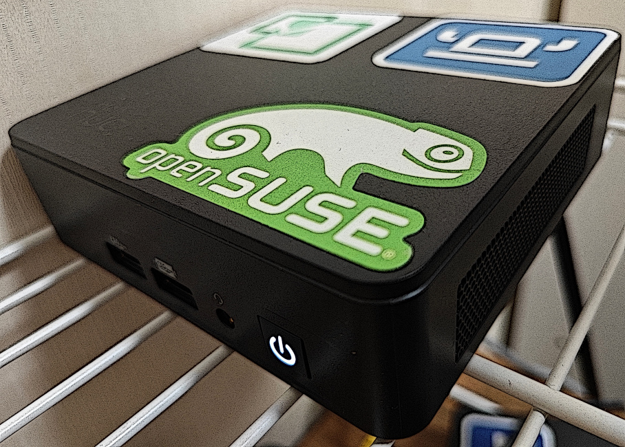
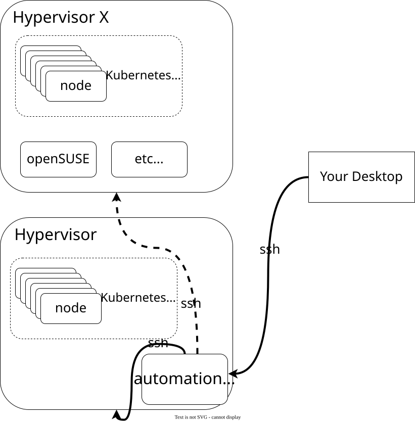
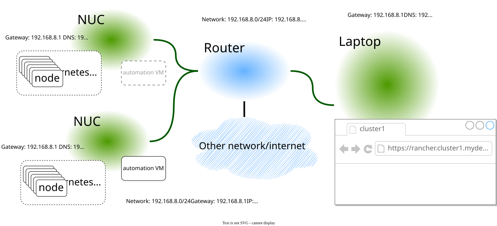
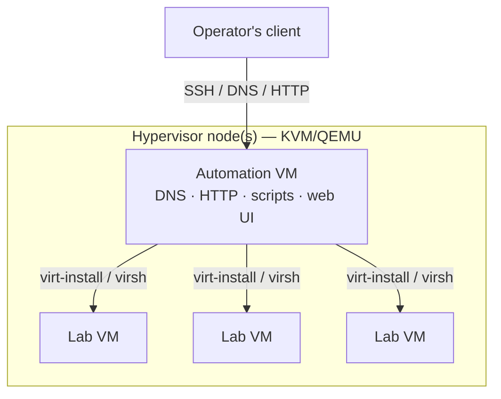
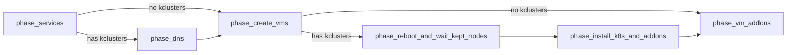
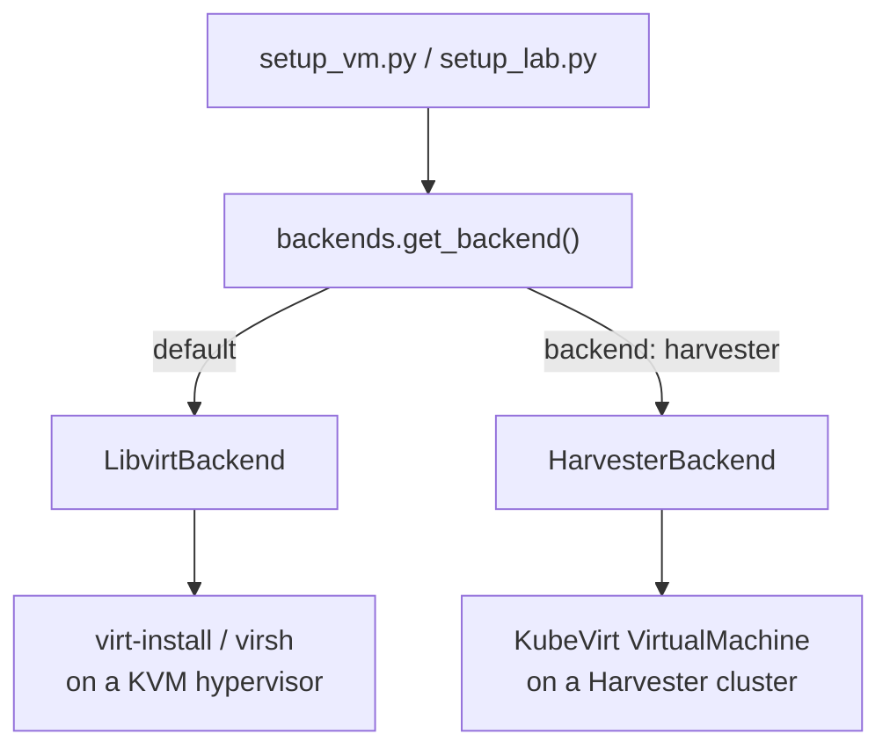
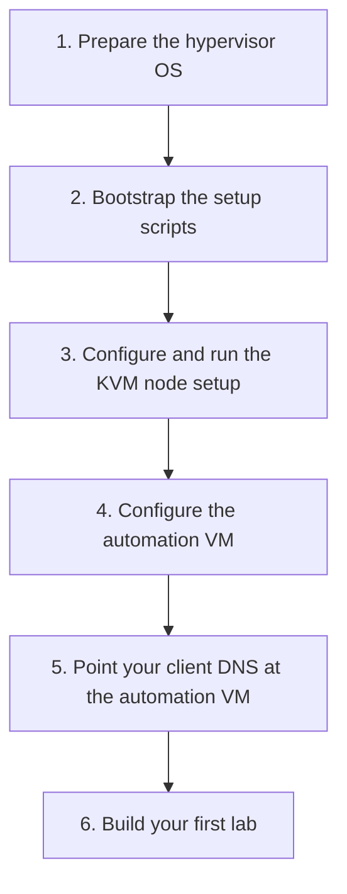
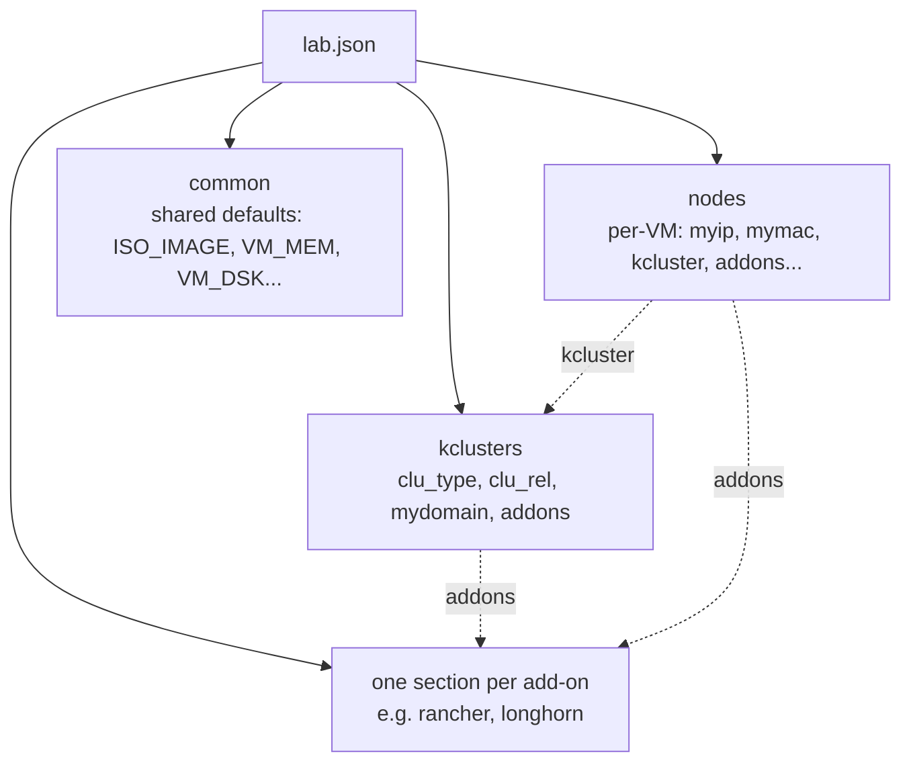

<a id="top"></a>
# lab-in-a-box

<p align="center">
  
  <br/>
  
</p>

<p align="center">
  <a href="https://github.com/SUSE-Technical-Marketing/lab-in-a-box/actions/workflows/ci.yml"></a>
  
  
  
  
</p>

<p align="center">
  <sub>🌐 <a href="README.md"><strong>English</strong></a> · <a href="README.es.md">Español</a> · <a href="README.de.md">Deutsch</a> · <a href="README.fr.md">Français</a> · <a href="README.pt-BR.md">Português (Brasil)</a> · <a href="README.ja.md">日本語</a> · <a href="README.zh-CN.md">简体中文</a></sub>
</p>

<p align="center"><em>Point it at a JSON or YAML file. Get back a working lab — VMs, DNS, Kubernetes, and add-ons, all wired up.</em></p>

<p align="center" float="left">
  <kbd></kbd>
</p>

**lab-in-a-box** turns a single bare-metal machine into a self-contained lab factory: point it at a JSON or YAML file describing the VMs, Kubernetes clusters, and software you want, and it builds the whole thing — DNS, provisioning, cluster bring-up, and add-ons — without you touching `virt-install` or Ansible by hand.

## Why lab-in-a-box?

<table>
<tr>
<td width="50%" valign="top">

`setup_lab.py` · **One JSON/YAML file, one command.**
Describe VMs, Kubernetes clusters (RKE2/K3s), and add-ons declaratively; it builds everything in the right order.

`install_<addon>` · **66 ready-made add-ons.**
Rancher, Longhorn, NeuVector, Harbor, Keycloak, Jenkins, Argo CD, SUSE Multi-Linux Manager/Uyuni (activation keys, RBAC, Content Lifecycle Management, Ansible integration, and more), vulnerable demo apps for security training, and more.

[`lab-builder`](#web-ui-lab-builder) · **A dynamic web UI.**
Renders forms straight from the add-ons' own schemas — add a field to a script, and the UI picks it up with zero front-end changes.

</td>
<td width="50%" valign="top">

`KVM_HOSTS` · **Multi-hypervisor aware.**
One lab definition can spread VMs across several KVM hosts, auto-selected by free CPU/RAM/disk, or pinned per node.

`podman` · **Fully containerized test suite.**
Every check runs in its own disposable container, wired into a pre-commit hook.

`config_method` · **Pluggable provisioning.**
Ignition+Combustion (SLE Micro), cloud-init (openSUSE/Ubuntu), `virt-customize` (legacy distros with no cloud-init/Ignition support), or a scripted ISO install (AutoYaST/Kickstart/Preseed/AutoInstall).

</td>
</tr>
</table>

---

## Table of Contents

- [Architecture](#architecture)
- [How it works](#how-it-works)
- [Quick Start](#quick-start)
- [Web UI (lab-builder)](#web-ui-lab-builder)
- [Lab definition format](#lab-definition-format)
- [Examples](#examples)
- [Step-by-Step Walkthroughs](#step-by-step-walkthroughs)
- [Available commands](#available-commands)
- [Available addons](#available-addons)
- [Configuration reference](#configuration-reference)
- [Testing](#testing)
- [Contributing / Developer setup](#contributing--developer-setup)

<p align="right"><a href="#top">↑ back to top</a></p>

---

## Architecture

<p align="center" float="left">
  <kbd></kbd>
  <kbd></kbd>
</p>

The system is built around a **two-tier architecture**:


```mermaid
graph TB
    Operator["Operator's client"] -->|"SSH / DNS / HTTP"| AutoVM
    subgraph HV["Hypervisor node(s) — KVM/QEMU"]
        AutoVM["Automation VM<br/>DNS · HTTP · scripts · web UI"]
        AutoVM -->|"virt-install / virsh"| VM1["Lab VM"]
        AutoVM -->|"virt-install / virsh"| VM2["Lab VM"]
        AutoVM -->|"virt-install / virsh"| VM3["Lab VM"]
    end
```

### Hypervisor node(s)

One or more physical/bare-metal machines running KVM/QEMU. Each hosts lab VMs and holds QCOW2 source images in `/var/lib/libvirt/images/sources/`. A NUC, a workstation, or any x86_64 machine capable of running KVM will do. Labs that need more capacity than one box can span **multiple KVM hosts** — see [multi-host labs](#multi-host-labs) below.

### Automation VM

A small VM running on the hypervisor that acts as the control plane for the entire lab. It provides:

- **DNS** — BIND (`named`) serves the lab domain and forwards external requests, so all lab hostnames resolve from any client pointing at it
- **HTTP** — serves provisioning files (Ignition, Combustion, cloud-init) at `/srv/www/htdocs/lab_creation/`
- **Scripts** — all lab management commands installed at `/usr/local/bin/`
- **Web UI** (optional) — [lab-builder](#web-ui-lab-builder), a browser-based lab.json designer

All user commands are run **on the automation VM**. It connects to the hypervisor(s) and to created VMs via SSH. No direct hypervisor access is needed after initial setup.

### Under the hood

The command-line tools and every add-on are Python 3.11, living in `libs/` and `scripts/` and installed to `/usr/local/lib/lab_creation/` — organized around a small set of shared library modules (`lab_creation.py`, `backends.py`, `services.py`, `spacecmd_common.py`, …) rather than one another. VM creation is behind a pluggable `VMBackend` interface (`LibvirtBackend` today), so the same orchestration code can eventually target other virtualization backends (KubeVirt, Harvester) without touching add-ons. One legacy add-on (`install_ds389`) is still plain bash — it predates the Python port and was already broken in bash, so it wasn't worth porting. The bash-era implementation these replaced lives on, archived, under `legacy_bash/`.

<p align="right"><a href="#top">↑ back to top</a></p>

---

## How it works

### Deploy pipeline

`setup_lab.py` runs a fixed sequence of phases; the two Kubernetes-only phases are skipped entirely for a VM-only lab (no `kclusters` section):


```mermaid
flowchart LR
    A["phase_services"] -->|"has kclusters"| C["phase_dns"]
    A -->|"no kclusters"| D["phase_create_vms"]
    C --> D["phase_create_vms"]
    D -->|"has kclusters"| F["phase_reboot_and_wait_kept_nodes"]
    D -->|"no kclusters"| H["phase_vm_addons"]
    F --> G["phase_install_k8s_and_addons"]
    G --> H["phase_vm_addons"]
```

### VM provisioning

Each VM is created by:
1. Resolving which KVM host it belongs on (the explicit `kvm_host` field, or auto-selected by free capacity — see [multi-host labs](#multi-host-labs))
2. Copying and resizing a QCOW2 source image on that host
3. Generating provisioning files from templates, per its `config_method`
4. Registering a DNS entry in BIND
5. Running `virt-install` on the hypervisor over SSH
6. Waiting for SSH to become available

Provisioning method is controlled by `config_method` in the lab JSON (per-node or per-`common`):

| Value | Method | Used for |
|---|---|---|
| _(empty, default)_ | Ignition + Combustion | SLE Micro |
| `cloud-init` | cloud-init ISO | openSUSE Leap, Ubuntu |
| `virt_customize` | Modifies the QCOW2 directly on the hypervisor (`virt-customize`) — no Ignition/cloud-init support needed on the guest | CentOS 7, old Debian/RHEL, or any image lacking Ignition/cloud-init |
| `install_iso` | Scripted install from a real installer ISO (AutoYaST, Kickstart, Preseed, or AutoInstall, selected by `install_type`) | Distros with no other provisioning path |

### VM backends

Which hypervisor technology actually creates a node is decided by a pluggable `VMBackend` interface, resolved once per node (`backend: harvester` in that node's config selects `HarvesterBackend`; anything else defaults to `LibvirtBackend`) — every add-on and orchestration script talks to the resolved backend the same way regardless of which one it is:


```mermaid
graph TD
    SV["setup_vm.py / setup_lab.py"] --> GB["backends.get_backend()"]
    GB -- "default" --> LB["LibvirtBackend"]
    GB -- "backend: harvester" --> HB["HarvesterBackend"]
    LB --> KVM["virt-install / virsh<br/>on a KVM hypervisor"]
    HB --> KV["KubeVirt VirtualMachine<br/>on a Harvester cluster"]
```

### Kubernetes setup

After VMs are up, `setup_lab.py` installs Kubernetes on each node according to the `kclusters` section of the JSON. RKE2 and K3s are both supported. Once a cluster is ready, its add-ons run in sequence; VM-level add-ons (attached to a single node rather than a cluster) run after that node is provisioned.

### Multi-host labs

A lab isn't limited to one hypervisor. Set `KVM_HOSTS` (space-separated) in `/etc/lab_creation.cfg` on the automation VM to make more than one hypervisor available:

```ini
KVM_HOSTS="hv1.mydemo.lab hv2.mydemo.lab hv3.mydemo.lab"
```

Then, for each node in the lab JSON, either:
- **pin it explicitly** — `"kvm_host": "hv2.mydemo.lab"` in that node's config, or
- **let it auto-select** — omit `kvm_host`; the node lands on whichever configured host currently has enough free CPU/RAM/disk for it (probed live over SSH).

Nodes that don't specify `kvm_host` and boxes with only one configured host behave exactly as before this feature existed — nothing changes for a single-hypervisor lab.

### Library loading order

Every script sources configuration in this order:

1. `/etc/lab_creation.defaults` — system defaults, paths, package lists
2. `/usr/local/lib/lab_creation/primary.py` — input validation, config loading
3. `/etc/lab_creation.cfg` — node-specific settings (`REMOTE_HOST`, `ROOT_SSH_KEY`, `VIRT_SRV`, `KVM_HOSTS`, etc.)
4. `/usr/local/lib/lab_creation/lab_creation.py` — VM, DNS, and orchestration functions
5. `/usr/local/lib/lab_creation/k8s.py` — Kubernetes cluster functions

<p align="right"><a href="#top">↑ back to top</a></p>

---

## Quick Start


```mermaid
flowchart TD
    S1["1. Prepare the hypervisor OS"] --> S2["2. Bootstrap the setup scripts"]
    S2 --> S3["3. Configure and run the KVM node setup"]
    S3 --> S4["4. Configure the automation VM"]
    S4 --> S5["5. Point your client DNS at the automation VM"]
    S5 --> S6["6. Build your first lab"]
```

### Requirements

- A machine capable of running KVM (Intel VT-x or AMD-V enabled)
- Internet access (or a local mirror) for package and image downloads
- A QCOW2 image for your chosen OS placed at `/var/lib/libvirt/images/sources/` on the hypervisor

> [!IMPORTANT]
> The automation VM needs `python3.11` specifically — the toolchain pins to it explicitly. Most distros ship an older default `python3` alongside it; the install script refuses to proceed if `python3.11` is missing.

Tested images:
- [SLE Micro](https://www.suse.com/download/sle-micro/) — recommended, used with Ignition+Combustion
- openSUSE Leap Micro — supported, used with cloud-init

### Step 1 — Prepare the hypervisor OS

Install SLES (or another KVM-capable Linux) on your hardware. During install, choose:
- **Network**: create a bridge interface (`br0`) linked to your main NIC with a static IP
- **System role**: KVM Virtualization Host

<details>
<summary>Writing a bootable USB from Linux</summary>

```shell
# Before inserting USB:
cat /proc/partitions > /tmp/partb4

# Insert USB, then:
cat /proc/partitions > /tmp/parta

# Find the new device:
diff /tmp/part*
```

> [!WARNING]
> The next command **destroys all data** on the target device. Double-check `sdX` against the `diff` output above before running it.

```shell
# Write the ISO (replace sdX with your device):
dd if=SLE-15-SP6-Online-x86_64-GM-Media1.iso of=/dev/sdX bs=4k && sync
```

</details>

### Step 2 — Bootstrap the setup scripts

From any Linux machine with SSH access to the hypervisor:

```shell
curl https://raw.githubusercontent.com/SUSE-Technical-Marketing/lab-in-a-box/main/install_demo_server_scripts.sh | bash -
```

This downloads the setup scripts to `/var/tmp/setup_demo_server/`.

### Step 3 — Configure and run the KVM node setup

```shell
cd /var/tmp/setup_demo_server/setup_demo_server/
vim lab.cfg
```

Key settings in `lab.cfg`:

| Setting | Description |
|---|---|
| `ROOT_PWD_HASH` | Hashed root password — generate with `mkpasswd --method=SHA-512 --stdin` |
| `ROOT_SSH_PUB_KEY` | Your SSH public key for passwordless access |
| `AUTOMATION_HOSTNAME` | Hostname for the automation VM (e.g. `automation.mydemo.lab`) |
| `_QCOW_IMAGE` | Filename of the source QCOW2 image |
| Network settings | IP, gateway, mask, DNS for the lab network |

Then run the setup (replace `<IP>` with your hypervisor IP, or omit for local):

```shell
./setup_kvm_node.py <IP>
```

This provisions the automation VM and starts all required services.

### Step 4 — Configure the automation VM

SSH into the automation VM and install the lab scripts:

```shell
ssh <AUTOMATION_HOSTNAME>
./install_automation_node_scripts.sh

cp /etc/lab_creation.cfg.example /etc/lab_creation.cfg
vim /etc/lab_creation.cfg
```

Key settings in `lab_creation.cfg`:

| Setting | Description |
|---|---|
| `REMOTE_HOST` | Hostname or IP of the (primary) KVM hypervisor |
| `KVM_HOSTS` | _(optional)_ space-separated list of additional hypervisors for a [multi-host lab](#multi-host-labs) |
| `ROOT_SSH_KEY` | Content of the SSH public key to inject into VMs |
| `VIRT_SRV` | libvirt connection URI (e.g. `qemu+ssh://root@hypervisor/system`) |
| `NETWORK` | Default libvirt network for VMs (e.g. `bridge=br0`) |

### Step 5 — Point your client DNS at the automation VM

For hostnames to resolve from your desktop:

```shell
# Linux (NetworkManager):
nmcli con mod <connection> ipv4.dns <AUTOMATION_IP>

# Or add to /etc/resolv.conf:
nameserver <AUTOMATION_IP>
```

### Step 6 — Build your first lab

```shell
setup_lab.py examples/cluster.json.template
```

See [Examples](#examples) below for more starting points, or open the [web UI](#web-ui-lab-builder) instead of writing JSON by hand.

<p align="right"><a href="#top">↑ back to top</a></p>

---

## Web UI (lab-builder)

A browser-based designer for `lab.json` files that **introspects the project's own Python libraries at run time** — it has no hardcoded knowledge of any add-on. Pick a component and it renders a form straight from that component's schema; add a field to a script and the UI shows it with zero front-end changes.

```shell
# Fastest way to try it — zero dependencies beyond Python:
python3.11 webui/run-local.py            # → http://localhost:8677/
```

For production deployment (Apache, or a standalone systemd/init-independent service, plus HTTPS via an idempotently-generated self-signed cert), see **[README.webui.md](README.webui.md)** — it covers all three deploy modes, the HTTP API, and troubleshooting.

<p align="right"><a href="#top">↑ back to top</a></p>

---

## Lab definition format

Labs are defined as JSON or YAML files (auto-detected — see the note below). The current format supports multiple Kubernetes clusters per lab (`kclusters`); see `examples/cluster.json.template` for the legacy single-cluster format (`cluster`).


```mermaid
graph TD
    Lab["lab.json"] --> Nodes["nodes<br/>per-VM: myip, mymac, kcluster, addons..."]
    Lab --> Common["common<br/>shared defaults: ISO_IMAGE, VM_MEM, VM_DSK..."]
    Lab --> KClusters["kclusters<br/>clu_type, clu_rel, mydomain, addons"]
    Lab --> AddonSections["one section per add-on<br/>e.g. rancher, longhorn"]
    Nodes -. "kcluster" .-> KClusters
    KClusters -. "addons" .-> AddonSections
    Nodes -. "addons" .-> AddonSections
```

> [!NOTE]
> A `.yaml`/`.yml` file works too — the format is auto-detected from the extension (or by falling back to YAML if a file isn't valid JSON), the same way through `setup_lab.py`'s preflight check, `install_<addon> --validate`, and every addon's own load path. YAML input requires `pyyaml` (`pip install pyyaml`) on the automation VM; without it you get a clear error telling you to install it, not a silent JSON-only failure.

```jsonc
{
  "nodes": {
    "node101.mydemo.lab": {
      "myip":  "192.168.88.101",
      "mymac": "34:8a:b1:4b:1a:c1",
      "INSTALL_RKE2_TYPE": "server",   // "server" or "agent"
      "kcluster": "cluster1"           // which kclusters entry this node belongs to
    },
    "node102.mydemo.lab": {
      "myip":  "192.168.88.102",
      "mymac": "34:8a:b1:4b:1a:c2",
      "INSTALL_RKE2_TYPE": "agent",
      "kcluster": "cluster1"
    }
  },
  "common": {
    "ISO_IMAGE":  "SL-Micro.x86_64-6.1-Default-qcow-GM.qcow2",
    "VM_MEM":     "24576",
    "VM_DSK":     "80",
    "VM_CPU":     "6",
    "VM_BOOT":    "uefi",             // uefi (default), firmware=bios, bios, uefi=off
    "mymask":     "24",
    "mygw":       "192.168.88.1",
    "mydns":      "192.168.88.73",
    "mynet_reverse": "88.168.192"
  },
  "kclusters": {
    "cluster1": {
      "clu_type":  "rke2",             // "rke2" or "k3s"
      "clu_rel":   "stable",
      "mydomain":  "mydemo.lab",
      "addons": ["rancher", "longhorn"]
    }
  },
  "rancher": {
    "rancher_shorthn":   "rancher",
    "rancher_rel":       "rancher-prime",
    "rancher_repo_url":  "https://charts.rancher.com/server-charts/prime",
    "rancher_helm_rel":  "rancher",
    "rancher_helm_chart": "rancher-prime/rancher",
    "rancher_Version":   "--version 2.13.3",
    "cert_manager_ver":  "--version v1.14.4"
  }
}
```

<details>
<summary>Same lab, as YAML</summary>

```yaml
nodes:
  node101.mydemo.lab:
    myip: "192.168.88.101"
    mymac: "34:8a:b1:4b:1a:c1"
    INSTALL_RKE2_TYPE: server   # "server" or "agent"
    kcluster: cluster1          # which kclusters entry this node belongs to
  node102.mydemo.lab:
    myip: "192.168.88.102"
    mymac: "34:8a:b1:4b:1a:c2"
    INSTALL_RKE2_TYPE: agent
    kcluster: cluster1

common:
  ISO_IMAGE: SL-Micro.x86_64-6.1-Default-qcow-GM.qcow2
  VM_MEM: "24576"
  VM_DSK: "80"
  VM_CPU: "6"
  VM_BOOT: uefi                # uefi (default), firmware=bios, bios, uefi=off
  mymask: "24"
  mygw: "192.168.88.1"
  mydns: "192.168.88.73"
  mynet_reverse: "88.168.192"

kclusters:
  cluster1:
    clu_type: rke2              # "rke2" or "k3s"
    clu_rel: stable
    mydomain: mydemo.lab
    addons: [rancher, longhorn]

rancher:
  rancher_shorthn: rancher
  rancher_rel: rancher-prime
  rancher_repo_url: https://charts.rancher.com/server-charts/prime
  rancher_helm_rel: rancher
  rancher_helm_chart: rancher-prime/rancher
  rancher_Version: "--version 2.13.3"
  cert_manager_ver: "--version v1.14.4"
```

</details>

Optional node-level fields:

| Field | Description |
|---|---|
| `addons` | List of addon scripts to run for this specific VM only — see below for per-node config overrides |
| `config_method` | Override provisioning method (`cloud-init`, `virt_customize`, `install_iso`) |
| `kvm_host` | Pin this VM to a specific hypervisor in a [multi-host lab](#multi-host-labs) |
| `extra_dsk` | Additional disk(s) to attach — `"/dev/sdb"`, or `"/dev/sdb,bus=scsi"` to override the default bus per disk |
| `salt_states` | Salt states to apply (cloud-init method only) |
| `VM_MACHINE` | virt-install machine type override — `""` (default, virt-install's own choice, currently `q35`) or `"pc"` (legacy i440fx), for an old guest whose kernel/GRUB can't find its root disk under q35 — see [Deploying a legacy image (CentOS 7)](#deploying-a-legacy-image-centos-7) |

**Per-node addon config overrides, added 2026-09-11:** every addon has one shared top-level config
section (e.g. `client_registration` in the earlier SMLM example) used by every node that lists it
in `addons`. When different nodes genuinely need different values for that same addon — the
motivating case: a lab registering many different OSes against one shared Uyuni/SMLM server,
where every node needs its *own* `client_registration_activation_key` — give that one node's
`addons[]` entry a nested override instead of a plain string:

```jsonc
"nodes": {
  "mercury.mydemo.lab": {
    "addons": [
      { "client_registration": { "client_registration_activation_key": "1-sles15sp7" } }
    ]
  },
  "callisto.mydemo.lab": {
    "addons": [
      "mariadb",
      { "client_registration": { "client_registration_activation_key": "1-debian13" } }
    ]
  }
}
```

A plain `"mariadb"` string entry behaves exactly as before (only the shared top-level `mariadb`
section applies). The `{"client_registration": {...}}` form overrides *just those fields*, for
*that node only* — anything the override doesn't mention (server, admin user, …) still comes from
the shared `client_registration` section. This works the same way for any addon, not just
`client_registration`; each `install_<addon>.py` opts in by reading its config via
`k8s.addon_node_config(definition, "<addon>", vm_name)` instead of `definition.get("<addon>", {})`
directly — see `libs/apps.py`'s `addon_entry_name()`/`addon_entry_overrides()` for the shared
parsing every consumer of an `addons[]` list goes through.

Optional kcluster fields:

| Field | Description |
|---|---|
| `mgm_node` | Hostname of the node that runs cluster addon installers; defaults to first server node |

Every add-on script also accepts `--schema` (alias for `--input-definition`), which prints its own configuration keys as machine-readable JSON or YAML — the same schema the [web UI](#web-ui-lab-builder) reads to build its forms:

```shell
install_longhorn --schema
setup_lab.py --input-definition yaml   # base topology schema (common/nodes/kclusters)
```

<p align="right"><a href="#top">↑ back to top</a></p>

---

## Examples

### Minimal single-VM lab

The smallest possible lab — one VM, no Kubernetes:

```jsonc
{
  "nodes": {
    "standalone.mydemo.lab": { "myip": "192.168.88.50" }
  },
  "common": {
    "ISO_IMAGE": "SL-Micro.x86_64-6.1-Default-qcow-GM.qcow2",
    "VM_MEM": "4096", "VM_DSK": "40", "VM_CPU": "2",
    "mymask": "24", "mygw": "192.168.88.1", "mydns": "192.168.88.73"
  }
}
```

```shell
setup_lab.py standalone.json
```

### RKE2 + Rancher + Longhorn (the "hello world" cluster)

A 2-node cluster with a management platform and distributed storage — see the full [Lab definition format](#lab-definition-format) example above.

```shell
setup_lab.py rancher-cluster.json
# Re-run later, skipping any VM that's already up and reachable:
setup_lab.py --keep rancher-cluster.json
```

### Spreading a cluster across two hosts

Pin the server to one hypervisor and let the agents auto-place on whichever of the [configured hosts](#multi-host-labs) has room:

```jsonc
{
  "nodes": {
    "srv1.mydemo.lab":   { "myip": "192.168.88.10", "kvm_host": "hv1.mydemo.lab", "kcluster": "prod" },
    "agent1.mydemo.lab": { "myip": "192.168.88.11", "kcluster": "prod" },
    "agent2.mydemo.lab": { "myip": "192.168.88.12", "kcluster": "prod" }
  },
  "common": { "ISO_IMAGE": "SL-Micro.x86_64-6.1-Default-qcow-GM.qcow2", "VM_MEM": "8192", "VM_DSK": "60", "VM_CPU": "4" },
  "kclusters": { "prod": { "clu_type": "rke2", "clu_rel": "stable", "mydomain": "mydemo.lab" } }
}
```

### SUSE Multi-Linux Manager (Uyuni) server + a registered client

Stand up an Uyuni server with an activation key, then register a second VM against it as a Salt client — see [Available addons](#available-addons) for the full feature set (`orgs`, RBAC, Content Lifecycle Management, Ansible integration, and more):

```jsonc
{
  "nodes": {
    "uyuni.mydemo.lab":  { "myip": "192.168.88.30", "addons": ["uyuni"] },
    "client1.mydemo.lab": { "myip": "192.168.88.31", "addons": ["client_registration"] }
  },
  "common": { "ISO_IMAGE": "SL-Micro.x86_64-6.1-Default-qcow-GM.qcow2", "VM_MEM": "8192", "VM_DSK": "60", "VM_CPU": "4" },
  "uyuni": {
    "uyuni_admin": "admin", "uyuni_password": "Uyuni12345",
    "uyuni_activation_key": "1-lab-clients", "uyuni_activation_key_base_channel": "sle-micro-6.1-pool"
  },
  "client_registration": {
    "client_registration_server_type": "uyuni",
    "client_registration_server": "uyuni.mydemo.lab",
    "client_registration_activation_key": "1-lab-clients"
  }
}
```

### Deploying a legacy image (CentOS 7)

CentOS 7 (and other pre-built `.qcow2` images that old) has neither Ignition/Combustion nor
cloud-init built in, so `config_method` must be `virt_customize` (see
[VM provisioning](#vm-provisioning)) — it edits the qcow2 filesystem directly instead of relying
on an in-guest agent. Two more overrides matter for an image this old:

- `VM_BOOT: "bios"` — CentOS 7's GRUB expects legacy BIOS, not this project's UEFI default.
- `VM_MACHINE: "pc"` — confirmed live against a 2015 CentOS 7 GenericCloud image (kernel
  `3.10.0-229`): booted under virt-install's own machine-type default (currently `q35`), it hangs
  forever in a dracut emergency shell (`Not all disks have been found`) — its virtio-blk root disk
  never shows up in time under Q35's PCIe topology. The identical disk boots straight through
  under the legacy i440fx chipset (`"pc"`). This is a chipset/old-kernel incompatibility, not
  anything specific to this project — the same override applies to any sufficiently old guest.

```jsonc
{
  "nodes": {
    "legacy1.mydemo.lab": {
      "myip": "192.168.88.120",
      "config_method": "virt_customize",
      "ISO_IMAGE": "CentOS-7-x86_64-GenericCloud-20150628_01.qcow2",
      "VM_BOOT": "bios",
      "VM_MACHINE": "pc"
    }
  },
  "common": { "VM_MEM": "2048", "VM_DSK": "30", "VM_CPU": "1", "VM_ROOT_PASS": "12345678" }
}
```

```shell
setup_lab.py legacy.json
```

`VM_ROOT_PASS` (in `common`, or per-node) sets the root password `virt_customize` bakes into the
image directly — omit it to reuse `ROOT_PWD_HASH` from `lab_creation.cfg` instead, the same
fallback cloud-init and Ignition use.

More distros (AlmaLinux, Debian, Rocky Linux, Alibaba Cloud Linux, and a documented
not-yet-working attempt at Raspberry Pi OS) are in **[EXAMPLES.md](EXAMPLES.md)**, kept separate
so this section doesn't grow without bound.

<p align="right"><a href="#top">↑ back to top</a></p>

---

## Step-by-Step Walkthroughs

The [Examples](#examples) above are copy-paste starting points. These three walk through complete, real scenarios end to end — what to run, what happens at each step, and how to verify it actually worked. Every JSON field and command shape below matches this project's own test suite (`tests/run_tests.sh`) and source.

> [!TIP]
> Walkthroughs 2 and 3 are **live-tested** — run against a real server/hardware, not just checked in isolation.

### Walkthrough 1 — Your first cluster: RKE2 + Rancher + Longhorn

Goal: two SLE Micro VMs, an RKE2 cluster, Rancher for management, Longhorn for storage — reachable from your browser at the end.

1. **Write the lab file.** Save this as `rancher-cluster.json` (adjust IPs/network to your lab domain):

   ```jsonc
   {
     "nodes": {
       "node101.mydemo.lab": {
         "myip": "192.168.88.101", "mymac": "34:8a:b1:4b:1a:c1",
         "INSTALL_RKE2_TYPE": "server", "kcluster": "cluster1"
       },
       "node102.mydemo.lab": {
         "myip": "192.168.88.102", "mymac": "34:8a:b1:4b:1a:c2",
         "INSTALL_RKE2_TYPE": "agent", "kcluster": "cluster1"
       }
     },
     "common": {
       "ISO_IMAGE": "SL-Micro.x86_64-6.1-Default-qcow-GM.qcow2",
       "VM_MEM": "24576", "VM_DSK": "80", "VM_CPU": "6",
       "mymask": "24", "mygw": "192.168.88.1", "mydns": "192.168.88.73"
     },
     "kclusters": {
       "cluster1": {
         "clu_type": "rke2", "clu_rel": "stable", "mydomain": "mydemo.lab",
         "addons": ["rancher", "longhorn"]
       }
     },
     "rancher": {
       "rancher_shorthn": "rancher", "rancher_rel": "rancher-prime",
       "rancher_repo_url": "https://charts.rancher.com/server-charts/prime",
       "rancher_helm_rel": "rancher", "rancher_helm_chart": "rancher-prime/rancher",
       "rancher_Version": "--version 2.13.3", "cert_manager_ver": "--version v1.14.4"
     }
   }
   ```

2. **Build it:**

   ```shell
   setup_lab.py rancher-cluster.json
   ```

   `setup_lab.py` preflights the file automatically before doing anything else — bad IPs, a `kcluster` reference that doesn't exist, a missing `ISO_IMAGE`, and similar mistakes get caught and printed (`✗ Preflight FAILED — N error(s)`) with nothing created, rather than failing partway through. A clean file prints `✓ Preflight passed` and proceeds straight to building.

   In order, this: registers both nodes in DNS → creates both VMs (copies the QCOW2 image, generates Combustion files, boots them, waits for SSH) → installs RKE2 on `node101` as server, then `node102` as agent → installs `rancher` and `longhorn` on the cluster's management node (`mgm_node`, defaulting to the first server node — `node101` here). A 2-node cluster with Rancher typically takes 15–25 minutes; most of it is RKE2 bootstrapping and Rancher's own Helm install.

3. **Verify DNS resolves** (from your own desktop, once it's [pointed at the automation VM's DNS](#step-5--point-your-client-dns-at-the-automation-vm)):

   ```shell
   dig +short node101.mydemo.lab rancher.mydemo.lab
   ```

   Both should return `192.168.88.101` (Rancher's ingress hostname is the `rancher_shorthn` value, `rancher`, under the cluster's `mydomain`).

4. **Log in.** Browse to `https://rancher.mydemo.lab` (self-signed cert — your browser will warn once) and log in with `rancher_initial_pwd` from `/etc/lab_creation.cfg` on the automation VM.

5. **Iterate without rebuilding everything.** Changed one node's config, or a VM crashed? Re-run with `--keep`: any VM that already exists, matches its defined IP/MAC, and is SSH-reachable is left alone; only what's actually missing or broken gets (re)created:

   ```shell
   setup_lab.py --keep rancher-cluster.json
   ```

6. **Tear it down** when you're done:

   ```shell
   destroy_lab.py rancher-cluster.json
   ```

### Walkthrough 2 — SUSE Multi-Linux Manager (Uyuni) server with a registered client

Goal: an Uyuni server with a real activation key, and a second VM that registers itself as a Salt-managed client against it. **Live-tested** end to end against a real Uyuni server.

1. **Write the lab file** — one node for the Uyuni server, one for the client:

   ```jsonc
   {
     "nodes": {
       "uyuni.mydemo.lab":   { "myip": "192.168.88.30", "addons": ["uyuni"] },
       "client1.mydemo.lab": { "myip": "192.168.88.31", "addons": ["client_registration"] }
     },
     "common": {
       "ISO_IMAGE": "SL-Micro.x86_64-6.1-Default-qcow-GM.qcow2",
       "VM_MEM": "8192", "VM_DSK": "60", "VM_CPU": "4",
       "mymask": "24", "mygw": "192.168.88.1", "mydns": "192.168.88.73", "mydomain": "mydemo.lab"
     },
     "uyuni": {
       "uyuni_admin": "admin", "uyuni_password": "Uyuni12345",
       "uyuni_activation_key": "1-lab-clients", "uyuni_activation_key_base_channel": "sle-micro-6.1-pool"
     },
     "client_registration": {
       "client_registration_server_type": "uyuni",
       "client_registration_server": "uyuni.mydemo.lab",
       "client_registration_activation_key": "1-lab-clients"
     }
   }
   ```

2. **Build it:**

   ```shell
   setup_lab.py uyuni-lab.json
   ```

   VM-level addons (both `uyuni` and `client_registration` are node-attached, not cluster-attached, since there's no `kclusters` section here) run once their own node is up. `install_uyuni` brings up the server, waits for it to become reachable, then creates the activation key. `install_client_registration` then bootstraps `client1` against it — installs the bootstrap script, runs it, and polls until the new minion's Salt key shows up as pending, then accepts it.

3. **Verify the client actually registered.** SSH into the Uyuni server and ask it directly:

   ```shell
   ssh uyuni.mydemo.lab
   mgrctl exec 'spacecmd -- system_list'
   ```

   `client1.mydemo.lab` should be in the list.

4. **Log in to the web UI** at `https://uyuni.mydemo.lab` with `uyuni_admin`/`uyuni_password` to see the same thing visually, browse the activation key, or run a highstate.

Known upstream rough edge (not this project's bug, documented in case you hit it): `salt-transactional-update`'s own package upgrade scriptlet can leave a duplicate YAML key in `/etc/salt/minion.d/transactional_update.conf` on the client, crash-looping `salt-minion` until it's manually deduplicated. Nothing in this repo touches that file.

### Walkthrough 3 — Automation VM under NAT (single-NIC laptop as the hypervisor)

Goal: bootstrap the automation VM on a host with no spare NIC to bridge — a private libvirt-managed network instead, with specific ports DNAT'd in from the host's own real IP. **Live-tested** end to end on a disposable nested VM.

This changes nothing about the [default Quick Start](#quick-start) flow if you don't opt in — `_network_mode` defaults to `"bridge"`, byte-for-byte the same as every existing setup.

1. **In `lab.cfg`** (Quick Start [Step 3](#step-3--configure-and-run-the-kvm-node-setup)), set:

   ```ini
   _network_mode="nat"
   _nat_network_name="labnat"          # default shown — a new libvirt virtual network, not your host's real LAN
   _nat_network_cidr="192.168.150.0/24" # default shown
   _nat_forwarded_ports="22:22/TCP 80:80/TCP 443:443/TCP"  # default shown — "<port on the HYPERVISOR's real IP>:<port on the AUTOMATION VM>/<protocol>"
   ```

   This forwards ports 22/80/443 on the **hypervisor's own real, externally-reachable IP** (`<external>`) through to the same ports on the **automation VM's private NAT address** (`<internal>`) — the automation VM is the only thing listening on this private network at this point, so "internal" always means "on the automation VM" here. (Step 5 below reuses this exact same `<external>:<internal>/<protocol>` syntax to forward into a *lab* VM instead, once one exists — there, "internal" shifts to mean that VM's own private NAT address, not the automation VM's.)

2. **Run the setup exactly as usual:**

   ```shell
   ./setup_kvm_node.py
   ```

   This defines the `labnat` libvirt network (NAT'd, DHCP/gateway handled by libvirt itself — the same mechanism as libvirt's own built-in `default` network, just under this project's own name/CIDR) instead of a bridge, then creates the automation VM on it with a static IP inside that private range, then DNAT-forwards the three ports above in from the host's own real IP.

3. **Verify the network and forwarding rules exist**, on the hypervisor:

   ```shell
   virsh net-list                              # labnat: active
   iptables -t nat -L LAB_PORTFWD -n -v         # DNAT rules to the automation VM's private IP
   iptables -L LAB_PORTFWD_FWD -n -v            # matching FORWARD-chain ACCEPT rules
   ```

4. **Reach the automation VM from outside the hypervisor**, using the hypervisor's own real IP — not the automation VM's private `192.168.150.x` address, which isn't routable from anywhere else:

   ```shell
   ssh root@<hypervisor-real-ip>          # DNAT'd to the automation VM's SSH, port 22
   ```

   Ports 80 and 443 are forwarded too by default (the provisioning-file HTTP server and, once you set up the [web UI](#web-ui-lab-builder), its HTTPS listener) — reachable the same way, through the hypervisor's real IP.

5. **Add forwarding for a lab VM**, not just the automation VM itself: give that node a `forwarded_ports` field and enable the `portforward` service once, in `common.services`:

   ```jsonc
   {
     "nodes": {
       "app1.mydemo.lab": {
         "myip": "192.168.150.20",
         "forwarded_ports": ["8080:80/TCP", "8443:443/TCP"]
       }
     },
     "common": { "services": ["portforward"], "...": "…rest of common as usual" }
   }
   ```

   `setup_lab.py`/`setup_vm.py` DNAT-forward those two ports in from the hypervisor's real IP the same way, the first time any node in the lab declares `forwarded_ports`.

<p align="right"><a href="#top">↑ back to top</a></p>

---

## Available commands

All commands run on the **automation VM** and take a JSON lab definition file as their first argument.

| Command | Description |
|---|---|
| `setup_lab.py [--keep] <lab.json>` | Create all VMs, set up Kubernetes clusters, and install every cluster-level and VM-level addon in order. `--keep` skips any VM that already exists, matches the defined IP/MAC, and is SSH-reachable — without it, every VM is destroyed and recreated. |
| `setup_vm.py <lab.json> <hostname>` | Create or recreate a single VM |
| `destroy_vm.py <lab.json> <hostname>` | Destroy a single VM |
| `destroy_lab.py <lab.json>` | Destroy all VMs in a lab |

Every command and every `install_<addon>` script supports:

```shell
setup_lab.py --version              # print the installed version
install_longhorn --schema           # print this addon's configuration schema (JSON)
install_longhorn --schema yaml      # ...or YAML
```

<p align="right"><a href="#top">↑ back to top</a></p>

---

## Available addons

Addons are referenced by name in the `addons` array of a kcluster or node. The corresponding `install_<name>` script must be on `PATH`.

<sub>Jump to: <a href="#addons-k8s">Kubernetes &amp; GitOps</a> · <a href="#addons-security">Security &amp; compliance</a> · <a href="#addons-suma">SUSE Multi-Linux Manager / Uyuni</a> · <a href="#addons-storage">Storage &amp; databases</a> · <a href="#addons-cicd">CI/CD &amp; tooling</a> · <a href="#addons-ai">AI / ML</a> · <a href="#addons-virt">Virtualization</a> · <a href="#addons-demos">Demo applications</a> · <a href="#addons-games">Games</a></sub>

<a id="addons-k8s"></a>
<details open>
<summary><strong>Kubernetes platform &amp; GitOps</strong></summary>

| Addon name | Description |
|---|---|
| [`rancher`](https://www.rancher.com/) | SUSE Rancher Prime Kubernetes management platform |
| [`longhorn`](https://longhorn.io/) | SUSE Longhorn distributed block storage |
| [`harbor`](https://goharbor.io/) | Container registry |
| [`argocd`](https://argo-cd.readthedocs.io/) | Argo CD GitOps controller |
| [`kubewarden`](https://www.kubewarden.io/) | Kubernetes policy engine |
| [`istio`](https://istio.io/) | Service mesh |
| [`linkerd`](https://linkerd.io/) | Service mesh |
| [`traefik`](https://traefik.io/) | Ingress controller |
| [`nginx`](https://nginx.org/) | Ingress controller / reverse proxy |
| [`coredns`](https://coredns.io/) | Cluster DNS |
| [`kucero`](https://github.com/SUSE/kucero) | Kubernetes cluster certificate rotation |
| [`fluid`](https://fluid-cloudnative.github.io/) | Data orchestration/caching for cloud-native workloads |
| [`suse_observability`](https://www.suse.com/products/suse-observability/) | SUSE Observability (StackState-based metrics/traces/topology) |
| [`agones`](https://agones.dev/) | Dedicated game-server hosting/scaling (agones.dev) |
</details>

<a id="addons-security"></a>
<details open>
<summary><strong>Security &amp; compliance</strong></summary>

| Addon name | Description |
|---|---|
| [`neuvector`](https://open-docs.neuvector.com/) | SUSE NeuVector container security platform |
| [`nv_testing`](https://open-docs.neuvector.com/testing/testing) | NeuVector security testing workloads (nginx/node/redis pods) |
| [`nv-demo-helm`](https://open-docs.neuvector.com/) | NeuVector Helm-based demo workloads |
| [`complianceascode`](https://complianceascode.github.io/) | OpenSCAP/ComplianceAsCode operator |
| [`keycloak`](https://www.keycloak.org/) | Identity and access management |
| [`kagent`](https://kagent.dev/) | Kubernetes agentic-AI security assistant |
| `insecure_app` | Intentionally vulnerable web application (demo/training) |
| [`struts_demo`](https://struts.apache.org/) | Apache Struts2 vulnerable demo application (CVE-2017-5638) |
</details>

<a id="addons-suma"></a>
<details open>
<summary><strong>SUSE Multi-Linux Manager / Uyuni</strong></summary>

| Addon name | Description |
|---|---|
| [`uyuni`](https://www.uyuni-project.org/) | Uyuni server (upstream): activation keys, orgs, RBAC, Content Lifecycle Management, Ansible integration, SCAP/CVE auditing, dev/QA/prod environment topology — see `install_uyuni --schema` for the full field list |
| [`smlm`](https://www.suse.com/products/multi-linux-manager/) | SUSE Multi-Linux Manager server — the same feature set as `uyuni`, Kubernetes/Helm-deployed |
| [`smlm_proxy`](https://www.suse.com/products/multi-linux-manager/) | SMLM proxy |
| `client_registration` | Register any VM as a Salt client of an existing `uyuni`/`smlm` server (activation key bootstrap + salt-key acceptance) |
| [`suma`](https://www.suse.com/products/multi-linux-manager/) | SUSE Multi-Linux Manager (SUMA), installed directly on the OS via `mgradm` — not Kubernetes |
</details>

<a id="addons-storage"></a>
<details open>
<summary><strong>Storage &amp; databases</strong></summary>

| Addon name | Description |
|---|---|
| [`mariadb`](https://mariadb.org/) | MariaDB database |
| [`postgresql`](https://www.postgresql.org/) | PostgreSQL database |
| [`openldap`](https://www.openldap.org/) | OpenLDAP directory service |
| [`ds389`](https://www.port389.org/) | 389 Directory Server (LDAP) — the one add-on still implemented in bash |
</details>

<a id="addons-cicd"></a>
<details open>
<summary><strong>CI/CD &amp; developer tooling</strong></summary>

| Addon name | Description |
|---|---|
| [`jenkins`](https://www.jenkins.io/) | Jenkins CI |
| [`appcollection`](https://apps.rancher.io/) | SUSE Application Collection |
| [`stackpack`](https://www.stackstate.com/) | StackState monitoring integration |
| [`trento`](https://www.trento-project.io/) | SAP infrastructure monitoring |
| [`prometheus`](https://prometheus.io/) | Standalone Prometheus server (podman container, no Kubernetes) — scrapes an `smlm`/`uyuni` server's own bundled exporters (`smlm_monitoring_enabled`) or any custom `prometheus_scrape_configs` targets |
</details>

<a id="addons-ai"></a>
<details open>
<summary><strong>AI / ML</strong></summary>

| Addon name | Description |
|---|---|
| [`ollama`](https://ollama.com/) | Local LLM runtime |
| [`deepseek`](https://www.deepseek.com/) | DeepSeek model, served via Ollama |
| [`apertus`](https://www.swiss-ai.org/apertus) | Apertus (Swiss AI Initiative) model, served via Ollama |
| [`gemini`](https://ai.google.dev/gemini-api) | Google Gemini API proxy (LiteLLM) |
| [`anthropic`](https://www.anthropic.com/) | Anthropic Claude API proxy (LiteLLM) |
| [`openai`](https://openai.com/) | OpenAI API proxy (LiteLLM) |
| [`kimi`](https://www.moonshot.ai/) | Moonshot AI Kimi API proxy (LiteLLM) |
| [`open_webui`](https://openwebui.com/) | Chat frontend for Ollama / OpenAI-compatible endpoints |
| [`suse_ai`](https://www.suse.com/solutions/artificial-intelligence/) | SUSE's own Ollama + Open WebUI + Milvus AI stack |
| [`milvus`](https://milvus.io/) | Milvus vector database (RAG/embedding search) |
| [`qdrant`](https://qdrant.tech/) | Qdrant vector database (RAG/embedding search) |
| [`weaviate`](https://weaviate.io/) | Weaviate vector database (RAG/embedding search) |
| [`gpu_operator`](https://github.com/NVIDIA/gpu-operator) | NVIDIA GPU Operator (GPU scheduling for AI workloads) |
| [`qwen`](https://qwenlm.github.io/) | Qwen2.5 model, served via Ollama |
| [`mistral`](https://mistral.ai/) | Mistral model, served via Ollama |
| [`codellama`](https://github.com/meta-llama/codellama) | Code Llama model, served via Ollama |
| [`starcoder2`](https://github.com/bigcode-project/starcoder2) | StarCoder2 model, served via Ollama |
| [`phoebe`](https://github.com/SUSE/phoebe) | (see `install_phoebe --schema`) |
</details>

<a id="addons-virt"></a>
<details open>
<summary><strong>Virtualization</strong></summary>

| Addon name | Description |
|---|---|
| [`harvester`](https://harvesterhci.io/) | SUSE Virtualization (Harvester/KubeVirt) node provisioning |
| [`kiwi`](https://osinside.github.io/kiwi/) | KIWI appliance builder |

</details>

<a id="addons-demos"></a>
<details open>
<summary><strong>Demo applications</strong></summary>

| Addon name | Description |
|---|---|
| [`wordpress`](https://wordpress.org/) | WordPress + MySQL demo application |
| [`fluentd`](https://www.fluentd.org/) | Log aggregation |
| [`mailman`](https://www.list.org/) | GNU Mailman 3 mailing-list management + web interface |
| [`mediagoblin`](https://www.mediagoblin.org/) | GNU MediaGoblin federated media-publishing platform |
| [`colt`](https://gitlab.com/NalaGinrut/colt) | Colt, a git-backed blog engine on GNU Artanis |
| [`wikimusic`](https://codeberg.org/jjba23/wikimusic) | WikiMusic, a musical-knowledge CMS on GNU Artanis |
| [`home_assistant`](https://www.home-assistant.io/) | Home Assistant home-automation platform |

</details>

<a id="addons-games"></a>
<details open>
<summary><strong>Games</strong></summary>

| Addon name | Description |
|---|---|
| [`supertux_classic`](https://github.com/Alzter/SuperTux-Classic) | SuperTux Classic, a self-hosted open-source Godot platformer |
| [`skynet_simulator`](https://github.com/edisgreat/skynet-simulator) | Skynet Simulator, a self-hosted open-source browser puzzle/idle game |
| [`open_saber`](https://github.com/leandrodreamer/BeepSaber) | Open Saber, a self-hosted open-source rhythm/block-cutting game |

</details>

To add a new addon: create `scripts/install_<name>.py` following the pattern of an existing one (source `addon_common`, load the relevant JSON section via `load_definition()`, do the work over SSH), add templates under `templates/addons/<name>/` if needed, and reference `"<name>"` in the `addons` array of your JSON — `install_automation_node_scripts.sh`'s deploy loop and the web UI both discover it automatically.

<p align="right"><a href="#top">↑ back to top</a></p>

---

## Configuration reference

### `/etc/lab_creation.defaults`

System-wide defaults loaded by every script. Defines paths, default delay timers, and package lists. **Do not edit** unless you know what you are doing.

### `/etc/lab_creation.cfg`

Node-specific configuration for the automation VM. Copied from `/etc/lab_creation.cfg.example` during setup. Key variables:

| Variable | Description |
|---|---|
| `REMOTE_HOST` | KVM hypervisor hostname or IP |
| `KVM_HOSTS` | _(optional)_ space-separated list of hypervisors for a [multi-host lab](#multi-host-labs); defaults to just `REMOTE_HOST` |
| `VIRT_SRV` | libvirt URI for remote hypervisor |
| `ROOT_SSH_KEY` | SSH public key content injected into provisioned VMs |
| `NETWORK` | Default libvirt network string |
| `REMOTE_DNS_SERVERS` | Space-separated list of additional DNS servers to update |
| `delay_min` | Minutes to wait between provisioning stages (increase on slow hardware) |

### Compute backends

A lab's VMs default to `libvirt` (the KVM hypervisor(s) above). Set `common.backend` (or a per-node `backend`, which overrides it) to target a different one — see the `backend` field's own `enum` for the full current list. Each non-default backend needs its own credentials in `/etc/lab_creation.cfg`:

**Multiple cloud accounts — the same way `KVM_HOSTS` gives you multiple hypervisors:** put each cloud account in its own file under `/etc/lab_creation/credentials/` (path configurable via `lab_creation.cfg`'s `CREDENTIALS_PATH`), as `<name>.yaml` (or `.json`/`.cfg` — the extension picks the parser; only `.yaml`/`.json` support the encrypted form below, since a plain `.cfg`'s flat `KEY=value` format can't hold one). Each file declares `cloudtype` (`aws`/`gcp`/`hetzner`/…) plus that provider's usual connection keys — the exact same keys the backend already reads from `lab_creation.cfg` (`AWS_REGION`, `AWS_PROFILE`, `AWS_SUBNET_ID`, …). A node (or `common`) then selects one with `"cloud_account": "<name>"`, exactly like `"kvm_host": "<host>"`:

```jsonc
// /etc/lab_creation/credentials/aws-sandbox.yaml  (built with setup_credentials.py, below)
"nodes": {
  "jupiter.mydemo.lab": { "cloud_account": "aws-sandbox" },
  "saturn.mydemo.lab":  { "cloud_account": "aws-prod" }
}
```

When `cloud_account` is set, its `cloudtype` **is** the backend (so the `backend` field becomes optional; if you set both and they disagree, preflight errors), and the account file's keys are layered over `lab_creation.cfg` for that node only. Omit `cloud_account` everywhere for today's single-account behaviour, unchanged. Each account is an isolated network, so the [Cloud DNS VM](#compute-backends) below becomes per-account (`lab-dns-aws-sandbox`, `lab-dns-aws-prod`, …); the unnamed default account keeps the plain `lab-dns-<backend>` name.

**Credential files are encrypted at rest by default, added 2026-09-11.** Build one with:

```shell
setup_credentials.py                              # interactive: pick a provider, fill in its fields
setup_credentials.py --encrypt-existing myfile.yaml  # encrypt an already-written plaintext file's sensitive fields
```

Cipher (see `libs/crypto_store.py`): the passphrase runs through **Argon2id** (a deliberately slow, memory-hard KDF — this, not the cipher, is the real security boundary for a passphrase-encrypted file) to derive a 512-bit master secret; **HKDF-SHA512** then derives two independent 256-bit subkeys (domain-separated by label, not just split in half); the data is encrypted with **AES-256-GCM then ChaCha20-Poly1305 in cascade** — two structurally different, independently-keyed AEAD ciphers, so a catastrophic break of either single algorithm still isn't enough on its own. Any tool that needs a credential (`setup_lab.py`, `setup_vm.py`, …) prompts for its passphrase once per run (cached in process memory only, never written anywhere) via `libs/primary.py`'s `try_load_cloud_account()` — the one function everything goes through.

A file can opt out of encryption with a top-level `unencrypted: true` (not the default — `setup_credentials.py` asks before writing one this way). `--encrypt-existing` encrypts only the sensitive-looking fields (secret/password/token-shaped names) in place, leaving e.g. `AWS_REGION`/`AWS_PROFILE` readable, and never overwrites its input — it writes `<name>.encrypted.yaml` alongside it for you to review and move into place. Requires the `cryptography` Python package (`python311-cryptography`, or `pip install cryptography`, ≥41 for Argon2id) on the automation VM — imported lazily, only when an actually-encrypted file is touched, so a lab that never sets `cloud_account` needs no new dependency.

**Cloud backends (Hetzner/AWS/GCP/Alibaba/Scaleway/UpCloud/OVHcloud/Exoscale) and `myip`:** leave a cloud-backend node's `myip` empty in the lab JSON — the real IP is only known once the provider assigns it at create time, not something you can decide in advance the way a static libvirt/Harvester IP works. `setup_vm.py` picks up the real IP from `create_vm()`'s own return value and registers it in DNS *after* the node actually exists, not before (a real bug found live-testing AWSBackend, 2026-09-06 — see TODO). `mymac` is similarly meaningless for a cloud backend — leave it unset; it's ignored rather than generated/conflict-checked.

**Cloud DNS VM:** the first time any lab node uses a given cloud backend, `setup_vm.py` also provisions (or reuses, if one already exists) a small, cheap DNS-serving VM inside that same cloud network — `lab-dns-<backend>`, e.g. `lab-dns-aws` — running BIND. This exists because cloud nodes generally cannot reach `automation.mydemo.lab`'s own BIND server at all (it sits behind the home lab's own NAT/router, not internet-reachable); a real multi-node cloud cluster needs its own DNS server living inside that same cloud network for its nodes to resolve each other. Every cloud node's DNS entry is registered in *both* this DNS VM and the central `automation.mydemo.lab` zone. **Two known gaps, live-tested 2026-09-09, neither closed:** (1) a freshly created cloud node does not yet automatically point its own resolution at this DNS VM, so a second cloud node in the same lab can't yet resolve a first one by hostname without further wiring; (2) querying this DNS VM's own zone via its AWS Elastic/Public IP from an external client (including automation.mydemo.lab itself) currently returns a bogus root-zone NXDOMAIN instead of the real answer — confirmed the write path (SSH-based zone registration) is solid and that querying via the VM's private IP or loopback works correctly, but the public-IP query path itself is not yet root-caused. See `libs/backends.py`'s `ensure_cloud_dns_vm()` docstring and TODO for the full investigation.

**Cloud instance sizing — nothing hardcoded, added 2026-09-10 per explicit user request:** every cloud backend maps `VM_CPU`/`VM_MEM` to the provider's own smallest sufficient instance type/server type/plan/flavor from a small built-in table (each one's own "Notes" column below says which) — that table was never meant to be a ceiling. Two ways to override it, in order of precedence:
1. **`cloud_instance_type`** (common or per-node, per-node wins) — an exact instance type/server type/plan/flavor name, used verbatim instead of auto-picking one at all. Works the same way on every cloud backend, including OVHcloud (skips its own live flavor-list API call) and GCP (skips building a custom `e2-custom-<cpu>-<mem>` type — give it a real predefined type like `n2-standard-4` instead).
2. **A `*_INSTANCE_TYPES`/`*_SERVER_TYPES`/`*_PLANS` config key** (see each provider's own row below) — a full replacement of the built-in table itself, so `VM_CPU`/`VM_MEM` auto-picking keeps working but against your own list. Format: `name:cores:mem_gb,name:cores:mem_gb,...`, e.g. `HETZNER_SERVER_TYPES=cx22:2:4,cx32:4:8,cx42:8:16`. This replaces the table entirely, not merges with it — repeat any built-in entries you still want. GCP and OVHcloud have no such key: GCP builds a real custom machine type directly from `VM_CPU`/`VM_MEM` (no catalog to override), and OVHcloud already queries its own real flavor list live at create time (see its own row).

| Backend | Required `/etc/lab_creation.cfg` keys | Notes |
|---|---|---|
| `harvester` | `HARVESTER_KUBECONFIG` (required), `HARVESTER_NAMESPACE` (optional, default `default`), `HARVESTER_NETWORK` (optional, a pre-existing Multus NetworkAttachmentDefinition) | `config_method: cloud-init` only; ISO_IMAGE must already be an imported Harvester VirtualMachineImage |
| `hetzner` | `HETZNER_TOKEN` (required, a Hetzner Cloud API token scoped to one project), `HETZNER_LOCATION` (optional, e.g. `nbg1`/`fsn1`/`hel1`/`ash`/`hil`), `HETZNER_SERVER_TYPES` (optional, overrides the built-in server_type table — see above) | `config_method: cloud-init` only; ISO_IMAGE must be a real Hetzner image name (e.g. `ubuntu-24.04`) or your own snapshot ID, not a qcow2/ISO filename; VM_CPU/VM_MEM are matched to the smallest Hetzner server_type that satisfies both, and vm_dsk_gb can't exceed that server_type's own bundled disk — current server types: [hetzner.com/cloud](https://www.hetzner.com/cloud/) (Hetzner has no single dedicated API-independent listing page; the Cloud Console/pricing page is the practical source) — see `libs/backends.py`'s `HetznerBackend` class docstring for the built-in table and full list of limitations |
| `aws` | `AWS_REGION` (required), plus either `AWS_PROFILE` or `AWS_ACCESS_KEY_ID`+`AWS_SECRET_ACCESS_KEY` (required); `AWS_SESSION_TOKEN` (required in practice for a temporary/STS-issued key — one starting `ASIA` rather than `AKIA`, e.g. from SSO/IAM Identity Center or an assumed role; `resolve()` dies with a clear message if it's missing for that key type); `AWS_SUBNET_ID`/`AWS_SECURITY_GROUP_ID`/`AWS_KEY_NAME` (all optional, default to the account's own default VPC/security group when unset — many real accounts have none, see the live-test findings in TODO); `AWS_INSTANCE_TYPES` (optional, overrides the built-in instance-type table — see above) | Requires the real `aws` CLI on the automation VM; `config_method: cloud-init` only; ISO_IMAGE must be a real AMI ID, not a qcow2/ISO filename; VM_CPU/VM_MEM are matched to the smallest sufficient EC2 instance type, but vm_dsk_gb DOES map directly (unlike Hetzner) via the AMI's own real root EBS volume — current instance types: [aws.amazon.com/ec2/instance-types](https://aws.amazon.com/ec2/instance-types/) — see `libs/backends.py`'s `AWSBackend` class docstring for the built-in table and full list of limitations |
| `gcp` | `GCP_PROJECT`/`GCP_ZONE` (both required), `GCP_SERVICE_ACCOUNT_KEY` (path to a service-account JSON key file); `GCP_IMAGE_PROJECT`/`GCP_NETWORK`/`GCP_SUBNET` (all optional) | Requires the real `gcloud` CLI on the automation VM; `config_method: cloud-init` only; ISO_IMAGE must be a real GCE image name, not a qcow2/ISO filename; VM_CPU/VM_MEM build a genuine custom machine type (`e2-custom-<cpu>-<mem>`, the only backend here that doesn't pick from a fixed SKU table, so no `*_INSTANCE_TYPES`-style override key — use `cloud_instance_type` instead to force a real predefined type) — predefined machine types: [cloud.google.com/compute/docs/general-purpose-machines](https://cloud.google.com/compute/docs/general-purpose-machines) — see `libs/backends.py`'s `GCPBackend` class docstring for the custom-shape rounding rules and full list of limitations |
| `alibaba` | `ALIBABA_ACCESS_KEY_ID`/`ALIBABA_ACCESS_KEY_SECRET`/`ALIBABA_REGION` (all required), `ALIBABA_SECURITY_GROUP_ID`/`ALIBABA_VSWITCH_ID` (both required — unlike AWS/GCP, there's no default-VPC fallback), `ALIBABA_INSTANCE_TYPES` (optional, overrides the built-in instance-type table — see above) | Requires the real `aliyun` CLI on the automation VM; `config_method: cloud-init` only; ISO_IMAGE must be a real Alibaba Cloud ImageId, not a qcow2/ISO filename; VM_CPU/VM_MEM are matched to the smallest sufficient ECS InstanceType, vm_dsk_gb maps directly via `--SystemDisk.Size` — current instance families: [alibabacloud.com/help/en/ecs/user-guide/overview-of-instance-families](https://www.alibabacloud.com/help/en/ecs/user-guide/overview-of-instance-families) — see `libs/backends.py`'s `AlibabaBackend` class docstring for the built-in table and full list of limitations |
| `scaleway` | `SCALEWAY_SECRET_KEY`/`SCALEWAY_PROJECT_ID`/`SCALEWAY_ZONE` (all required), `SCALEWAY_SERVER_TYPES` (optional, overrides the built-in commercial_type table — see above) | Raw REST against `api.scaleway.com` (no CLI needed); `config_method: cloud-init` only; ISO_IMAGE must be a real Scaleway image ID, not a qcow2/ISO filename; VM_CPU/VM_MEM are matched to the smallest sufficient `commercial_type` (DEV1-S/M/L, GP1-S) — current commercial types: [scaleway.com/en/docs/instances/reference-content/choosing-instance-type](https://www.scaleway.com/en/docs/instances/reference-content/choosing-instance-type/); cloud-init is delivered via a separate `PATCH .../user_data/cloud-init` call after server creation — **this specific mechanism was NOT independently re-verified live this session**, flagged in `libs/backends.py`'s `ScalewayBackend` class docstring as the weakest-verified part of this backend |
| `upcloud` | `UPCLOUD_USERNAME`/`UPCLOUD_PASSWORD`/`UPCLOUD_ZONE` (all required — an UpCloud subaccount with API access enabled in the control panel), `UPCLOUD_PLANS` (optional, overrides the built-in plan table — see above) | Raw REST against `api.upcloud.com` over HTTP Basic Auth (no CLI needed, no token-auth support); `config_method: cloud-init` only; ISO_IMAGE must be a real UpCloud storage/template UUID, not a qcow2/ISO filename; VM_CPU/VM_MEM are matched to the smallest sufficient `plan` (UpCloud's own "NxCPU-MGB" naming) — current plans: [upcloud.com/docs/products/cloud-servers/plans](https://upcloud.com/docs/products/cloud-servers/plans/); vm_dsk_gb maps directly via the storage device's own `size` field; server lookup by name is a client-side filter over the full server list (no confirmed server-side name filter) — see `libs/backends.py`'s `UpCloudBackend` class docstring for the built-in table and full list of limitations, including the unconfirmed `user_data` field |
| `ovhcloud` | `OVH_APPLICATION_KEY`/`OVH_APPLICATION_SECRET`/`OVH_CONSUMER_KEY`/`OVH_SERVICE_NAME`/`OVH_REGION` (all required), `OVH_ENDPOINT` (optional, default `https://eu.api.ovh.com/1.0` — override for a `ca`/`us`-registered OVH account) | Raw REST against the OVHcloud API using OVH's own request-signing scheme (no simple bearer token/Basic Auth — this is the least-verified backend in this file, none of it exercised against a real OVHcloud account); `config_method: cloud-init` only; ISO_IMAGE must be a real region-scoped OVHcloud Public Cloud imageId (UUID); flavor sizing is NOT a static table like the other backends (so no `*_INSTANCE_TYPES`-style config key here either) — OVH flavor IDs are per-region UUIDs, so `_pick_flavor()` does a real API call at create time; use `cloud_instance_type` to skip that call and give a real flavorId directly — current flavors/pricing: [ovhcloud.com/en/public-cloud/prices](https://www.ovhcloud.com/en/public-cloud/prices/) (the real, per-region flavor UUIDs are only visible via the API/console, not that pricing page) — see `libs/backends.py`'s `OVHcloudBackend` class docstring for the full, explicitly-flagged list of what remains unconfirmed |
| `exoscale` | `EXOSCALE_API_KEY`/`EXOSCALE_API_SECRET`/`EXOSCALE_ZONE` (all required), `EXOSCALE_INSTANCE_TYPES` (optional, overrides the built-in instance-type table — see above) | Requires the real `exo` CLI on the automation VM; `config_method: cloud-init` only (passed straight to `exo`'s own `--cloud-init <file>` flag, the simplest cloud-init delivery of any cloud backend here); ISO_IMAGE must be a real Exoscale template ID/name, not a qcow2/ISO filename; VM_CPU/VM_MEM are matched to the smallest sufficient `instance-type` (Exoscale's own "standard.<size>" family) — current instance types: run `exo compute instance-type list` (the authoritative source per [community.exoscale.com/product/compute/instances/overview](https://community.exoscale.com/product/compute/instances/overview/) — the built-in table's exact vCPU/RAM figures were NOT independently re-confirmed against that command this session); vm_dsk_gb maps directly via `--disk-size` — see `libs/backends.py`'s `ExoscaleBackend` class docstring |

### `/usr/local/lib/lab_creation/`

Installed Python library modules. Updated by running `install_automation_node_scripts.sh` from the repo on the automation VM.

| File | Contents |
|---|---|
| `lab_creation.py` | VM lifecycle, DNS, multi-host resolution, and orchestration helpers |
| `backends.py` | `VMBackend` interface + `LibvirtBackend` (create/delete/reboot a VM, provisioning-file push) |
| `services.py` | DNS service management |
| `spacecmd_common.py` | Shared SUSE Multi-Linux Manager/Uyuni automation (activation keys, orgs, RBAC, CLM, Ansible, SCAP/CVE) used by `install_uyuni`/`install_smlm`/`install_client_registration` |
| `primary.py` | Input validation and config loading |
| `k8s.py` | Kubernetes cluster distro interface (RKE2/K3s) |
| `addon_common.py` | Shared CLI plumbing every `install_*` addon uses (`--help`/`--version`/`--schema` dispatch, schema validation) |

The four bash helpers (`lab_creation.bash`, `k8s_functions.bash`, `primary_functions.bash`, `extensions.sh`) are also still installed alongside these — kept indefinitely for `install_ds389`, the one addon that never got a Python port.

<p align="right"><a href="#top">↑ back to top</a></p>

---

## Testing

Every check runs in its **own independent, disposable `podman` container** — a crash, hang, or leftover state in one can't touch any other:

```shell
tests/run_tests.sh
```

Covers bash and Python syntax across the whole tree, schema/webui consistency, mocked-SSH unit tests for every core library and orchestration script, and regression tests for bugs found during live testing. Add a new check by dropping an executable script into `tests/checks/` — it's picked up automatically, no wiring needed.

Wired into a pre-commit hook (enable once per clone, see [Contributing](#contributing--developer-setup)) — it runs automatically on every commit and skips with a warning if `podman` isn't installed, rather than blocking the commit.

> [!NOTE]
> The [Examples](#examples) above each have a matching real-hardware deploy+check test under `tests/examples/` — they need a working KVM hypervisor and automation VM, so they're **not** part of `tests/run_tests.sh`'s automatic sweep, but they're present and runnable by hand (`tests/examples/run_example.sh <name>`) before pushing a change that could affect one of these documented flows. See [tests/examples/README.md](tests/examples/README.md).

<p align="right"><a href="#top">↑ back to top</a></p>

---

## Contributing / Developer setup

See **[CONTRIBUTING.md](CONTRIBUTING.md)** for the full guide (dev setup, coding conventions, how to add an add-on, PR process). This project follows the [Contributor Covenant Code of Conduct](CODE_OF_CONDUCT.md); see [SECURITY.md](SECURITY.md) to report a vulnerability. Every push and pull request runs through [CI](https://github.com/SUSE-Technical-Marketing/lab-in-a-box/actions/workflows/ci.yml) — Python 3.11 syntax/import checks, every add-on's schema, `shellcheck`, and the full containerized test suite below.

### One-time git setup

After cloning the repository, run:

```shell
git config core.hooksPath .githooks
```

This activates the hooks in `.githooks/`, which:
- run the full [test suite](#testing) before every commit
- manage per-script version stamping (see below)

### How versioning works

> [!NOTE]
> This is handled entirely by the git hooks above — you never edit `__LABVERSION__` by hand.

Every script contains the placeholder:

```python
__LABVERSION__ = "__LABVERSION__"
```

The hooks in `.githooks/` expand and restore this placeholder automatically:

| Hook | Trigger | Action |
|---|---|---|
| `post-checkout` | `git checkout` / `git switch` | Replaces `__LABVERSION__` in each script with the hash of the last commit that touched that file |
| `post-merge` | `git pull` / `git merge` | Same as above |
| `post-rewrite` | `git rebase` / `git commit --amend` | Same as above |
| `pre-commit` | `git commit` | Restores `__LABVERSION__` in any staged scripts before the commit is written, so hashes are never stored in the repository |

The result: every script in your working tree shows its own version via `--version`, and the repo itself always stores the clean placeholder. When scripts are installed via `install_automation_node_scripts.sh`, the same per-file hash substitution is applied at install time using `git log -1 --format=%h`.

### Installing scripts onto the automation VM

From the repo root on the automation VM (or any machine with the repo cloned):

```shell
./install_automation_node_scripts.sh
```

This backs up the existing installation (both its own timestamped tarball and, separately, whatever your own backup process keeps), copies every script/library/template to its system path, and stamps each installed file with its version hash.

### Dependencies

Runtime (on the automation VM):
`python3.11`, `jq`, `ssh`, `rsync`, `nc`, `helm`, `kubectl`, `named` (BIND)

Hypervisor setup additionally requires:
`virt-install`, `virsh`, `qemu-img`, `zypper`, QCOW2 source images in `/var/lib/libvirt/images/sources/`

Running the [test suite](#testing) additionally requires:
`podman`

Using a YAML (rather than JSON) [lab definition](#lab-definition-format) additionally requires:
`pyyaml` (`pip install pyyaml`)
