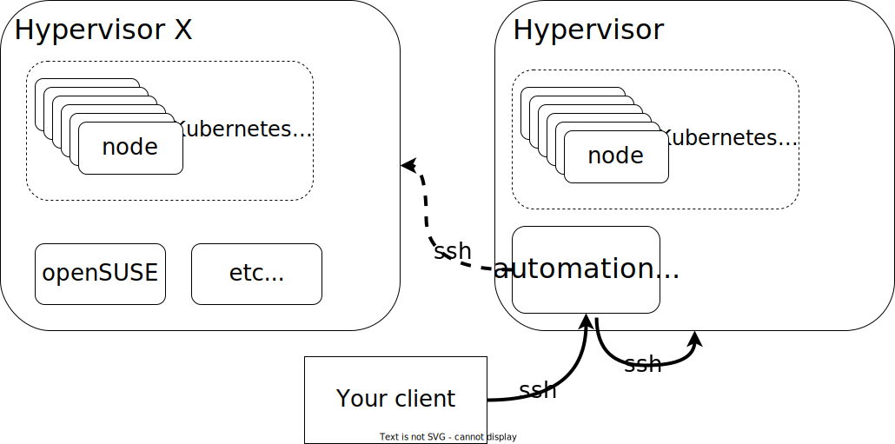

# lab-in-a-box


The purpose of this project is to enable users to setup their own lab where they can quickly try different software and its features in a reliable and controlled manner with modularity and automation in mind.
It contains a set of scripts that should make it easy to have your own lab and try different software.

This repository containing instructions and scripts to setup a lab in a NUC (or whatever hardware) from scratch.


In the words of an AI:

"Easily set up your own lab to try out various software hassle-free. Our scripts and instructions ensure a smooth, controlled experience, promoting modularity and automation. Get experimenting!"

## How does it work



The system is made of one or more virtualization hypervisors, the nodes running the workloads, and a VM called "automation" which is responsible for orchestrating the creation of labs on the hypervisors.

A lab can be an RKE2 cluster with Rancher, Longhorn and NeuVector installed, a simple VM with openSUSE Leap Micro, or something else depending on the automation that becomes available here.

To orchestrate the labs we only need an SSH connection to the automation VM which will communicate also via SSH with the hypervisor.

The Automation machine acts as a DNS server for the lab, providing local resolution for the lab domain as well as forwarding requests to other DNS servers, so ideally the Desktop (client) will point at the Automation VM DNS to get resolution for the lab domains.


## Quick Start


- **Scenario A)** Dedicated hardware and OS.
  
 1. The first step will be to prepare the media to install the OS, we have choosen SLES as the preferred OS, this is what we will need:
   
    - An empty USB of at least 8GB
    - Download an ISO image for SLES ( https://www.suse.com/download/sles/ ie. SLE-15-SP5-Online-x86_64-GM-Media1.iso )

    Once you have downloaded the ISO image you can follow the instructions on ( https://www.suse.com/support/kb/doc/?id=000018742 ) or do this steps:
   - Without the usb you want to use, run the following command:

```shell
     cat /proc/partitions  >/tmp/partb4
```
     
   - Now connect the usb and run:

```shell
     cat /proc/partitions  >/tmp/parta3
```
     
   - Now lets see what's the usb device name:

```shell
     $ diff /tmp/part*
     27,29d26
     <    8       32   15649792 sdZ
     <    8       33       3654 sdZ1
     <    8       34     501008 sdZ2
```
    
  - In this case we will to use /dev/**sdZ**, so let's write the iso to the usb:

      **IMPORTANT: The contents of the USB will be lost forever, make sure you don't have anything valuable.**

```shell
     dd if=SLE-15-SP5-Online-x86_64-GM-Media1.iso of=/dev/sdZ bs=4k && sync
```
     
   - After this we can *remove the USB* drive and *boot your lab node with it* to proceed with the install.


 2. Boot and install SLES from the USB media.

    We will make the following choices when prompted:
    
    - Select "SUSE Linux Enterprise Server"
    - A bridge interface linked to the main NIC and configure the network, this can be done on the *Network Settings* screen:
      - Click "Add"
      - Select "Bridge" to create a new bridge interface
      - Then proceed to add the static IP, DNS and hostname of your choice
      - Go to "Bridged Devices" tab and select the network interface/s you will connect to your network.
    - System role: "KVM Virtualization Host"

    **NOTE**: While it is installing you may download SLEmicro QCOW and other images you may want to use to later place them in /var/lib/libvirt/images/sources/. ( You can obtain SLEmicro from https://www.suse.com/download/sle-micro/ )

 3. Configure the lab.

    This step will require aproximately 15minutes depending on your internet conncetion and hardware.

    - From a linux system run the following command:
      ```shell
      curl https://raw.githubusercontent.com/SUSE-Technical-Marketing/lab-in-a-box/main/install_demo_server_scripts.sh | bash -
      ```
    - Define the settings for your node and lab
      ```shell
      cd /var/tmp/setup_demo_server/setup_demo_server/
      vim lab.cfg
      ```
      Here the most important to change are:

      - ROOT_PWD_HASH - The hash for the root password ( you can generate one with ```mkpasswd --method=SHA-512 --stdin```  )

      - ROOT_SSH_PUB_KEY - A public key you want to use to connect to the servers.

      - AUTOMATION_HOSTNAME - The hostname of the automation VM, this is the VM that will orchestrate all the actions, where you will connect and trigger commands, besides that it contains some supporting services such as DNS server.

      - The network settings - self-explanatory

      - _QCOW_IMAGE - The QCOW image to be use to build VMs, for the moment this has been tested only with SLEmicro but it should work with openSUSE Leap micro, other OS which support ignition and combustion files may work.

      - root_pwd - The initial root password for the lab automation VM
      
    - Once you have the config file ready lets run the script, <IP_of_lab_node> should be replaced with the IP of your lab node (hypervisor):

      ```shell
      bash setup_kvm_node.sh <IP_of_lab_node>
      ```
    - Once the setup is completed we need to login into the automation VM, at this point it is worth to configure your client with the DNS server created inside the automation VM so that you can resolve all the DNS of your lab.
    - We will clone the repository first
      ```shell
      git clone git@github.com:SUSE-Technical-Marketing/lab-in-a-box.git
      ```

    - Install the scripts in the right locations
      ```shell
      bash install_automation_node_scripts.sh
      ```
   
    - Edit the lab creation configuration file
      ```shell
      cp /etc/lab_creation.cfg.example /etc/lab_creation.cfg
      vim /etc/lab_creation.cfg
      ```
      
    - Create your first lab by editing one of the example files inside examples folder
      ```
      cp examples/cluster.json.template cluster2.json 
      cp -r examples/cluster cluster1
      vim cluster1.json
      vim cluster1/*
      ```
      ```
      setup_cluster.sh cluster1.json
      ```
      **NOTE**: Depending on the VMs capacity, the network and other factors it may take from 10 minutes to more.


      


